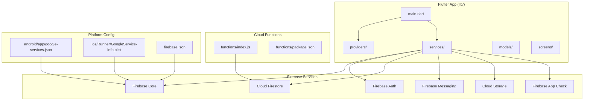
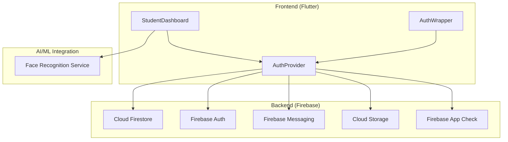
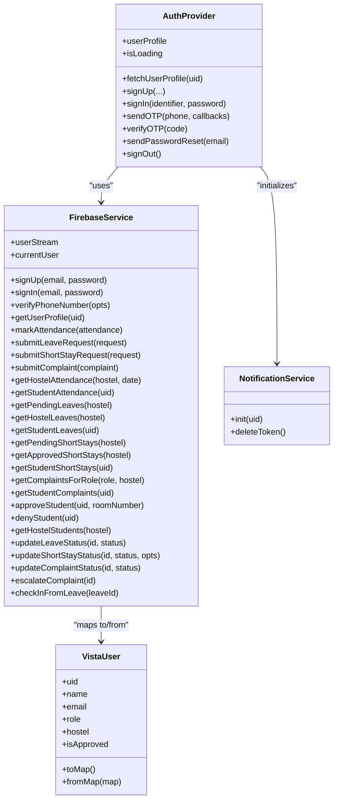
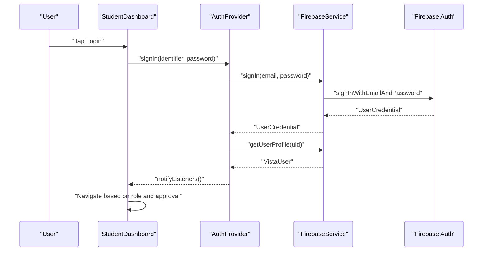
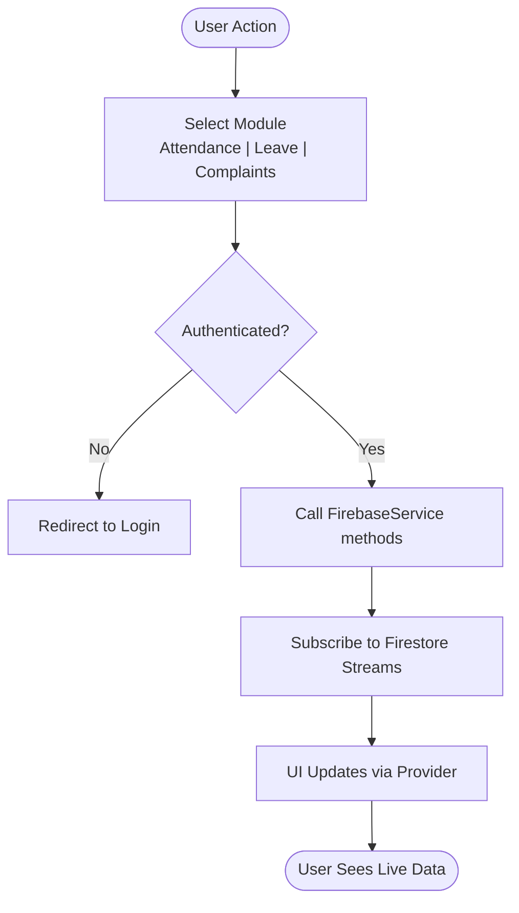
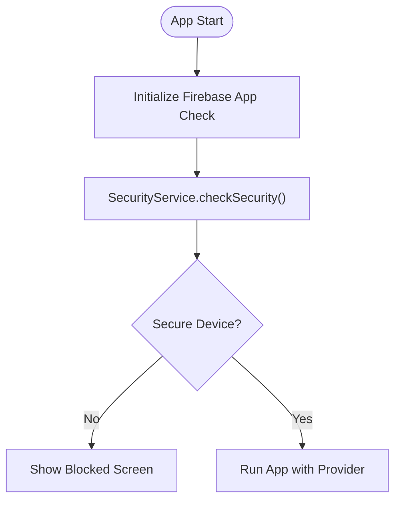
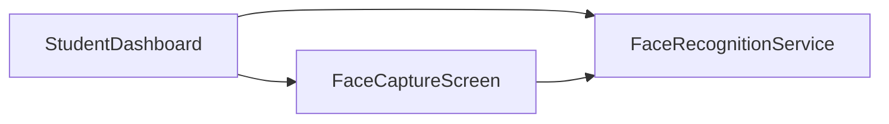
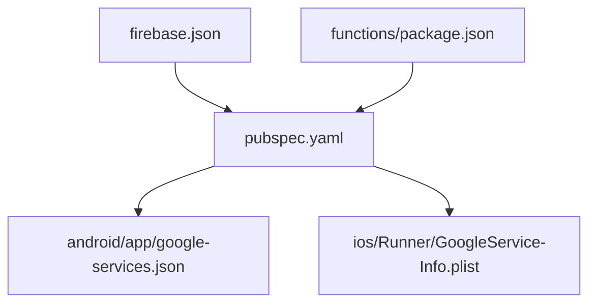

# Architecture Overview

<cite>
**Referenced Files in This Document**
- [main.dart](file://lib/main.dart)
- [auth_provider.dart](file://lib/providers/auth_provider.dart)
- [firebase_service.dart](file://lib/services/firebase_service.dart)
- [notification_service.dart](file://lib/services/notification_service.dart)
- [security_service.dart](file://lib/services/security_service.dart)
- [vista_user.dart](file://lib/models/vista_user.dart)
- [attendance_model.dart](file://lib/models/attendance_model.dart)
- [leave_request_model.dart](file://lib/models/leave_request_model.dart)
- [complaint_model.dart](file://lib/models/complaint_model.dart)
- [student_dashboard.dart](file://lib/screens/student/student_dashboard.dart)
- [firebase_options.dart](file://lib/firebase_options.dart)
- [pubspec.yaml](file://pubspec.yaml)
- [firebase.json](file://firebase.json)
- [google-services.json](file://android/app/google-services.json)
- [GoogleService-Info.plist](file://ios/Runner/GoogleService-Info.plist)
- [functions/package.json](file://functions/package.json)
</cite>

## Table of Contents
1. [Introduction](#introduction)
2. [Project Structure](#project-structure)
3. [Core Components](#core-components)
4. [Architecture Overview](#architecture-overview)
5. [Detailed Component Analysis](#detailed-component-analysis)
6. [Dependency Analysis](#dependency-analysis)
7. [Performance Considerations](#performance-considerations)
8. [Troubleshooting Guide](#troubleshooting-guide)
9. [Conclusion](#conclusion)

## Introduction
This document presents the architecture of the VISTA APP system, a cross-platform mobile and web application designed for JKLU hostel management. The system follows an MVVM-style architecture with a Flutter frontend using Provider for state management, Firebase backend services for authentication, real-time databases, messaging, and storage, and AI/ML integration points for face recognition. It documents component interactions, data flows across authentication, attendance, leave, and complaint management, and explains technical decisions around cross-platform development, security, and real-time synchronization.

## Project Structure
The repository is organized into platform-specific build artifacts, Flutter application code, Firebase configuration, and Cloud Functions. The Flutter app resides under lib/, with models, providers, services, screens, and utilities. Firebase configuration is centralized via firebase.json and platform-specific configuration files. Cloud Functions live under functions/.

**Diagram sources**
- [main.dart:23-85](file://lib/main.dart#L23-L85)
- [firebase_service.dart:12-28](file://lib/services/firebase_service.dart#L12-L28)
- [firebase.json:1-54](file://firebase.json#L1-L54)
- [google-services.json:1-29](file://android/app/google-services.json#L1-L29)
- [GoogleService-Info.plist:1-30](file://ios/Runner/GoogleService-Info.plist#L1-L30)
- [functions/package.json:1-14](file://functions/package.json#L1-L14)

**Section sources**
- [main.dart:23-118](file://lib/main.dart#L23-L118)
- [firebase.json:1-54](file://firebase.json#L1-L54)

## Core Components
- Application bootstrap and routing: Initializes Firebase, sets up security checks, and mounts the app with Provider-managed authentication state.
- Authentication provider: Manages user sign-up/sign-in, phone-based OTP verification, password reset, and user profile retrieval.
- Firebase service: Centralizes Firestore, Auth, Messaging, and Storage interactions, including real-time streams and rate-limited writes.
- Notification service: Handles FCM token lifecycle and local notifications on mobile.
- Security service: Enforces device security checks and real-device validation.
- Domain models: Strongly typed models for users, attendance, leave requests, and complaints.
- Screens: Student dashboard orchestrates tabs for attendance, leave, complaints, and short stay, integrating with services and providers.

**Section sources**
- [main.dart:23-118](file://lib/main.dart#L23-L118)
- [auth_provider.dart:8-206](file://lib/providers/auth_provider.dart#L8-L206)
- [firebase_service.dart:12-668](file://lib/services/firebase_service.dart#L12-L668)
- [notification_service.dart:10-114](file://lib/services/notification_service.dart#L10-L114)
- [security_service.dart:1-14](file://lib/services/security_service.dart#L1-L14)
- [vista_user.dart:1-96](file://lib/models/vista_user.dart#L1-L96)
- [attendance_model.dart:1-46](file://lib/models/attendance_model.dart#L1-L46)
- [leave_request_model.dart:1-90](file://lib/models/leave_request_model.dart#L1-L90)
- [complaint_model.dart:1-84](file://lib/models/complaint_model.dart#L1-L84)
- [student_dashboard.dart:32-371](file://lib/screens/student/student_dashboard.dart#L32-L371)

## Architecture Overview
The system follows an MVVM-style separation:
- View: Flutter screens and widgets (e.g., StudentDashboard).
- ViewModel: Provider-managed state (AuthProvider).
- Model: FirebaseService encapsulating backend interactions.
- Data: Firestore collections for users, attendance, leave_requests, short_stay_requests, complaints, counters, and phone_mappings.

**Diagram sources**
- [main.dart:100-117](file://lib/main.dart#L100-L117)
- [auth_provider.dart:8-34](file://lib/providers/auth_provider.dart#L8-L34)
- [firebase_service.dart:12-28](file://lib/services/firebase_service.dart#L12-L28)
- [student_dashboard.dart:9-10](file://lib/screens/student/student_dashboard.dart#L9-L10)

## Detailed Component Analysis

### MVVM Implementation and Component Interactions
- View: StudentDashboard manages UI state, permissions, and tabbed navigation. It subscribes to real-time updates from FirebaseService streams.
- ViewModel: AuthProvider exposes user state, loading flags, and actions (sign-in, sign-out, OTP, password reset). It listens to Firebase auth state changes and fetches user profiles.
- Model: FirebaseService abstracts Firestore queries, streams, and mutations, including counters, sequences, and security mappings.
- Data: Firestore collections store users, attendance, leave_requests, short_stay_requests, complaints, counters, and phone_mappings.

**Diagram sources**
- [auth_provider.dart:8-206](file://lib/providers/auth_provider.dart#L8-L206)
- [firebase_service.dart:12-668](file://lib/services/firebase_service.dart#L12-L668)
- [notification_service.dart:10-114](file://lib/services/notification_service.dart#L10-L114)
- [vista_user.dart:5-96](file://lib/models/vista_user.dart#L5-L96)

**Section sources**
- [auth_provider.dart:8-206](file://lib/providers/auth_provider.dart#L8-L206)
- [firebase_service.dart:12-668](file://lib/services/firebase_service.dart#L12-L668)
- [notification_service.dart:10-114](file://lib/services/notification_service.dart#L10-L114)
- [vista_user.dart:5-96](file://lib/models/vista_user.dart#L5-L96)

### Authentication Flow (MVVM)

**Diagram sources**
- [auth_provider.dart:165-187](file://lib/providers/auth_provider.dart#L165-L187)
- [firebase_service.dart:38-41](file://lib/services/firebase_service.dart#L38-L41)
- [firebase_service.dart:110-146](file://lib/services/firebase_service.dart#L110-L146)

**Section sources**
- [auth_provider.dart:165-187](file://lib/providers/auth_provider.dart#L165-L187)
- [firebase_service.dart:38-41](file://lib/services/firebase_service.dart#L38-L41)
- [firebase_service.dart:110-146](file://lib/services/firebase_service.dart#L110-L146)

### Real-Time Data Flows: Attendance, Leave, Complaints
- Attendance: Streams daily attendance filtered by hostel and date; supports night reporting window and late grace periods.
- Leave: Streams pending/approved/rejected requests per hostel and per student; supports check-in from leave.
- Complaints: Streams complaints targeted to roles with escalation support.

**Diagram sources**
- [student_dashboard.dart:566-800](file://lib/screens/student/student_dashboard.dart#L566-L800)
- [firebase_service.dart:148-181](file://lib/services/firebase_service.dart#L148-L181)
- [firebase_service.dart:204-296](file://lib/services/firebase_service.dart#L204-L296)
- [firebase_service.dart:430-491](file://lib/services/firebase_service.dart#L430-L491)

**Section sources**
- [student_dashboard.dart:566-800](file://lib/screens/student/student_dashboard.dart#L566-L800)
- [firebase_service.dart:148-181](file://lib/services/firebase_service.dart#L148-L181)
- [firebase_service.dart:204-296](file://lib/services/firebase_service.dart#L204-L296)
- [firebase_service.dart:430-491](file://lib/services/firebase_service.dart#L430-L491)

### Security and Device Integrity
- Firebase App Check: Activated on native platforms to mitigate abuse.
- SecurityService: Conditional imports enforce device security checks and real-device validation.
- Permissions: Location and camera permissions are enforced on mobile for attendance and face capture.

**Diagram sources**
- [main.dart:45-84](file://lib/main.dart#L45-L84)
- [security_service.dart:5-13](file://lib/services/security_service.dart#L5-L13)

**Section sources**
- [main.dart:45-84](file://lib/main.dart#L45-L84)
- [security_service.dart:5-13](file://lib/services/security_service.dart#L5-L13)

### AI/ML Integration Layer
- Face Capture: Conditional import of face capture screen for mobile vs stub on web.
- Face Recognition Service: Dedicated service module indicates planned ML usage for identity verification.

**Diagram sources**
- [student_dashboard.dart:9-10](file://lib/screens/student/student_dashboard.dart#L9-L10)
- [student_dashboard.dart:32-371](file://lib/screens/student/student_dashboard.dart#L32-L371)

**Section sources**
- [student_dashboard.dart:9-10](file://lib/screens/student/student_dashboard.dart#L9-L10)
- [student_dashboard.dart:32-371](file://lib/screens/student/student_dashboard.dart#L32-L371)

## Dependency Analysis
- Flutter dependencies: Firebase SDKs, Provider, camera, MLKit, image processing, and localization.
- Firebase configuration: Platform-specific JSON files and firebase.json define project IDs, Firestore rules, and hosting.
- Cloud Functions: Node.js-based functions for backend logic.

**Diagram sources**
- [pubspec.yaml:30-69](file://pubspec.yaml#L30-L69)
- [firebase.json:1-54](file://firebase.json#L1-L54)
- [google-services.json:1-29](file://android/app/google-services.json#L1-L29)
- [GoogleService-Info.plist:1-30](file://ios/Runner/GoogleService-Info.plist#L1-L30)
- [functions/package.json:1-14](file://functions/package.json#L1-L14)

**Section sources**
- [pubspec.yaml:30-69](file://pubspec.yaml#L30-L69)
- [firebase.json:1-54](file://firebase.json#L1-L54)
- [google-services.json:1-29](file://android/app/google-services.json#L1-L29)
- [GoogleService-Info.plist:1-30](file://ios/Runner/GoogleService-Info.plist#L1-L30)
- [functions/package.json:1-14](file://functions/package.json#L1-L14)

## Performance Considerations
- Real-time streams: Use targeted queries with filters (hostel, date ranges, statuses) to minimize payload sizes.
- Rate limiting: FirebaseService wraps critical writes with a rate limiter to prevent bursts.
- Pagination and sorting: Server-side sorting and client-side pagination reduce render overhead.
- Conditional imports: Web/mobile differences reduce unnecessary dependencies and improve load times.
- Local caching: SharedPreferences and local notifications reduce network round trips on mobile.

[No sources needed since this section provides general guidance]

## Troubleshooting Guide
- Firebase initialization failures: Early catch and logging in main.dart; verify platform configuration files and environment variables.
- Authentication issues: Normalize phone numbers for lookup; handle missing accounts gracefully.
- Notification token lifecycle: Clear tokens on logout and delete tokens on device change.
- Security blocks: If blocked screen appears, ensure device is not an emulator/root and mock locations are disabled.

**Section sources**
- [main.dart:34-58](file://lib/main.dart#L34-L58)
- [auth_provider.dart:170-178](file://lib/providers/auth_provider.dart#L170-L178)
- [notification_service.dart:18-81](file://lib/services/notification_service.dart#L18-L81)
- [main.dart:148-194](file://lib/main.dart#L148-L194)

## Conclusion
VISTA APP employs a clean MVVM architecture with Flutter and Provider for state management, and Firebase for backend services. Real-time synchronization, robust security measures, and modular services enable scalable and maintainable hostel management across attendance, leave, and complaints. AI/ML integration points are positioned to enhance identity verification and future capabilities.