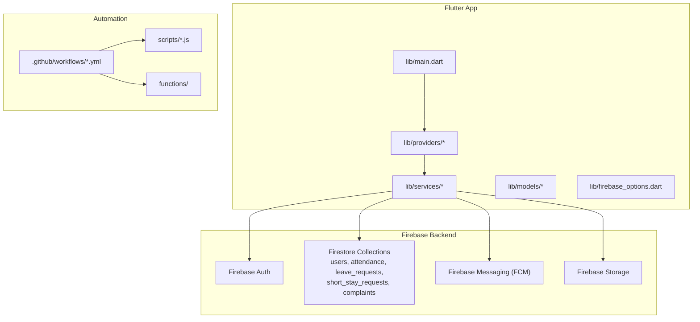
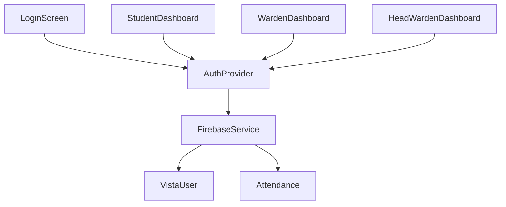
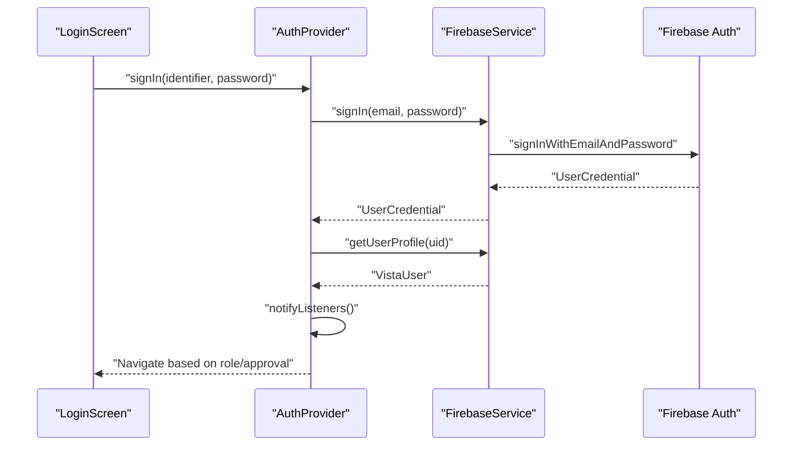
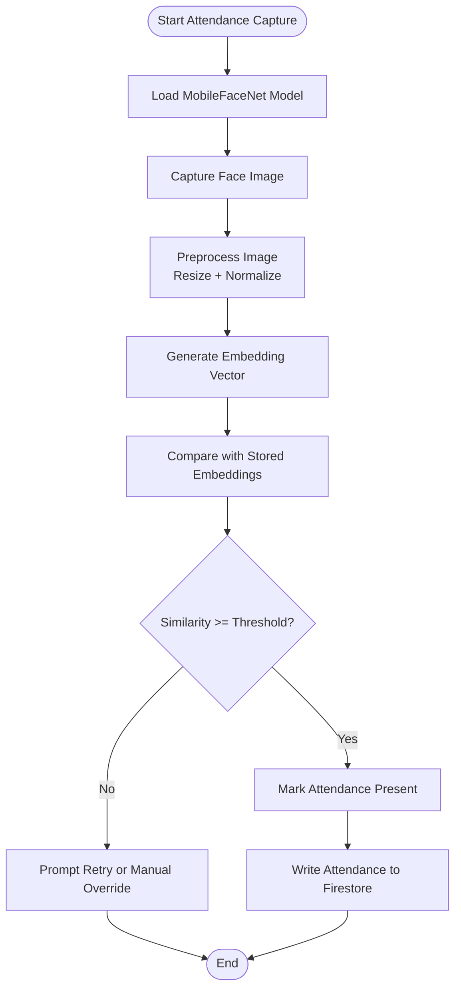
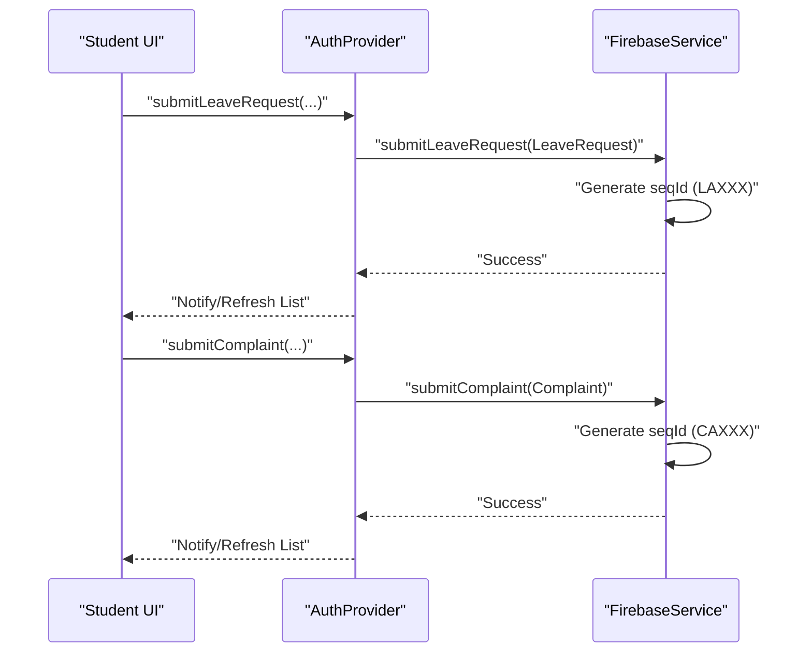
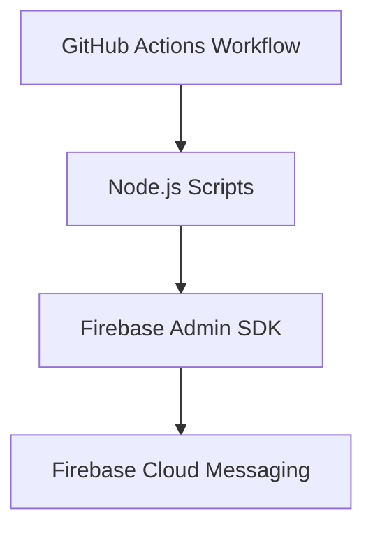
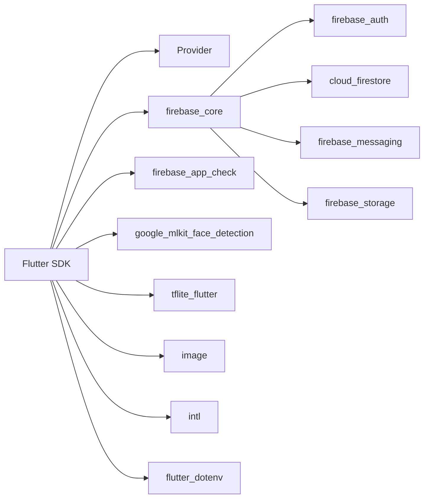

# System Design

<cite>
**Referenced Files in This Document**
- [README.md](file://README.md)
- [pubspec.yaml](file://pubspec.yaml)
- [lib/main.dart](file://lib/main.dart)
- [lib/firebase_options.dart](file://lib/firebase_options.dart)
- [lib/providers/auth_provider.dart](file://lib/providers/auth_provider.dart)
- [lib/models/vista_user.dart](file://lib/models/vista_user.dart)
- [lib/models/attendance_model.dart](file://lib/models/attendance_model.dart)
- [lib/services/firebase_service.dart](file://lib/services/firebase_service.dart)
- [lib/services/face_recognition_service.dart](file://lib/services/face_recognition_service.dart)
- [functions/package.json](file://functions/package.json)
- [.github/workflows/attendance_reminders.yml](file://.github/workflows/attendance_reminders.yml)
</cite>

## Table of Contents
1. [Introduction](#introduction)
2. [Project Structure](#project-structure)
3. [Core Components](#core-components)
4. [Architecture Overview](#architecture-overview)
5. [Detailed Component Analysis](#detailed-component-analysis)
6. [Dependency Analysis](#dependency-analysis)
7. [Performance Considerations](#performance-considerations)
8. [Troubleshooting Guide](#troubleshooting-guide)
9. [Conclusion](#conclusion)
10. [Appendices](#appendices)

## Introduction
This document describes the system design of VISTA APP, a Flutter-based, cross-platform application for JKLU hostel management. The system follows an MVVM architecture with Provider for state management, integrates Firebase for backend services, and incorporates AI/ML for face recognition-based attendance. It supports Android, iOS, Web, and desktop platforms, and orchestrates workflows across authentication, attendance, leave, and complaint management. The design emphasizes security, scalability, and maintainability through layered components, reactive streams, and rate-limited operations.

## Project Structure
The repository is organized into platform-specific build configurations, Flutter application code, Firebase backend configuration, serverless automation, and CI/CD workflows.

- Flutter application entrypoint initializes Firebase, sets up security checks, and bootstraps the app with Provider-managed state.
- Application code is split into models (data), providers (ViewModels), services (domain/logic), screens (Views), and utilities/widgets.
- Firebase configuration is centralized via generated options for current platform.
- Backend services include Firestore collections for users, attendance, leave, short-stay, and complaints, with security enforced by production rules.
- Automation is implemented via GitHub Actions that periodically triggers Node.js scripts to send reminders and monitor Firestore.

**Diagram sources**
- [lib/main.dart:23-85](file://lib/main.dart#L23-L85)
- [lib/firebase_options.dart:17-75](file://lib/firebase_options.dart#L17-L75)
- [.github/workflows/attendance_reminders.yml:1-46](file://.github/workflows/attendance_reminders.yml#L1-L46)

**Section sources**
- [README.md:82-89](file://README.md#L82-L89)
- [pubspec.yaml:88-122](file://pubspec.yaml#L88-L122)

## Core Components
- Authentication and Authorization
  - AuthProvider manages user session lifecycle, listens to auth state changes, and fetches user profiles from Firestore. It supports email/password login, phone-based verification, password reset, and logout with FCM token cleanup.
- Data Models
  - VistaUser encapsulates roles (student, warden, headWarden) and profile attributes. Attendance model stores presence records with timestamps and hostels.
- Services
  - FirebaseService abstracts Firestore operations for users, attendance, leave, short-stay, and complaints, including rate-limited writes and range queries.
  - FaceRecognitionService loads a TFLite MobileFaceNet model to compute embeddings and similarity scores for attendance verification.
- Frontend Screens and Navigation
  - The app renders role-specific dashboards and wraps navigation with an AuthWrapper that routes users based on role and approval status.

**Section sources**
- [lib/providers/auth_provider.dart:8-206](file://lib/providers/auth_provider.dart#L8-L206)
- [lib/models/vista_user.dart:3-96](file://lib/models/vista_user.dart#L3-L96)
- [lib/models/attendance_model.dart:3-46](file://lib/models/attendance_model.dart#L3-L46)
- [lib/services/firebase_service.dart:12-668](file://lib/services/firebase_service.dart#L12-L668)
- [lib/services/face_recognition_service.dart:6-88](file://lib/services/face_recognition_service.dart#L6-L88)
- [lib/main.dart:100-146](file://lib/main.dart#L100-L146)

## Architecture Overview
VISTA APP follows MVVM:
- Views: Flutter screens under lib/screens.
- ViewModel: Provider-based AuthProvider under lib/providers.
- Model: Immutable data classes under lib/models.
- Service Layer: FirebaseService under lib/services coordinates domain logic and persistence.

**Diagram sources**
- [lib/main.dart:107-116](file://lib/main.dart#L107-L116)
- [lib/providers/auth_provider.dart:8-34](file://lib/providers/auth_provider.dart#L8-L34)
- [lib/services/firebase_service.dart:12-28](file://lib/services/firebase_service.dart#L12-L28)
- [lib/models/vista_user.dart:5-44](file://lib/models/vista_user.dart#L5-L44)
- [lib/models/attendance_model.dart:3-20](file://lib/models/attendance_model.dart#L3-L20)

## Detailed Component Analysis

### Authentication Flow (MVVM)
The authentication flow demonstrates Provider-driven state updates and Firebase-backed persistence.

**Diagram sources**
- [lib/providers/auth_provider.dart:165-187](file://lib/providers/auth_provider.dart#L165-L187)
- [lib/services/firebase_service.dart:38-41](file://lib/services/firebase_service.dart#L38-L41)
- [lib/services/firebase_service.dart:110-146](file://lib/services/firebase_service.dart#L110-L146)

**Section sources**
- [lib/providers/auth_provider.dart:8-206](file://lib/providers/auth_provider.dart#L8-L206)
- [lib/services/firebase_service.dart:12-70](file://lib/services/firebase_service.dart#L12-L70)

### Attendance Management (AI/ML Integration)
The attendance pipeline leverages face recognition to generate embeddings and marks presence in Firestore.

**Diagram sources**
- [lib/services/face_recognition_service.dart:16-82](file://lib/services/face_recognition_service.dart#L16-L82)
- [lib/services/firebase_service.dart:148-181](file://lib/services/firebase_service.dart#L148-L181)

**Section sources**
- [lib/services/face_recognition_service.dart:6-88](file://lib/services/face_recognition_service.dart#L6-L88)
- [lib/models/attendance_model.dart:3-46](file://lib/models/attendance_model.dart#L3-L46)

### Leave and Complaint Workflows
Leave and complaint submissions are rate-limited and tracked with sequential IDs. Queries are scoped by hostel and status for role-based dashboards.

**Diagram sources**
- [lib/providers/auth_provider.dart:51-108](file://lib/providers/auth_provider.dart#L51-L108)
- [lib/services/firebase_service.dart:204-228](file://lib/services/firebase_service.dart#L204-L228)
- [lib/services/firebase_service.dart:431-452](file://lib/services/firebase_service.dart#L431-L452)

**Section sources**
- [lib/services/firebase_service.dart:183-202](file://lib/services/firebase_service.dart#L183-L202)
- [lib/services/firebase_service.dart:204-296](file://lib/services/firebase_service.dart#L204-L296)
- [lib/services/firebase_service.dart:431-491](file://lib/services/firebase_service.dart#L431-L491)

### Cross-Platform and CI/CD Integration
- Cross-platform: Flutter supports Android, iOS, Web, Linux, macOS, and Windows via platform-specific runners and build configs.
- CI/CD: GitHub Actions schedules nightly attendance reminders and invokes Node.js scripts to send push notifications using Firebase Admin.

**Diagram sources**
- [.github/workflows/attendance_reminders.yml:1-46](file://.github/workflows/attendance_reminders.yml#L1-L46)
- [functions/package.json:1-14](file://functions/package.json#L1-L14)

**Section sources**
- [.github/workflows/attendance_reminders.yml:1-46](file://.github/workflows/attendance_reminders.yml#L1-L46)
- [functions/package.json:1-14](file://functions/package.json#L1-L14)

## Dependency Analysis
The app’s dependency graph centers on Flutter, Provider, and Firebase. AI/ML dependencies include tflite_flutter and image processing libraries. Cross-platform targets are declared in pubspec.

**Diagram sources**
- [pubspec.yaml:30-70](file://pubspec.yaml#L30-L70)

**Section sources**
- [pubspec.yaml:21-70](file://pubspec.yaml#L21-L70)

## Performance Considerations
- Reactive Streams: Firestore snapshots are used extensively for real-time UI updates. Prefer limiting query scopes (hostel, status, date ranges) to reduce payload sizes.
- Rate Limiting: FirebaseService wraps high-frequency writes (leave, complaint, short-stay) with a rate limiter to avoid throttling and contention.
- Model Loading: FaceRecognitionService lazily loads the MobileFaceNet model and normalizes preprocessing to minimize inference overhead.
- Network Efficiency: Batch UI updates via Provider.notifyListeners and avoid unnecessary rebuilds by isolating state per screen.
- Offline Behavior: Consider implementing Firestore offline persistence and optimistic updates for critical flows like leave submission.

[No sources needed since this section provides general guidance]

## Troubleshooting Guide
- Firebase Initialization Failures
  - Ensure platform-specific configuration files are present and DefaultFirebaseOptions.currentPlatform resolves correctly.
  - On web, initialization failures can cascade; the app attempts graceful handling and logs errors.
- App Check and Security
  - App Check activation is skipped on web; on native, debug vs. production providers are selected based on debug mode.
  - SecurityService checks emulate, root, VPN, and mock location; if flagged insecure, the app displays a blocked screen.
- Authentication Issues
  - Phone number login relies on a phone-to-email mapping; ensure phone_mappings documents are maintained.
  - Logout clears FCM tokens to prevent stale notifications.
- Attendance Pipeline
  - If face model fails to load, embeddings will not be computed; verify asset inclusion and interpreter initialization.
  - Adjust similarity threshold carefully to balance false positives/negatives.
- Automation Failures
  - Verify GitHub Actions secrets (FIREBASE_SERVICE_ACCOUNT) and Node runtime versions.
  - Confirm scheduled cron times align with IST and timezone settings.

**Section sources**
- [lib/main.dart:34-58](file://lib/main.dart#L34-L58)
- [lib/main.dart:80-82](file://lib/main.dart#L80-L82)
- [lib/providers/auth_provider.dart:189-204](file://lib/providers/auth_provider.dart#L189-L204)
- [lib/services/face_recognition_service.dart:16-26](file://lib/services/face_recognition_service.dart#L16-L26)
- [.github/workflows/attendance_reminders.yml:30-45](file://.github/workflows/attendance_reminders.yml#L30-L45)

## Conclusion
VISTA APP’s architecture cleanly separates concerns across MVVM layers, leveraging Firebase for scalable backend operations and integrating AI/ML for robust attendance verification. The system is designed for cross-platform deployment, automated notifications, and strong security controls. By adhering to reactive streams, rate-limited operations, and CI/CD automation, the platform supports growth and reliable service delivery for JKLU hostel management.

[No sources needed since this section summarizes without analyzing specific files]

## Appendices
- Technology Stack Highlights
  - Frontend: Flutter (Dart)
  - State Management: Provider (MVVM)
  - Backend: Firebase (Auth, Firestore, FCM, Storage)
  - AI/ML: Google ML Kit (Face Detection), TFLite (MobileFaceNet)
  - Automation: GitHub Actions (Node.js Watcher)

**Section sources**
- [README.md:34-42](file://README.md#L34-L42)