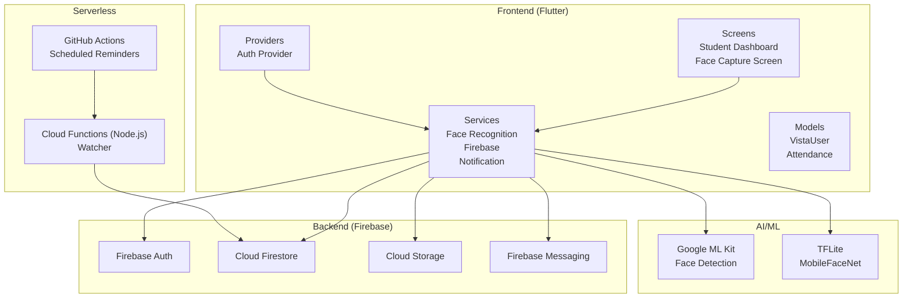
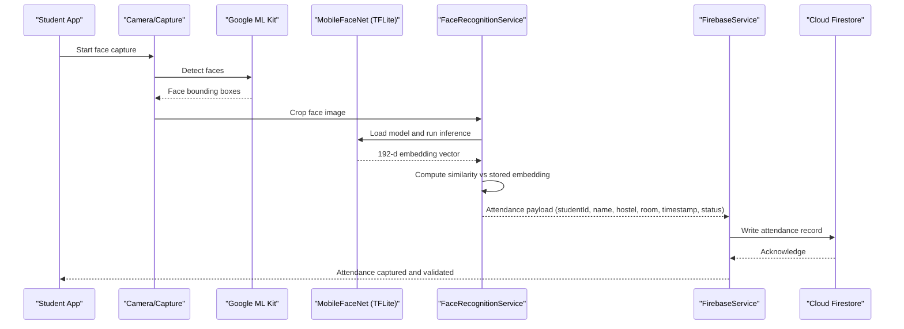
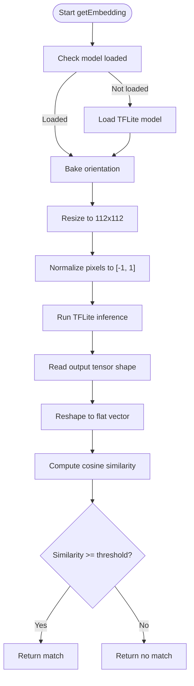
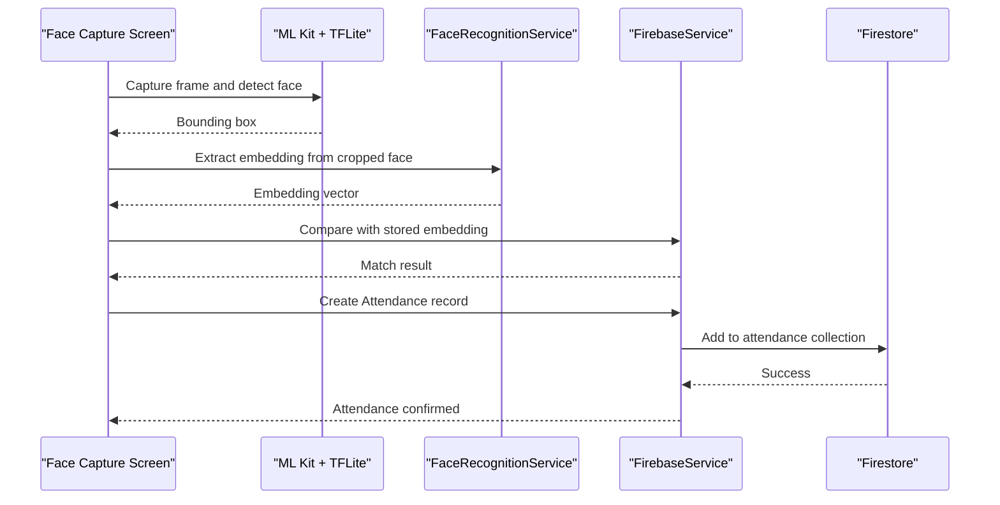
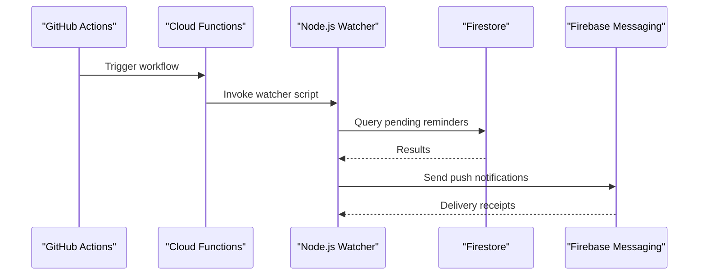
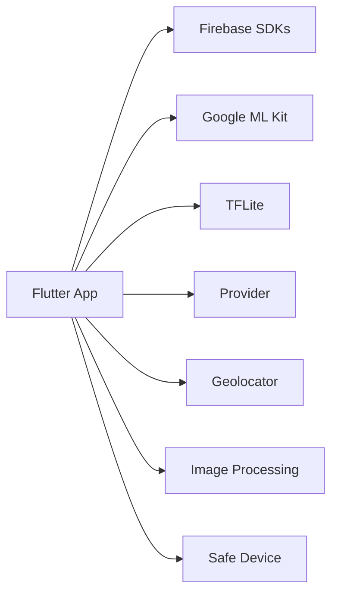
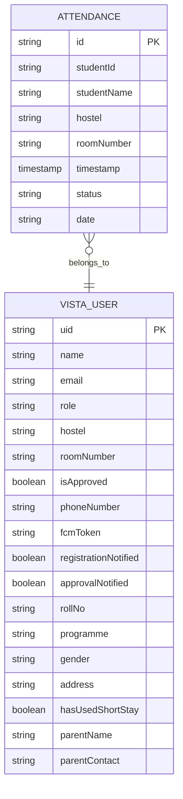

# Attendance Management System

<cite>
**Referenced Files in This Document**
- [main.dart](file://lib/main.dart)
- [README.md](file://README.md)
- [pubspec.yaml](file://pubspec.yaml)
- [face_recognition_service.dart](file://lib/services/face_recognition_service.dart)
- [firebase_service.dart](file://lib/services/firebase_service.dart)
- [attendance_model.dart](file://lib/models/attendance_model.dart)
- [vista_user.dart](file://lib/models/vista_user.dart)
- [face_capture_screen.dart](file://lib/screens/student/face_capture_screen.dart)
- [notification_service.dart](file://lib/services/notification_service.dart)
- [index.js](file://functions/index.js)
- [attendance_reminders.yml](file://.github/workflows/attendance_reminders.yml)
- [notify_watcher.js](file://scripts/notify_watcher.js)
- [send_reminders.js](file://scripts/send_reminders.js)
- [seed_wardens.js](file://scripts/seed_wardens.js)
- [firestore.rules](file://firestore.rules)
- [firestore.indexes.json](file://firestore.indexes.json)
- [firebase.json](file://firebase.json)
</cite>

## Table of Contents
1. [Introduction](#introduction)
2. [Project Structure](#project-structure)
3. [Core Components](#core-components)
4. [Architecture Overview](#architecture-overview)
5. [Detailed Component Analysis](#detailed-component-analysis)
6. [Dependency Analysis](#dependency-analysis)
7. [Performance Considerations](#performance-considerations)
8. [Troubleshooting Guide](#troubleshooting-guide)
9. [Conclusion](#conclusion)
10. [Appendices](#appendices)

## Introduction
This document describes the AI-powered attendance management system built with Flutter and Firebase. The system integrates MobileFaceNet via TensorFlow Lite for face recognition, Google ML Kit for face detection, and liveness detection requiring a blink verification. Biometric security is enforced through Firestore rules, and the system supports nightly reporting windows, real-time validation, and robust attendance capture workflows. The document explains the technical implementation of image preprocessing, AI model inference, result interpretation, performance optimization, accuracy considerations, and troubleshooting strategies.

## Project Structure
The application follows a layered architecture:
- Frontend (Flutter): UI screens, state management, and platform integrations
- Services: Firebase integration, face recognition, and notification logic
- Models: Data structures for users, attendance, and related entities
- Functions: Serverless automation for reminders and watchers
- CI/CD: GitHub Actions workflows for scheduled tasks

**Diagram sources**
- [main.dart:23-85](file://lib/main.dart#L23-L85)
- [pubspec.yaml:30-69](file://pubspec.yaml#L30-L69)
- [firebase_service.dart:12-22](file://lib/services/firebase_service.dart#L12-L22)
- [face_recognition_service.dart:6-26](file://lib/services/face_recognition_service.dart#L6-L26)
- [index.js:1-200](file://functions/index.js#L1-L200)
- [attendance_reminders.yml:1-50](file://github/workflows/attendance_reminders.yml#L1-L50)

**Section sources**
- [main.dart:23-118](file://lib/main.dart#L23-L118)
- [pubspec.yaml:30-69](file://pubspec.yaml#L30-L69)
- [README.md:82-89](file://README.md#L82-L89)

## Core Components
- Face Recognition Service: Loads MobileFaceNet TFLite model, performs preprocessing, runs inference, and computes cosine similarity for identity matching
- Firebase Service: Centralized Firestore and Auth operations, attendance streaming, rate limiting, and sequential ID generation
- Attendance Model: Structured representation of attendance records with date partitioning
- VistaUser Model: User profile with role-based attributes and biometric-related metadata
- Face Capture Screen: Orchestrates camera capture, ML Kit face detection, liveness blink verification, and embedding comparison
- Notification Service: Manages FCM tokens and push notifications for reminders and updates
- Cloud Functions: Automated watcher for Firestore and scheduled reminders via GitHub Actions

**Section sources**
- [face_recognition_service.dart:6-87](file://lib/services/face_recognition_service.dart#L6-L87)
- [firebase_service.dart:12-667](file://lib/services/firebase_service.dart#L12-L667)
- [attendance_model.dart:3-45](file://lib/models/attendance_model.dart#L3-L45)
- [vista_user.dart:5-95](file://lib/models/vista_user.dart#L5-L95)
- [face_capture_screen.dart:1-200](file://lib/screens/student/face_capture_screen.dart#L1-L200)
- [notification_service.dart:1-200](file://lib/services/notification_service.dart#L1-L200)

## Architecture Overview
The system architecture combines client-side AI inference with backend orchestration and real-time synchronization.

**Diagram sources**
- [face_recognition_service.dart:16-60](file://lib/services/face_recognition_service.dart#L16-L60)
- [firebase_service.dart:149-153](file://lib/services/firebase_service.dart#L149-L153)
- [face_capture_screen.dart:1-200](file://lib/screens/student/face_capture_screen.dart#L1-L200)

## Detailed Component Analysis

### Face Recognition Service
Implements MobileFaceNet integration with TFLite:
- Model loading from assets
- Image preprocessing: orientation bake, resize to 112x112, normalization to [-1, 1]
- Dynamic output tensor handling for flexible embedding sizes
- Cosine similarity scoring with configurable threshold
- Legacy landmark extraction compatibility

**Diagram sources**
- [face_recognition_service.dart:16-82](file://lib/services/face_recognition_service.dart#L16-L82)

**Section sources**
- [face_recognition_service.dart:6-87](file://lib/services/face_recognition_service.dart#L6-L87)

### Face Detection with Google ML Kit
- Detects faces in real-time frames
- Provides bounding boxes for cropping
- Supports liveness detection via blink verification workflow

**Section sources**
- [face_capture_screen.dart:1-200](file://lib/screens/student/face_capture_screen.dart#L1-L200)
- [pubspec.yaml:52](file://pubspec.yaml#L52)

### Liveness Detection (Blink Verification)
- Requires user to blink during capture to confirm live presence
- Prevents spoofing with photos or videos
- Integrated into face capture flow before embedding comparison

**Section sources**
- [README.md:14-17](file://README.md#L14-L17)
- [face_capture_screen.dart:1-200](file://lib/screens/student/face_capture_screen.dart#L1-L200)

### Attendance Capture Workflow
- Real-time validation against stored embeddings
- Automatic attendance creation with date partitioning
- Streaming queries for hostel-level and student-level attendance
- Rate limiting to prevent abuse

**Diagram sources**
- [face_capture_screen.dart:1-200](file://lib/screens/student/face_capture_screen.dart#L1-L200)
- [face_recognition_service.dart:28-82](file://lib/services/face_recognition_service.dart#L28-L82)
- [firebase_service.dart:149-153](file://lib/services/firebase_service.dart#L149-L153)

**Section sources**
- [firebase_service.dart:148-181](file://lib/services/firebase_service.dart#L148-L181)
- [attendance_model.dart:22-32](file://lib/models/attendance_model.dart#L22-L32)

### Nightly Reporting Window and Automated Reminders
- Scheduled reminders at 10:00 PM and 10:20 PM IST using GitHub Actions
- Serverless watcher monitors Firestore for triggers
- Push notifications delivered via Firebase Messaging

**Diagram sources**
- [attendance_reminders.yml:1-50](file://github/workflows/attendance_reminders.yml#L1-L50)
- [index.js:1-200](file://functions/index.js#L1-L200)
- [notify_watcher.js:1-200](file://scripts/notify_watcher.js#L1-L200)
- [send_reminders.js:1-200](file://scripts/send_reminders.js#L1-L200)

**Section sources**
- [README.md:19-25](file://README.md#L19-L25)
- [attendance_reminders.yml:1-50](file://github/workflows/attendance_reminders.yml#L1-L50)
- [index.js:1-200](file://functions/index.js#L1-L200)

### Biometric Security Measures and Firestore Rules
- Strict RBAC policies protect biometric data and user privacy
- Production-grade Firestore rules deployed via CLI
- Role-based access ensures sensitive collections remain protected

**Section sources**
- [README.md:27-31](file://README.md#L27-L31)
- [firestore.rules:1-200](file://firestore.rules#L1-L200)
- [README.md:62-66](file://README.md#L62-L66)

### Geofencing Integration
- Geolocation services integrated via geolocator package
- Can be used to enforce check-in proximity to hostels
- Not currently implemented in the referenced code; can be added to capture workflow

**Section sources**
- [pubspec.yaml:49](file://pubspec.yaml#L49)

## Dependency Analysis
External libraries and their roles:
- firebase_core, firebase_auth, cloud_firestore, firebase_messaging, firebase_storage: Backend services
- google_mlkit_face_detection, tflite_flutter: AI/ML inference
- provider: State management
- geolocator, permission_handler: Location and permissions
- image, flutter_image_compress: Image processing
- path_provider, image_picker: File and camera integration
- safe_device: Device security checks

**Diagram sources**
- [pubspec.yaml:30-69](file://pubspec.yaml#L30-L69)

**Section sources**
- [pubspec.yaml:30-69](file://pubspec.yaml#L30-L69)

## Performance Considerations
- Model warm-up: Load TFLite model on app startup to reduce latency
- Preprocessing optimization: Reuse normalized buffers and avoid redundant conversions
- Batch operations: Group Firestore writes using transactions or batched writes
- Rate limiting: Implemented per operation to prevent spam
- Image compression: Compress images before upload to reduce bandwidth
- Caching: Cache recent embeddings locally to minimize repeated comparisons
- Threading: Keep inference off the UI thread; use isolates if needed
- Accuracy tuning: Adjust similarity threshold based on testing; consider multiple reference embeddings

[No sources needed since this section provides general guidance]

## Troubleshooting Guide
Common issues and resolutions:
- Model loading failures: Verify model asset path and file integrity
- Orientation issues: Ensure orientation baking is applied before resizing
- Low similarity scores: Confirm proper lighting, alignment, and cropping
- Permission denials: Request camera and storage permissions at runtime
- Emulator/root detection: Security checks block emulators and rooted devices
- Network connectivity: Handle offline scenarios with local caching and retry logic
- Firestore write conflicts: Use transactions for critical updates
- Blink verification failures: Provide clear UI feedback and retry prompts

**Section sources**
- [face_recognition_service.dart:16-26](file://lib/services/face_recognition_service.dart#L16-L26)
- [main.dart:80-82](file://lib/main.dart#L80-L82)
- [firebase_service.dart:149-153](file://lib/services/firebase_service.dart#L149-L153)

## Conclusion
The AI-powered attendance system leverages MobileFaceNet and Google ML Kit to deliver accurate, secure, and real-time biometric attendance. With Firestore rules enforcing strict privacy controls, automated reminders, and robust validation workflows, the system provides a scalable solution for hostel management. Proper performance tuning and troubleshooting practices ensure reliable operation in production environments.

[No sources needed since this section summarizes without analyzing specific files]

## Appendices

### Data Models Overview

**Diagram sources**
- [attendance_model.dart:3-45](file://lib/models/attendance_model.dart#L3-L45)
- [vista_user.dart:5-95](file://lib/models/vista_user.dart#L5-L95)

### Security and Compliance
- App Check activation for production
- Device security checks (emulators, root, mock locations)
- Firestore rules deployment
- Code obfuscation and secure signing for releases

**Section sources**
- [main.dart:45-50](file://lib/main.dart#L45-L50)
- [main.dart:80-82](file://lib/main.dart#L80-L82)
- [README.md:27-31](file://README.md#L27-L31)
- [README.md:70-79](file://README.md#L70-L79)