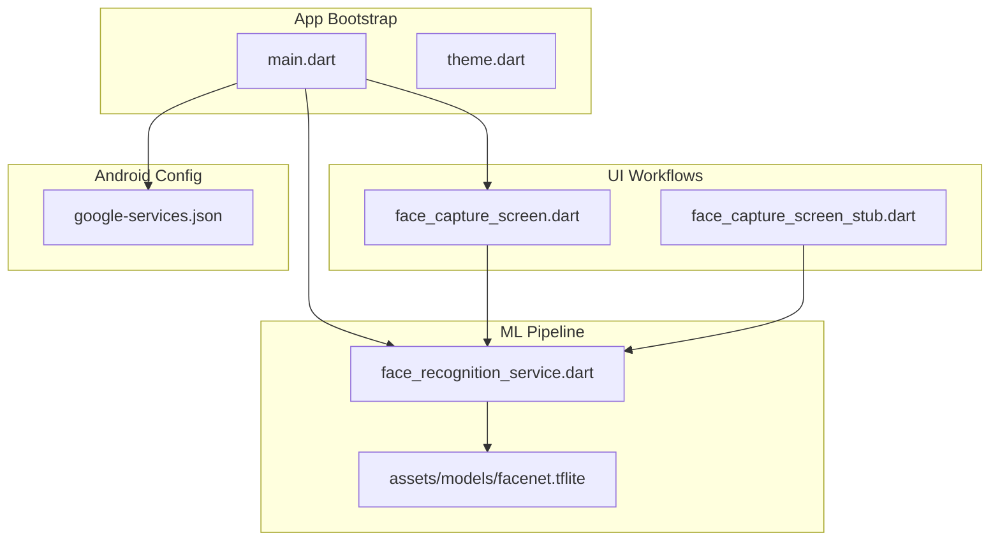
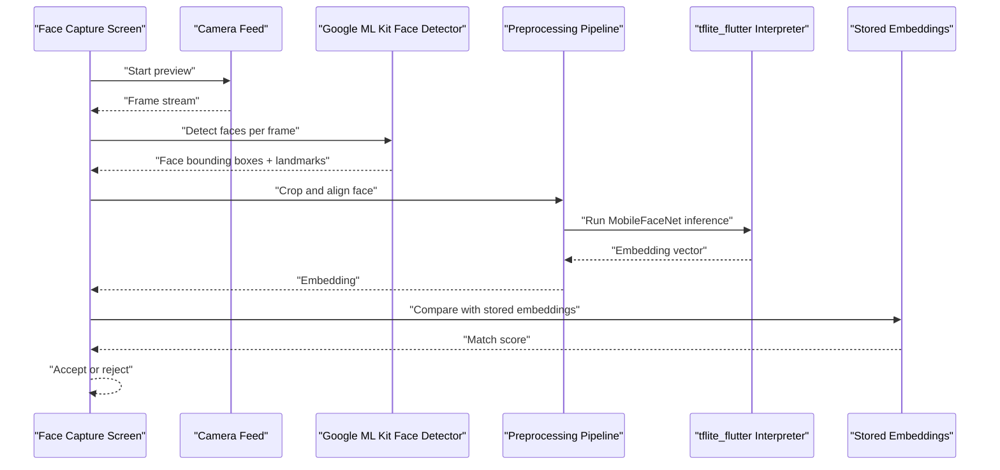
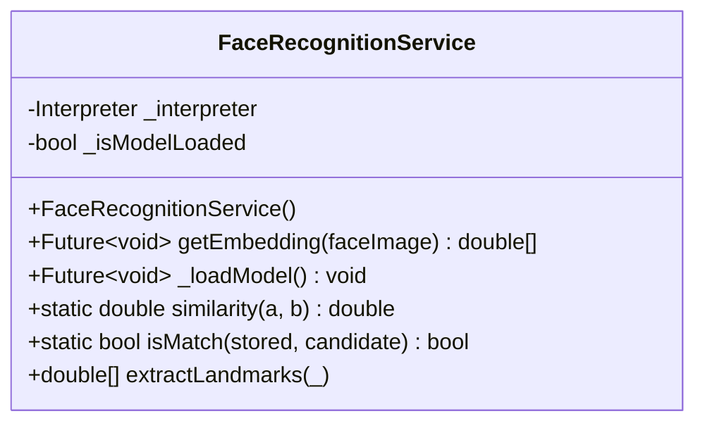
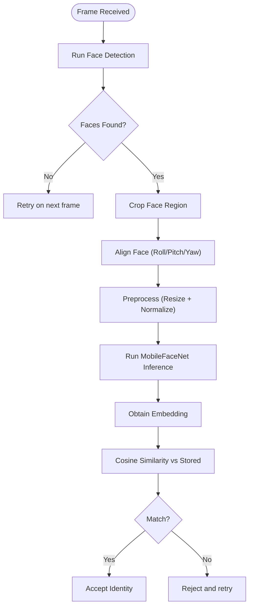
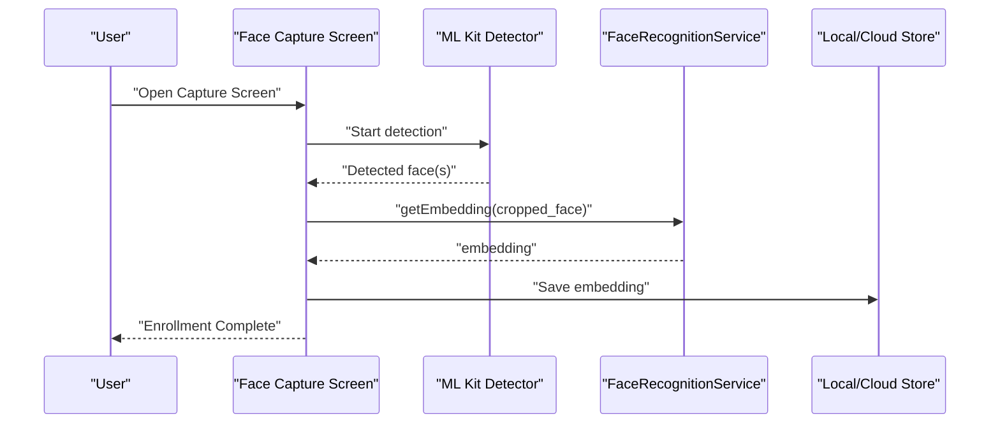
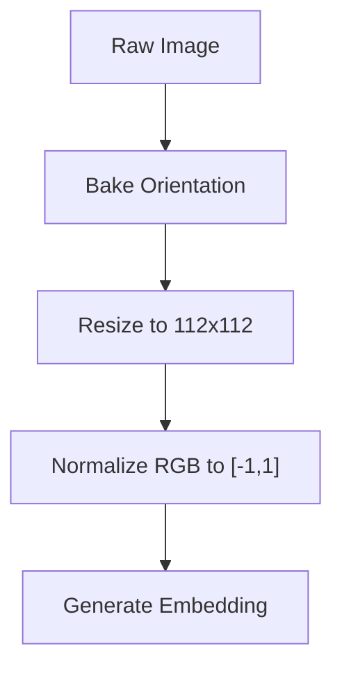
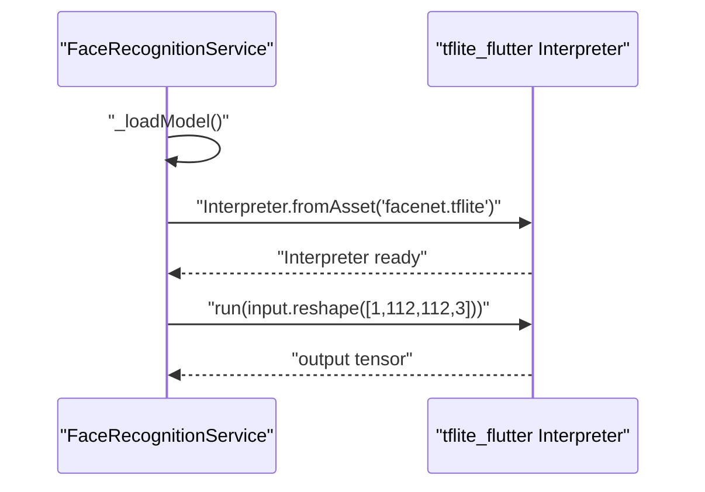
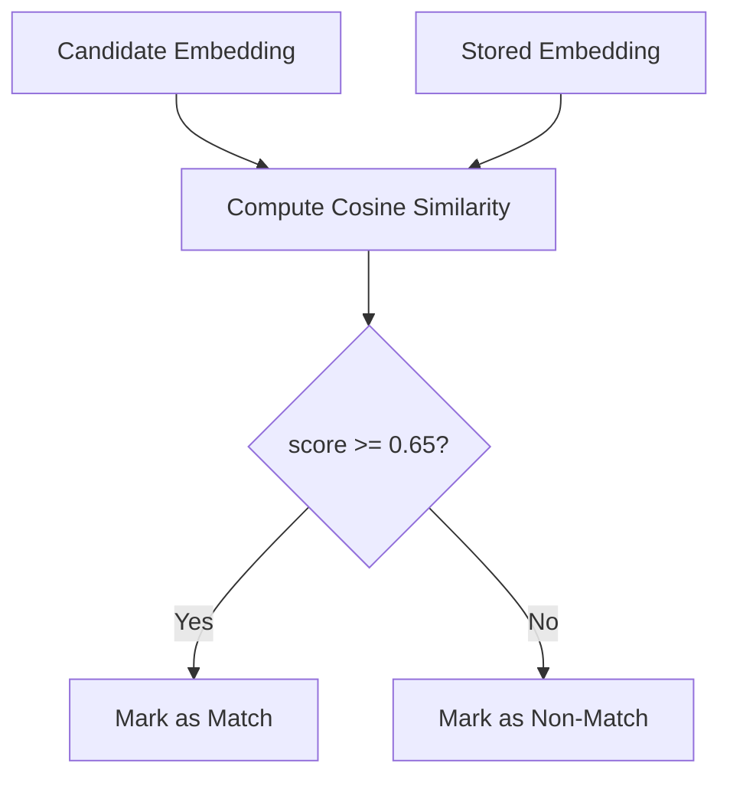
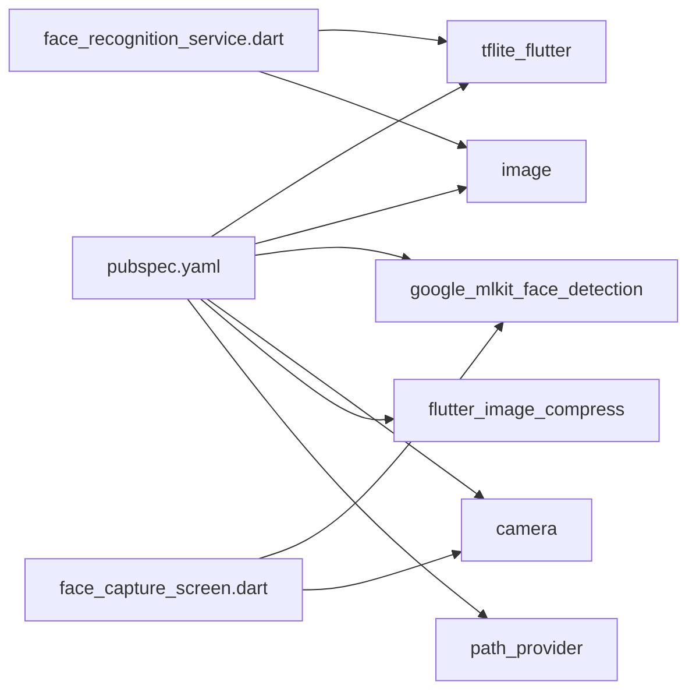

# Face Recognition System

<cite>
**Referenced Files in This Document**
- [face_recognition_service.dart](file://lib/services/face_recognition_service.dart)
- [face_capture_screen.dart](file://lib/screens/student/face_capture_screen.dart)
- [face_capture_screen_stub.dart](file://lib/screens/student/face_capture_screen_stub.dart)
- [pubspec.yaml](file://pubspec.yaml)
- [main.dart](file://lib/main.dart)
- [google-services.json](file://android/app/google-services.json)
- [theme.dart](file://lib/utils/theme.dart)
</cite>

## Table of Contents
1. [Introduction](#introduction)
2. [Project Structure](#project-structure)
3. [Core Components](#core-components)
4. [Architecture Overview](#architecture-overview)
5. [Detailed Component Analysis](#detailed-component-analysis)
6. [Dependency Analysis](#dependency-analysis)
7. [Performance Considerations](#performance-considerations)
8. [Troubleshooting Guide](#troubleshooting-guide)
9. [Conclusion](#conclusion)

## Introduction
This document explains the face recognition system implemented in the VISTA app. It covers the integration of the MobileFaceNet AI model via TensorFlow Lite, the face detection pipeline using Google ML Kit, and the image preprocessing pipeline. It also documents the face capture workflow, real-time camera processing, face alignment, model loading and inference execution, result interpretation, performance optimization strategies, memory management, robustness against varying lighting conditions, and troubleshooting guidance for common detection issues.

## Project Structure
The face recognition system spans several modules:
- Application bootstrap and environment initialization
- Face recognition service for embedding generation and similarity computation
- Face capture screens for enrollment and verification workflows
- Asset packaging for the TFLite model
- Android configuration for Firebase services

**Diagram sources**
- [main.dart:23-85](file://lib/main.dart#L23-L85)
- [face_recognition_service.dart:8-26](file://lib/services/face_recognition_service.dart#L8-L26)
- [face_capture_screen.dart](file://lib/screens/student/face_capture_screen.dart)
- [face_capture_screen_stub.dart](file://lib/screens/student/face_capture_screen_stub.dart)
- [google-services.json:1-29](file://android/app/google-services.json#L1-L29)

**Section sources**
- [main.dart:23-85](file://lib/main.dart#L23-L85)
- [pubspec.yaml:90-96](file://pubspec.yaml#L90-L96)

## Core Components
- FaceRecognitionService: Loads the MobileFaceNet TFLite model, preprocesses face crops, runs inference, and computes cosine similarity for matching.
- Face capture screens: Provide the user interface for enrolling new faces and verifying identities during check-in/check-out.
- Asset packaging: Ensures the model is bundled under assets/models and discoverable at runtime.
- Android configuration: Provides Firebase client configuration for backend services.

Key responsibilities:
- Model lifecycle management and lazy loading
- Image preprocessing pipeline (orientation bake, resize, normalization)
- Dynamic output tensor handling for embeddings
- Similarity scoring and threshold-based matching
- UI integration for capture and feedback

**Section sources**
- [face_recognition_service.dart:8-87](file://lib/services/face_recognition_service.dart#L8-L87)
- [face_capture_screen.dart](file://lib/screens/student/face_capture_screen.dart)
- [face_capture_screen_stub.dart](file://lib/screens/student/face_capture_screen_stub.dart)
- [pubspec.yaml:90-96](file://pubspec.yaml#L90-L96)

## Architecture Overview
The system integrates real-time camera capture with face detection and recognition:
- Real-time camera feed is captured and frames are processed.
- Google ML Kit detects faces and provides bounding boxes and landmarks.
- Detected faces are cropped and aligned.
- The cropped face is preprocessed and passed to MobileFaceNet via tflite_flutter to produce a fixed-length embedding.
- The embedding is compared to stored templates using cosine similarity.

**Diagram sources**
- [face_recognition_service.dart:28-60](file://lib/services/face_recognition_service.dart#L28-L60)
- [face_capture_screen.dart](file://lib/screens/student/face_capture_screen.dart)

## Detailed Component Analysis

### FaceRecognitionService
Responsibilities:
- Load MobileFaceNet model from assets on demand
- Preprocess face images: orientation correction, resize to 112x112, normalize to [-1, 1]
- Run inference with dynamic output tensor handling
- Compute cosine similarity and perform threshold-based matching

Implementation highlights:
- Lazy model loading ensures startup performance and reduces memory footprint until needed.
- Preprocessing follows MobileFaceNet’s expected input format.
- Dynamic output shape handling supports variable embedding sizes.
- Cosine similarity provides robust discrimination between identities.

**Diagram sources**
- [face_recognition_service.dart:8-87](file://lib/services/face_recognition_service.dart#L8-L87)

**Section sources**
- [face_recognition_service.dart:16-26](file://lib/services/face_recognition_service.dart#L16-L26)
- [face_recognition_service.dart:28-60](file://lib/services/face_recognition_service.dart#L28-L60)
- [face_recognition_service.dart:62-82](file://lib/services/face_recognition_service.dart#L62-L82)

### Face Detection Pipeline (Google ML Kit)
- The project declares the Google ML Kit face detection plugin in dependencies.
- The detection pipeline provides bounding boxes and landmarks for alignment and cropping.
- Cropping and alignment are performed prior to inference to maximize recognition accuracy.

**Diagram sources**
- [pubspec.yaml:52](file://pubspec.yaml#L52)
- [face_recognition_service.dart:28-60](file://lib/services/face_recognition_service.dart#L28-L60)

**Section sources**
- [pubspec.yaml:52](file://pubspec.yaml#L52)

### Face Capture Workflow
- Enrollment: Capture multiple frontal views, detect faces, crop and align, generate embeddings, and persist to storage.
- Verification: Live capture, detect faces, preprocess, infer embedding, compare against enrolled template, and approve/deny.

**Diagram sources**
- [face_capture_screen.dart](file://lib/screens/student/face_capture_screen.dart)
- [face_recognition_service.dart:28-60](file://lib/services/face_recognition_service.dart#L28-L60)

**Section sources**
- [face_capture_screen.dart](file://lib/screens/student/face_capture_screen.dart)
- [face_capture_screen_stub.dart](file://lib/screens/student/face_capture_screen_stub.dart)

### Image Preprocessing and Alignment
- Orientation bake: Corrects rotation metadata from camera captures.
- Resize: Standardized to 112x112 pixels for MobileFaceNet.
- Normalization: Pixel values mapped to [-1, 1] range.
- Alignment: Uses detected landmarks to roll-align faces for consistent pose.

**Diagram sources**
- [face_recognition_service.dart:33-46](file://lib/services/face_recognition_service.dart#L33-L46)

**Section sources**
- [face_recognition_service.dart:33-46](file://lib/services/face_recognition_service.dart#L33-L46)

### Model Loading and Inference Execution
- Model loading: Deferred until first use to reduce cold-start latency.
- Tensor I/O: Input shape is [1, 112, 112, 3]; output shape is dynamically resolved to compute embedding length.
- Inference: Runs synchronously on the CPU interpreter; consider GPU delegate for production.

**Diagram sources**
- [face_recognition_service.dart:16-26](file://lib/services/face_recognition_service.dart#L16-L26)
- [face_recognition_service.dart:48-53](file://lib/services/face_recognition_service.dart#L48-L53)

**Section sources**
- [face_recognition_service.dart:16-26](file://lib/services/face_recognition_service.dart#L16-L26)
- [face_recognition_service.dart:48-60](file://lib/services/face_recognition_service.dart#L48-L60)

### Result Interpretation and Matching
- Cosine similarity: Ranges from -1 to 1; higher indicates closer match.
- Threshold tuning: A value around 0.65 is used to balance precision and recall for MobileFaceNet.

**Diagram sources**
- [face_recognition_service.dart:62-82](file://lib/services/face_recognition_service.dart#L62-L82)

**Section sources**
- [face_recognition_service.dart:62-82](file://lib/services/face_recognition_service.dart#L62-L82)

## Dependency Analysis
External dependencies relevant to face recognition:
- tflite_flutter: TensorFlow Lite interpreter for on-device inference
- image: Dart image manipulation library for preprocessing
- google_mlkit_face_detection: Face detection and landmark extraction
- camera: Camera capture for real-time frames
- flutter_image_compress: Optional compression for performance
- path_provider: File system access for model and assets

**Diagram sources**
- [pubspec.yaml:52-66](file://pubspec.yaml#L52-L66)
- [face_recognition_service.dart:3-4](file://lib/services/face_recognition_service.dart#L3-L4)
- [face_capture_screen.dart](file://lib/screens/student/face_capture_screen.dart)

**Section sources**
- [pubspec.yaml:52-66](file://pubspec.yaml#L52-L66)

## Performance Considerations
- Model loading
  - Keep model size minimal; MobileFaceNet is optimized for mobile.
  - Defer loading until first use to reduce startup time.
- Inference acceleration
  - Consider enabling GPU delegate or NNAPI delegate via tflite_flutter options for improved throughput.
  - Use FP16 quantization if supported by the model.
- Memory management
  - Dispose of Interpreter instances when not in use to free memory.
  - Reuse Float buffers and avoid repeated allocations in hot loops.
- Preprocessing optimization
  - Perform resizing and normalization in-place where possible.
  - Use native image libraries to minimize Dart heap pressure.
- Real-time constraints
  - Downscale input frames if necessary to meet latency targets.
  - Batch multiple detections per frame only if beneficial.
- Lighting robustness
  - Normalize exposure and contrast during preprocessing.
  - Prefer frontal poses; augment dataset with varied lighting conditions.
- Threshold tuning
  - Calibrate similarity threshold on your dataset to balance false positives and false negatives.

[No sources needed since this section provides general guidance]

## Troubleshooting Guide
Common issues and remedies:
- Model not loaded
  - Verify asset path and presence under assets/models.
  - Ensure the asset bundle includes the .tflite file.
- Inference failures
  - Confirm input tensor shape matches [1, 112, 112, 3].
  - Check output tensor shape resolution and embedding length.
- Poor detection accuracy
  - Ensure sufficient lighting and front-facing pose.
  - Increase enrollment samples and vary angles/expressions.
- Frame rate drops
  - Reduce frame resolution or skip intermediate frames.
  - Offload preprocessing to native code or use optimized libraries.
- Landmark-based alignment
  - The current implementation focuses on embedding-based matching; update capture screens to use image-based alignment if needed.

**Section sources**
- [face_recognition_service.dart:16-26](file://lib/services/face_recognition_service.dart#L16-L26)
- [face_recognition_service.dart:48-60](file://lib/services/face_recognition_service.dart#L48-L60)

## Conclusion
The VISTA app implements a practical face recognition pipeline by combining Google ML Kit for robust face detection and MobileFaceNet via tflite_flutter for efficient on-device embedding generation. The system emphasizes real-time performance, memory-conscious design, and configurable thresholds for reliable identity verification. By following the optimization and troubleshooting recommendations, teams can maintain high accuracy across diverse environments and device capabilities.