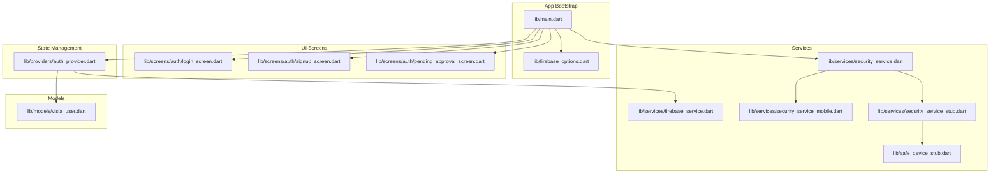
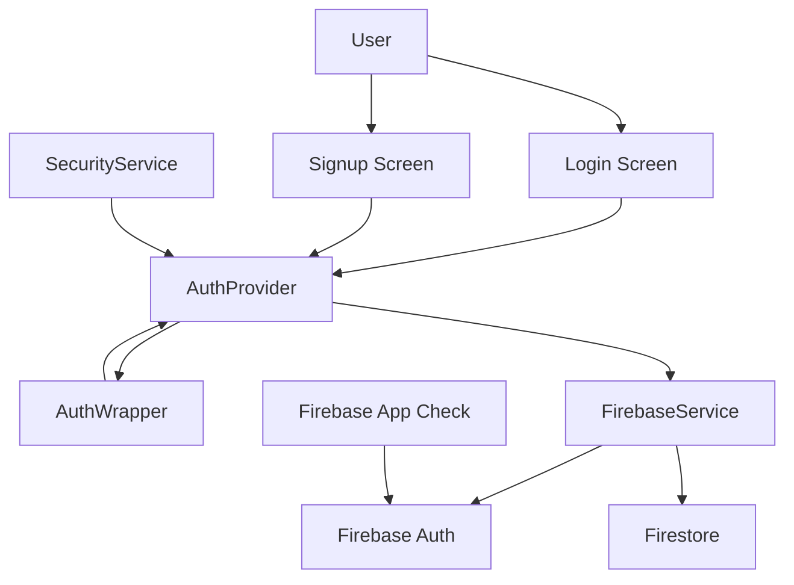
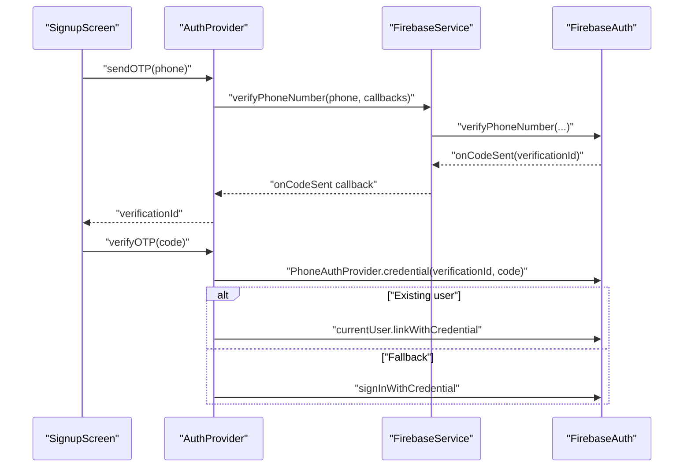
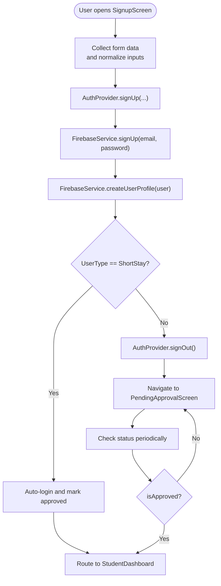
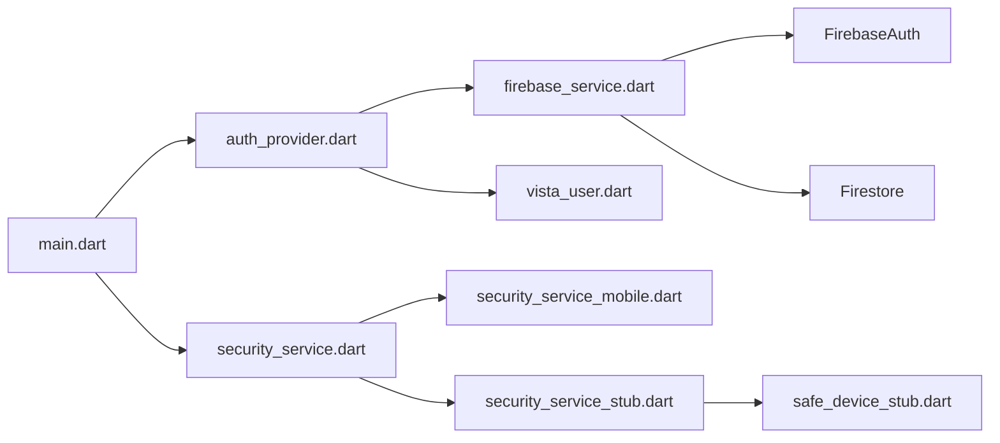

# Authentication System

<cite>
**Referenced Files in This Document**
- [main.dart](file://lib/main.dart)
- [firebase_options.dart](file://lib/firebase_options.dart)
- [auth_provider.dart](file://lib/providers/auth_provider.dart)
- [firebase_service.dart](file://lib/services/firebase_service.dart)
- [security_service.dart](file://lib/services/security_service.dart)
- [security_service_mobile.dart](file://lib/services/security_service_mobile.dart)
- [security_service_stub.dart](file://lib/services/security_service_stub.dart)
- [safe_device_stub.dart](file://lib/safe_device_stub.dart)
- [login_screen.dart](file://lib/screens/auth/login_screen.dart)
- [signup_screen.dart](file://lib/screens/auth/signup_screen.dart)
- [pending_approval_screen.dart](file://lib/screens/auth/pending_approval_screen.dart)
- [vista_user.dart](file://lib/models/vista_user.dart)
</cite>

## Table of Contents
1. [Introduction](#introduction)
2. [Project Structure](#project-structure)
3. [Core Components](#core-components)
4. [Architecture Overview](#architecture-overview)
5. [Detailed Component Analysis](#detailed-component-analysis)
6. [Dependency Analysis](#dependency-analysis)
7. [Performance Considerations](#performance-considerations)
8. [Troubleshooting Guide](#troubleshooting-guide)
9. [Conclusion](#conclusion)

## Introduction
This document describes the multi-role authentication system in VISTA APP, covering phone number verification, user registration, role-based access control (Student, Warden, Head Warden), and security validations. It explains how Firebase Authentication integrates with Firestore-backed user profiles, how custom roles are enforced client-side, and how device integrity checks and App Check are configured for production-grade security. It also documents the user lifecycle from registration through approval and role assignment, along with session management and anti-tampering measures.

## Project Structure
The authentication system spans several layers:
- App bootstrap initializes Firebase and App Check, performs device security checks, and sets up routing.
- Providers manage authentication state and coordinate with Firebase services.
- Screens implement login, registration, and pending approval flows.
- Services encapsulate Firebase operations and security checks.
- Models define user profiles and roles.

**Diagram sources**
- [main.dart:23-85](file://lib/main.dart#L23-L85)
- [firebase_options.dart:18-75](file://lib/firebase_options.dart#L18-L75)
- [login_screen.dart:1-230](file://lib/screens/auth/login_screen.dart#L1-L230)
- [signup_screen.dart:1-625](file://lib/screens/auth/signup_screen.dart#L1-L625)
- [pending_approval_screen.dart:1-60](file://lib/screens/auth/pending_approval_screen.dart#L1-L60)
- [auth_provider.dart:1-206](file://lib/providers/auth_provider.dart#L1-L206)
- [firebase_service.dart:1-668](file://lib/services/firebase_service.dart#L1-L668)
- [security_service.dart:1-14](file://lib/services/security_service.dart#L1-L14)
- [security_service_mobile.dart](file://lib/services/security_service_mobile.dart)
- [security_service_stub.dart:1-11](file://lib/services/security_service_stub.dart#L1-L11)
- [safe_device_stub.dart:1-11](file://lib/safe_device_stub.dart#L1-L11)
- [vista_user.dart:1-96](file://lib/models/vista_user.dart#L1-L96)

**Section sources**
- [main.dart:23-118](file://lib/main.dart#L23-L118)
- [firebase_options.dart:18-75](file://lib/firebase_options.dart#L18-L75)

## Core Components
- Firebase initialization and App Check activation for Android and Apple platforms.
- Device security checks via a platform abstraction that guards against emulators, rooted devices, mock locations, and development mode.
- Authentication provider orchestrating sign-up, sign-in, phone verification, password reset, and sign-out.
- Firebase service encapsulating Auth, Firestore, and derived operations (profile, approvals, short stays, leaves, complaints).
- Role-aware routing and UI wrappers enforcing access control based on user role and approval status.

Key implementation highlights:
- App Check is activated conditionally on non-web platforms and uses debug providers in debug mode and Play Integrity in release.
- Security checks are performed before app runtime and block insecure environments.
- Auth wrapper routes users to appropriate dashboards or pending approval screen based on role and approval state.
- Phone number verification uses Firebase phone auth with manual code entry and linking to existing accounts.

**Section sources**
- [main.dart:45-84](file://lib/main.dart#L45-L84)
- [security_service.dart:1-14](file://lib/services/security_service.dart#L1-L14)
- [auth_provider.dart:1-206](file://lib/providers/auth_provider.dart#L1-L206)
- [firebase_service.dart:1-668](file://lib/services/firebase_service.dart#L1-L668)
- [vista_user.dart:1-96](file://lib/models/vista_user.dart#L1-L96)

## Architecture Overview
The authentication architecture combines client-side routing, state management, and backend services:
- Firebase Authentication manages identities and credentials.
- Firestore stores user profiles and supports role-based queries.
- SecurityService enforces device integrity checks.
- App Check protects backend requests from automated abuse.

**Diagram sources**
- [main.dart:100-146](file://lib/main.dart#L100-L146)
- [login_screen.dart:21-54](file://lib/screens/auth/login_screen.dart#L21-L54)
- [signup_screen.dart:31-138](file://lib/screens/auth/signup_screen.dart#L31-L138)
- [auth_provider.dart:20-34](file://lib/providers/auth_provider.dart#L20-L34)
- [firebase_service.dart:12-28](file://lib/services/firebase_service.dart#L12-L28)
- [security_service.dart:1-14](file://lib/services/security_service.dart#L1-L14)

## Detailed Component Analysis

### Firebase Initialization and App Check
- Initializes Firebase with platform-specific options and prints initialization status.
- Activates Firebase App Check on Android and Apple platforms, using debug providers in debug mode and Play Integrity in release.
- Retrieves a debug token via a platform channel for diagnostics and logs it.

Production-grade security:
- App Check prevents unauthorized access by validating device integrity and app safety.
- Debug providers are used only in debug builds to simplify testing while ensuring production uses Play Integrity.

**Section sources**
- [main.dart:34-58](file://lib/main.dart#L34-L58)
- [main.dart:63-74](file://lib/main.dart#L63-L74)
- [firebase_options.dart:18-75](file://lib/firebase_options.dart#L18-L75)

### Device Integrity Checks
- SecurityService exposes a unified interface for checking device security and real device status.
- On mobile platforms, a platform-specific implementation evaluates emulator/root/mocking conditions.
- On web, a stub implementation is used to satisfy imports without native capabilities.

Anti-tampering measures:
- Blocks emulators, rooted/jailbroken devices, and mock location environments.
- Prevents operation in development mode environments that could compromise integrity.

**Section sources**
- [main.dart:80-82](file://lib/main.dart#L80-L82)
- [security_service.dart:1-14](file://lib/services/security_service.dart#L1-L14)
- [security_service_mobile.dart](file://lib/services/security_service_mobile.dart)
- [security_service_stub.dart:1-11](file://lib/services/security_service_stub.dart#L1-L11)
- [safe_device_stub.dart:1-11](file://lib/safe_device_stub.dart#L1-L11)

### Authentication Provider and User Lifecycle
- AuthProvider listens to Firebase auth state changes and loads user profiles from Firestore.
- Supports sign-up with automatic profile creation and optional immediate sign-in for short-stay students.
- Implements phone number verification and linking to existing accounts.
- Handles sign-in with flexible identifiers (email or normalized phone), resolves email from phone mapping, and loads user profile.
- Manages sign-out with FCM token cleanup and service token deletion.

User lifecycle:
- New registrations create a Firestore profile and set role to Student with isApproved false.
- Short-stay students are auto-approved and remain signed in.
- Pending approvals route students to a dedicated screen until warden approves.
- Role assignment occurs server-side via warden actions; client enforces routing based on role and approval.

**Section sources**
- [auth_provider.dart:20-34](file://lib/providers/auth_provider.dart#L20-L34)
- [auth_provider.dart:51-108](file://lib/providers/auth_provider.dart#L51-L108)
- [auth_provider.dart:113-152](file://lib/providers/auth_provider.dart#L113-L152)
- [auth_provider.dart:165-187](file://lib/providers/auth_provider.dart#L165-L187)
- [auth_provider.dart:189-204](file://lib/providers/auth_provider.dart#L189-L204)

### Firebase Service Layer
- Provides typed access to FirebaseAuth and Firestore (default database).
- Exposes streams for auth state changes and user profile retrieval.
- Implements phone number verification, password reset, and profile CRUD operations.
- Maintains a phone-to-email mapping for robust login resolution by phone number.
- Offers role-based queries for pending registrations and approved students.

Custom claims note:
- The service does not set or refresh custom claims. Role enforcement is client-side via user model and routing.

**Section sources**
- [firebase_service.dart:12-28](file://lib/services/firebase_service.dart#L12-L28)
- [firebase_service.dart:44-59](file://lib/services/firebase_service.dart#L44-L59)
- [firebase_service.dart:67-70](file://lib/services/firebase_service.dart#L67-L70)
- [firebase_service.dart:73-108](file://lib/services/firebase_service.dart#L73-L108)
- [firebase_service.dart:110-146](file://lib/services/firebase_service.dart#L110-L146)

### Role-Based Access Control and Routing
- AuthWrapper selects the appropriate dashboard based on user role and approval status.
- Students awaiting approval are routed to the pending approval screen.
- Approved students proceed to the student dashboard; wardens and head wardens to their respective dashboards.

**Section sources**
- [main.dart:120-146](file://lib/main.dart#L120-L146)
- [pending_approval_screen.dart:1-60](file://lib/screens/auth/pending_approval_screen.dart#L1-L60)
- [vista_user.dart:3-44](file://lib/models/vista_user.dart#L3-L44)

### Phone Number Verification Workflow

**Diagram sources**
- [auth_provider.dart:113-152](file://lib/providers/auth_provider.dart#L113-L152)
- [firebase_service.dart:44-59](file://lib/services/firebase_service.dart#L44-L59)

**Section sources**
- [auth_provider.dart:113-152](file://lib/providers/auth_provider.dart#L113-L152)
- [firebase_service.dart:44-59](file://lib/services/firebase_service.dart#L44-L59)

### Registration and Approval Flow

**Diagram sources**
- [signup_screen.dart:66-138](file://lib/screens/auth/signup_screen.dart#L66-L138)
- [auth_provider.dart:51-108](file://lib/providers/auth_provider.dart#L51-L108)
- [firebase_service.dart:73-78](file://lib/services/firebase_service.dart#L73-L78)
- [pending_approval_screen.dart:1-60](file://lib/screens/auth/pending_approval_screen.dart#L1-L60)
- [main.dart:133-144](file://lib/main.dart#L133-L144)

**Section sources**
- [signup_screen.dart:66-138](file://lib/screens/auth/signup_screen.dart#L66-L138)
- [auth_provider.dart:51-108](file://lib/providers/auth_provider.dart#L51-L108)
- [firebase_service.dart:73-78](file://lib/services/firebase_service.dart#L73-L78)
- [pending_approval_screen.dart:1-60](file://lib/screens/auth/pending_approval_screen.dart#L1-L60)
- [main.dart:133-144](file://lib/main.dart#L133-L144)

### Login Screen and Identifier Resolution
- Accepts email or phone number as identifier.
- Normalizes phone numbers and resolves associated email from Firestore phone mapping.
- Triggers password save prompts on supported platforms.

**Section sources**
- [login_screen.dart:21-54](file://lib/screens/auth/login_screen.dart#L21-L54)
- [auth_provider.dart:165-187](file://lib/providers/auth_provider.dart#L165-L187)
- [firebase_service.dart:88-95](file://lib/services/firebase_service.dart#L88-L95)

### Session Management
- Auth state stream drives user profile loading and UI updates.
- On sign-out, clears FCM tokens from Firestore and deletes device token to ensure clean handover between users.
- Supports staying signed in for short-stay students during registration.

**Section sources**
- [auth_provider.dart:24-34](file://lib/providers/auth_provider.dart#L24-L34)
- [auth_provider.dart:189-204](file://lib/providers/auth_provider.dart#L189-L204)
- [firebase_service.dart:84-86](file://lib/services/firebase_service.dart#L84-L86)

## Dependency Analysis

**Diagram sources**
- [main.dart:6-16](file://lib/main.dart#L6-L16)
- [auth_provider.dart:1-10](file://lib/providers/auth_provider.dart#L1-L10)
- [firebase_service.dart:1-11](file://lib/services/firebase_service.dart#L1-L11)
- [security_service.dart:1-14](file://lib/services/security_service.dart#L1-L14)
- [security_service_mobile.dart](file://lib/services/security_service_mobile.dart)
- [security_service_stub.dart:1-11](file://lib/services/security_service_stub.dart#L1-L11)
- [safe_device_stub.dart:1-11](file://lib/safe_device_stub.dart#L1-L11)
- [vista_user.dart:1-4](file://lib/models/vista_user.dart#L1-L4)

**Section sources**
- [main.dart:6-16](file://lib/main.dart#L6-L16)
- [auth_provider.dart:1-10](file://lib/providers/auth_provider.dart#L1-L10)
- [firebase_service.dart:1-11](file://lib/services/firebase_service.dart#L1-L11)
- [security_service.dart:1-14](file://lib/services/security_service.dart#L1-L14)

## Performance Considerations
- Auth state listener updates are suppressed during sign-up to prevent premature navigation and UI thrashing.
- Firestore profile writes during sign-up use timeouts to avoid blocking the UI on network latency.
- Rate limiters are used for sensitive operations like marking attendance, leaving requests, and short stay submissions to reduce load and prevent abuse.

Recommendations:
- Monitor App Check metrics and adjust thresholds for production traffic.
- Consider caching user profiles locally to reduce Firestore reads on cold starts.
- Use batched writes for bulk operations to minimize latency and cost.

**Section sources**
- [auth_provider.dart:14-15](file://lib/providers/auth_provider.dart#L14-L15)
- [auth_provider.dart:88-96](file://lib/providers/auth_provider.dart#L88-L96)
- [firebase_service.dart:149-153](file://lib/services/firebase_service.dart#L149-L153)
- [firebase_service.dart:205-207](file://lib/services/firebase_service.dart#L205-L207)
- [firebase_service.dart:299-301](file://lib/services/firebase_service.dart#L299-L301)

## Troubleshooting Guide
Common issues and resolutions:
- Firebase initialization failures on web: The app attempts initialization and logs errors; subsequent calls may fail if configuration is missing. Ensure Firebase configuration files are present or environment variables are loaded.
- App Check token acquisition failures: Verify App Check is properly configured for the platform and that debug tokens are retrieved only in debug builds.
- Security violation screen: If the device is detected as insecure (emulator, rooted, mock location), the app displays a blocked screen. Users must disable developer options and use a physical device.
- Phone verification errors: Ensure phone numbers are normalized and that the web verifier is configured for web builds. Handle verification failures gracefully and retry as needed.
- Login failures: Normalize identifiers and resolve emails from phone mappings. Catch specific Firebase exceptions for invalid credentials and network errors.

**Section sources**
- [main.dart:34-58](file://lib/main.dart#L34-L58)
- [main.dart:70-74](file://lib/main.dart#L70-L74)
- [main.dart:148-194](file://lib/main.dart#L148-L194)
- [auth_provider.dart:113-135](file://lib/providers/auth_provider.dart#L113-L135)
- [login_screen.dart:41-53](file://lib/screens/auth/login_screen.dart#L41-L53)

## Conclusion
VISTA APP’s authentication system integrates Firebase Authentication and Firestore to support multi-role access control with robust device integrity checks and App Check protection. The design separates concerns across providers, services, and screens, enabling a clear user lifecycle from registration to approval and role-based routing. While custom claims are not used for role enforcement, the client-side model and routing ensure appropriate access control. Production deployments should rely on App Check with Play Integrity, maintain strict device security checks, and follow the outlined troubleshooting steps to ensure reliability and security.