# Complaint Management System

<cite>
**Referenced Files in This Document**
- [README.md](file://README.md)
- [main.dart](file://lib/main.dart)
- [firebase_options.dart](file://lib/firebase_options.dart)
- [vista_user.dart](file://lib/models/vista_user.dart)
- [complaint_model.dart](file://lib/models/complaint_model.dart)
- [auth_provider.dart](file://lib/providers/auth_provider.dart)
- [student_dashboard.dart](file://lib/screens/student/student_dashboard.dart)
- [warden_dashboard.dart](file://lib/screens/warden/warden_dashboard.dart)
- [head_warden_dashboard.dart](file://lib/screens/head_warden/head_warden_dashboard.dart)
- [firebase_service.dart](file://lib/services/firebase_service.dart)
- [notification_service.dart](file://lib/services/notification_service.dart)
- [security_service.dart](file://lib/services/security_service.dart)
- [notify_watcher.yml](file://.github/workflows/notify_watcher.yml)
- [send_reminders.js](file://scripts/send_reminders.js)
- [firebase.json](file://firebase.json)
- [firestore.rules](file://firestore.rules)
- [firestore.indexes.json](file://firestore.indexes.json)
</cite>

## Table of Contents
1. [Introduction](#introduction)
2. [Project Structure](#project-structure)
3. [Core Components](#core-components)
4. [Architecture Overview](#architecture-overview)
5. [Detailed Component Analysis](#detailed-component-analysis)
6. [Dependency Analysis](#dependency-analysis)
7. [Performance Considerations](#performance-considerations)
8. [Troubleshooting Guide](#troubleshooting-guide)
9. [Conclusion](#conclusion)

## Introduction
This document describes the multi-tier complaint management system within the VISTA hostel management application. It explains how anonymous complaints are filed, how complaints are categorized and escalated, how wardens coordinate responses, and how real-time updates and notifications are integrated. It also covers the complaint lifecycle from filing through resolution, evidence collection, investigation processes, closure procedures, anonymous submission options, complaint statistics tracking, and administrative oversight capabilities for head wardens.

## Project Structure
The complaint management system spans UI dashboards, models, providers, services, and backend integrations:
- UI dashboards for students, wardens, and head wardens
- Data models for users and complaints
- Authentication and authorization via Firebase
- Real-time Firestore streams for live updates
- Notification service for push notifications
- Security service for device checks
- GitHub Actions and Node.js scripts for background automation

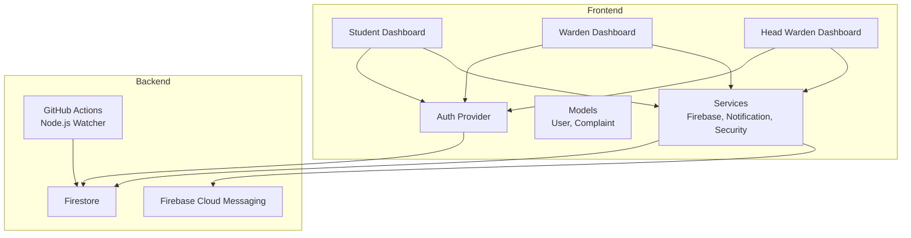

**Diagram sources**
- [main.dart:100-117](file://lib/main.dart#L100-L117)
- [auth_provider.dart:24-34](file://lib/providers/auth_provider.dart#L24-L34)
- [firebase_service.dart](file://lib/services/firebase_service.dart)
- [notification_service.dart](file://lib/services/notification_service.dart)
- [notify_watcher.yml](file://github/workflows/notify_watcher.yml)

**Section sources**
- [README.md:82-89](file://README.md#L82-L89)
- [main.dart:100-117](file://lib/main.dart#L100-L117)

## Core Components
- Complaint model encapsulates complaint metadata, target roles, status, anonymity, escalation flag, timestamps, and notification tracking.
- User model defines roles (student, warden, head warden) and associated attributes.
- Auth provider manages authentication state, user profile retrieval, and notification initialization.
- Student dashboard integrates complaint tabs and listens for real-time updates.
- Warden and head warden dashboards include complaint management tabs with activity markers and export capabilities.
- Firebase service provides Firestore queries and streams for complaints.
- Notification service initializes and manages FCM tokens and notifications.
- Security service validates device authenticity.

**Section sources**
- [complaint_model.dart:3-84](file://lib/models/complaint_model.dart#L3-L84)
- [vista_user.dart:3-96](file://lib/models/vista_user.dart#L3-L96)
- [auth_provider.dart:24-49](file://lib/providers/auth_provider.dart#L24-L49)
- [student_dashboard.dart:91-97](file://lib/screens/student/student_dashboard.dart#L91-L97)
- [warden_dashboard.dart:224-237](file://lib/screens/warden/warden_dashboard.dart#L224-L237)
- [head_warden_dashboard.dart:202-215](file://lib/screens/head_warden/head_warden_dashboard.dart#L202-L215)
- [firebase_service.dart](file://lib/services/firebase_service.dart)
- [notification_service.dart](file://lib/services/notification_service.dart)
- [security_service.dart](file://lib/services/security_service.dart)

## Architecture Overview
The complaint management architecture leverages Firebase Firestore for real-time data synchronization, Provider for state management, and FCM for push notifications. The system supports three tiers:
- Student tier: file anonymous or non-anonymous complaints, track status, receive notifications.
- Warden tier: triage, investigate, escalate, and resolve complaints within hostels.
- Head warden tier: oversee escalated complaints across hostels, generate reports, and export data.

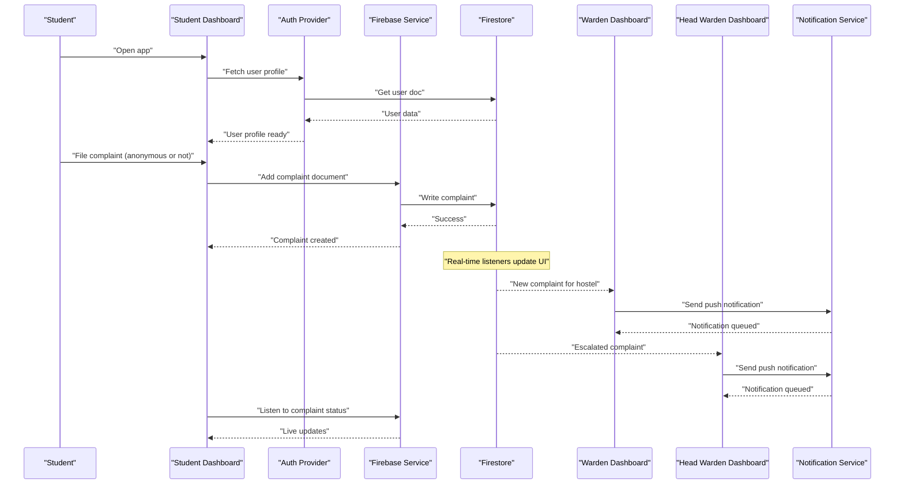

**Diagram sources**
- [auth_provider.dart:36-49](file://lib/providers/auth_provider.dart#L36-L49)
- [student_dashboard.dart:91-97](file://lib/screens/student/student_dashboard.dart#L91-L97)
- [warden_dashboard.dart:224-237](file://lib/screens/warden/warden_dashboard.dart#L224-L237)
- [head_warden_dashboard.dart:202-215](file://lib/screens/head_warden/head_warden_dashboard.dart#L202-L215)
- [notification_service.dart](file://lib/services/notification_service.dart)

## Detailed Component Analysis

### Anonymous Complaint Submission
- Anonymous mode hides the student identifier while preserving searchable student name for administrative purposes.
- The complaint model stores both studentId and studentName, enabling targeted filtering and search without exposing identity when anonymous is selected.
- Student dashboard integrates complaint tabs and subscribes to real-time complaint streams for live updates.

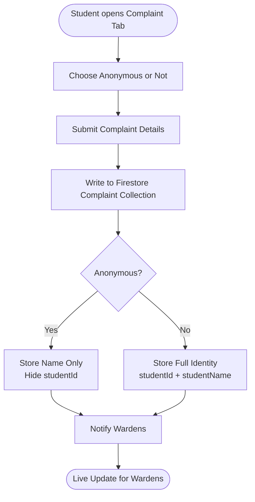

**Diagram sources**
- [complaint_model.dart:5-38](file://lib/models/complaint_model.dart#L5-L38)
- [student_dashboard.dart:241](file://lib/screens/student/student_dashboard.dart#L241)

**Section sources**
- [complaint_model.dart:5-38](file://lib/models/complaint_model.dart#L5-L38)
- [student_dashboard.dart:241](file://lib/screens/student/student_dashboard.dart#L241)

### Complaint Categorization and Target Roles
- Complaints specify targetRoles as a list, allowing routing to warden, head warden, maintenance, or other departments.
- The model preserves backward compatibility by keeping targetRole alongside targetRoles.
- Dashboards filter complaints by role and hostel to ensure appropriate visibility and responsibility.

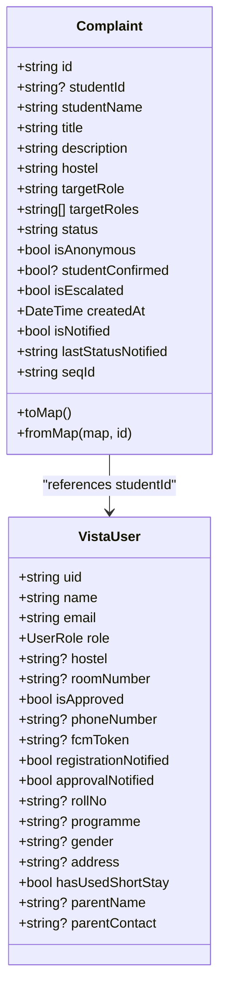

**Diagram sources**
- [complaint_model.dart:3-84](file://lib/models/complaint_model.dart#L3-L84)
- [vista_user.dart:5-96](file://lib/models/vista_user.dart#L5-L96)

**Section sources**
- [complaint_model.dart:47-71](file://lib/models/complaint_model.dart#L47-L71)
- [warden_dashboard.dart:226](file://lib/screens/warden/warden_dashboard.dart#L226)
- [head_warden_dashboard.dart:204](file://lib/screens/head_warden/head_warden_dashboard.dart#L204)

### Escalation Workflows
- Escalation is tracked via isEscalated flag and targetRoles expansion to include higher authorities.
- Head warden dashboards listen for complaints designated for head warden role and display activity markers.
- Escalation triggers notifications to head wardens and updates complaint status accordingly.

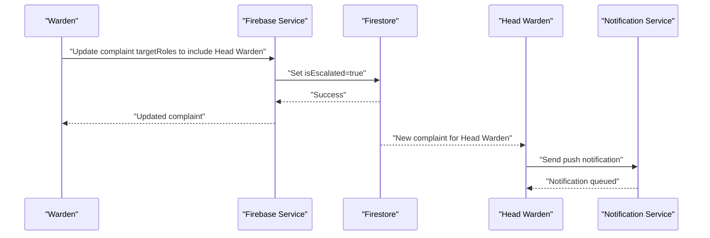

**Diagram sources**
- [warden_dashboard.dart:226](file://lib/screens/warden/warden_dashboard.dart#L226)
- [head_warden_dashboard.dart:204](file://lib/screens/head_warden/head_warden_dashboard.dart#L204)
- [notification_service.dart](file://lib/services/notification_service.dart)

**Section sources**
- [complaint_model.dart:15](file://lib/models/complaint_model.dart#L15)
- [warden_dashboard.dart:226](file://lib/screens/warden/warden_dashboard.dart#L226)
- [head_warden_dashboard.dart:204](file://lib/screens/head_warden/head_warden_dashboard.dart#L204)

### Warden Coordination Mechanisms
- Warden dashboard maintains activity markers for new complaints and displays snackbars to draw attention to pending items.
- Real-time streams for complaints enable immediate response and status updates.
- Export functionality allows wardens to export complaint data for reporting and audits.

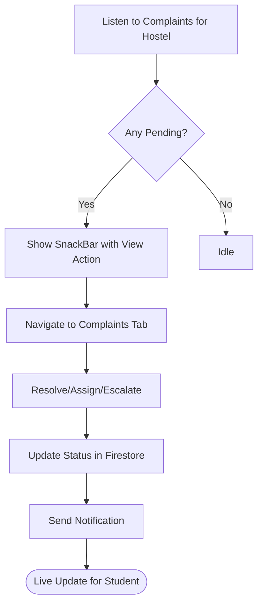

**Diagram sources**
- [warden_dashboard.dart:181-256](file://lib/screens/warden/warden_dashboard.dart#L181-L256)
- [warden_dashboard.dart:120-134](file://lib/screens/warden/warden_dashboard.dart#L120-L134)

**Section sources**
- [warden_dashboard.dart:181-256](file://lib/screens/warden/warden_dashboard.dart#L181-L256)
- [warden_dashboard.dart:120-134](file://lib/screens/warden/warden_dashboard.dart#L120-L134)

### Real-Time Updates and Resolution Tracking
- Student dashboard subscribes to complaint streams to reflect live status changes.
- Complaint model tracks lastStatusNotified and isNotified to prevent duplicate notifications.
- Resolution involves updating status, optionally requiring student confirmation, and closing the case.

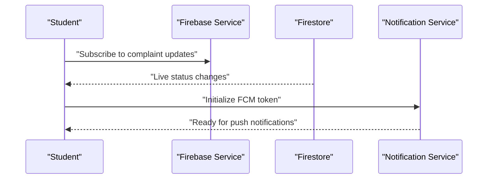

**Diagram sources**
- [student_dashboard.dart:91-97](file://lib/screens/student/student_dashboard.dart#L91-L97)
- [auth_provider.dart:42-46](file://lib/providers/auth_provider.dart#L42-L46)
- [notification_service.dart](file://lib/services/notification_service.dart)

**Section sources**
- [student_dashboard.dart:91-97](file://lib/screens/student/student_dashboard.dart#L91-L97)
- [complaint_model.dart:17-18](file://lib/models/complaint_model.dart#L17-L18)

### Integration with Notification System
- NotificationService initializes FCM tokens upon user login and clears tokens on logout.
- GitHub Actions Node.js watcher periodically checks Firestore for changes and triggers notifications.
- Nightly attendance reminders are scheduled via GitHub Actions workflow.

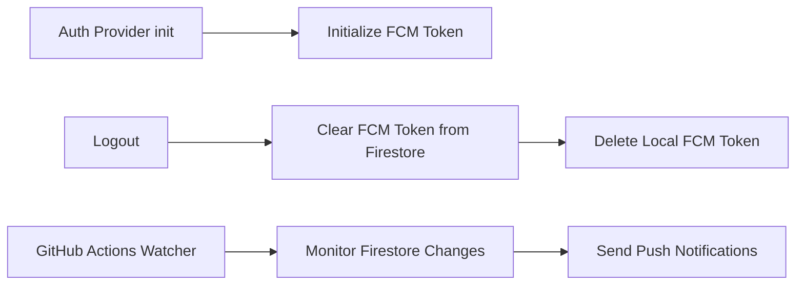

**Diagram sources**
- [auth_provider.dart:42-46](file://lib/providers/auth_provider.dart#L42-L46)
- [auth_provider.dart:193-202](file://lib/providers/auth_provider.dart#L193-L202)
- [notify_watcher.yml](file://github/workflows/notify_watcher.yml)
- [send_reminders.js](file://scripts/send_reminders.js)

**Section sources**
- [auth_provider.dart:42-46](file://lib/providers/auth_provider.dart#L42-L46)
- [auth_provider.dart:193-202](file://lib/providers/auth_provider.dart#L193-L202)
- [README.md:19-25](file://README.md#L19-L25)
- [notify_watcher.yml](file://github/workflows/notify_watcher.yml)
- [send_reminders.js](file://scripts/send_reminders.js)

### Complaint Lifecycle: Filing to Closure
- Filing: Student submits complaint with optional anonymity; complaint stored with metadata and initial status.
- Investigation: Warden reviews complaint, collects evidence, assigns status, and communicates with student.
- Escalation: If unresolved, warden escalates to head warden with expanded targetRoles.
- Resolution: Head warden resolves complaint; student may confirm resolution; system updates status and notifies parties.
- Closure: Complaint marked closed with final status and timestamp.

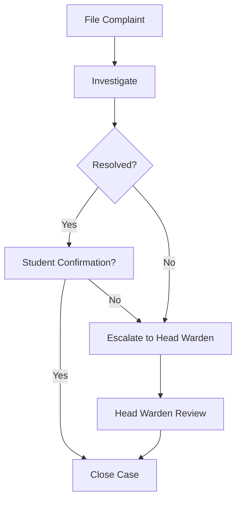

**Diagram sources**
- [complaint_model.dart:12-14](file://lib/models/complaint_model.dart#L12-L14)
- [warden_dashboard.dart:226](file://lib/screens/warden/warden_dashboard.dart#L226)
- [head_warden_dashboard.dart:204](file://lib/screens/head_warden/head_warden_dashboard.dart#L204)

**Section sources**
- [complaint_model.dart:12-14](file://lib/models/complaint_model.dart#L12-L14)
- [warden_dashboard.dart:226](file://lib/screens/warden/warden_dashboard.dart#L226)
- [head_warden_dashboard.dart:204](file://lib/screens/head_warden/head_warden_dashboard.dart#L204)

### Evidence Collection and Investigation Processes
- While the code does not define explicit evidence fields in the complaint model, the complaint document supports arbitrary fields for attachments or references.
- Investigation is performed within the warden and head warden dashboards, with real-time updates visible to students.
- Escalation ensures higher authority involvement when local resolution is insufficient.

**Section sources**
- [complaint_model.dart:40-58](file://lib/models/complaint_model.dart#L40-L58)
- [warden_dashboard.dart:224-237](file://lib/screens/warden/warden_dashboard.dart#L224-L237)
- [head_warden_dashboard.dart:202-215](file://lib/screens/head_warden/head_warden_dashboard.dart#L202-L215)

### Complaint Statistics Tracking and Administrative Oversight
- Head warden dashboard aggregates complaints across hostels and provides export capabilities for compliance and reporting.
- Activity markers highlight pending items across registrations, leaves, complaints, and short stays.
- Export dialog supports exporting complaint data for specific date ranges and hostels.

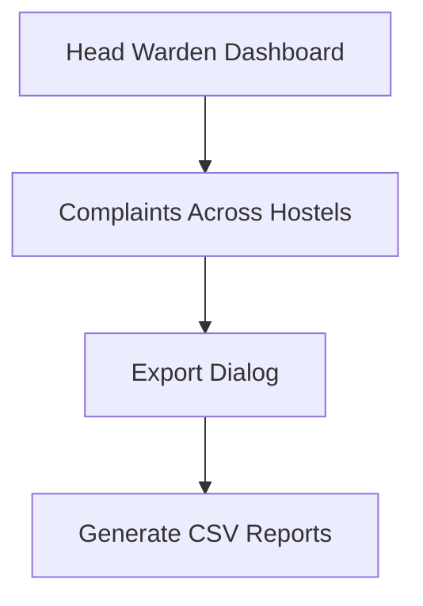

**Diagram sources**
- [head_warden_dashboard.dart:58-169](file://lib/screens/head_warden/head_warden_dashboard.dart#L58-L169)

**Section sources**
- [head_warden_dashboard.dart:58-169](file://lib/screens/head_warden/head_warden_dashboard.dart#L58-L169)

## Dependency Analysis
The system exhibits layered dependencies:
- UI dashboards depend on Provider for state and on Firebase service for data access.
- Auth provider depends on Firebase service and notification service for initialization.
- Security service is used for device checks and blocking unauthorized environments.
- Firestore rules and indexes enforce access control and query performance.

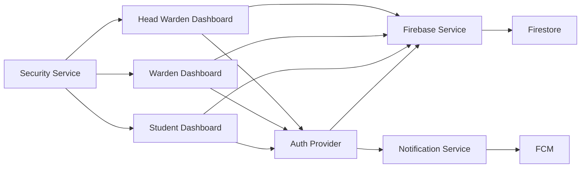

**Diagram sources**
- [main.dart:100-117](file://lib/main.dart#L100-L117)
- [auth_provider.dart:24-49](file://lib/providers/auth_provider.dart#L24-L49)
- [firebase_service.dart](file://lib/services/firebase_service.dart)
- [notification_service.dart](file://lib/services/notification_service.dart)
- [security_service.dart](file://lib/services/security_service.dart)

**Section sources**
- [main.dart:100-117](file://lib/main.dart#L100-L117)
- [auth_provider.dart:24-49](file://lib/providers/auth_provider.dart#L24-L49)
- [firebase_service.dart](file://lib/services/firebase_service.dart)
- [notification_service.dart](file://lib/services/notification_service.dart)
- [security_service.dart](file://lib/services/security_service.dart)

## Performance Considerations
- Real-time streams reduce polling overhead; ensure proper subscription lifecycle management to avoid leaks.
- Firestore queries should leverage indexes defined in firestore.indexes.json for optimal performance.
- Device security checks (SecurityService) prevent emulator/rooted device usage, reducing risk and improving data integrity.
- Background automation via GitHub Actions minimizes server costs while maintaining reliability.

[No sources needed since this section provides general guidance]

## Troubleshooting Guide
- Authentication failures: Verify Firebase initialization and credentials; check .env configuration and platform-specific debug tokens.
- Notification issues: Confirm FCM token initialization on login and clearing on logout; ensure GitHub Actions secrets are configured.
- Real-time sync problems: Validate Firestore rules and indexes; confirm streams are subscribed/unsubscribed properly.
- Security violations: If blocked screen appears, ensure device is not rooted/emulated and mock locations are disabled.

**Section sources**
- [main.dart:23-84](file://lib/main.dart#L23-L84)
- [auth_provider.dart:193-202](file://lib/providers/auth_provider.dart#L193-L202)
- [README.md:62-66](file://README.md#L62-L66)
- [firestore.rules](file://firestore.rules)
- [firestore.indexes.json](file://firestore.indexes.json)

## Conclusion
The VISTA complaint management system provides a robust, multi-tier solution for handling student complaints with anonymous options, real-time updates, escalation workflows, and administrative oversight. Its architecture balances security, scalability, and usability through Firebase, Provider, and FCM, supported by GitHub Actions for background automation.