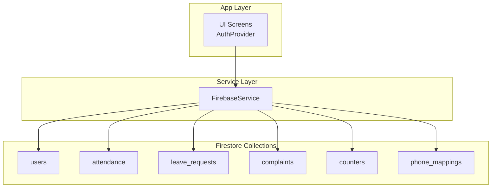
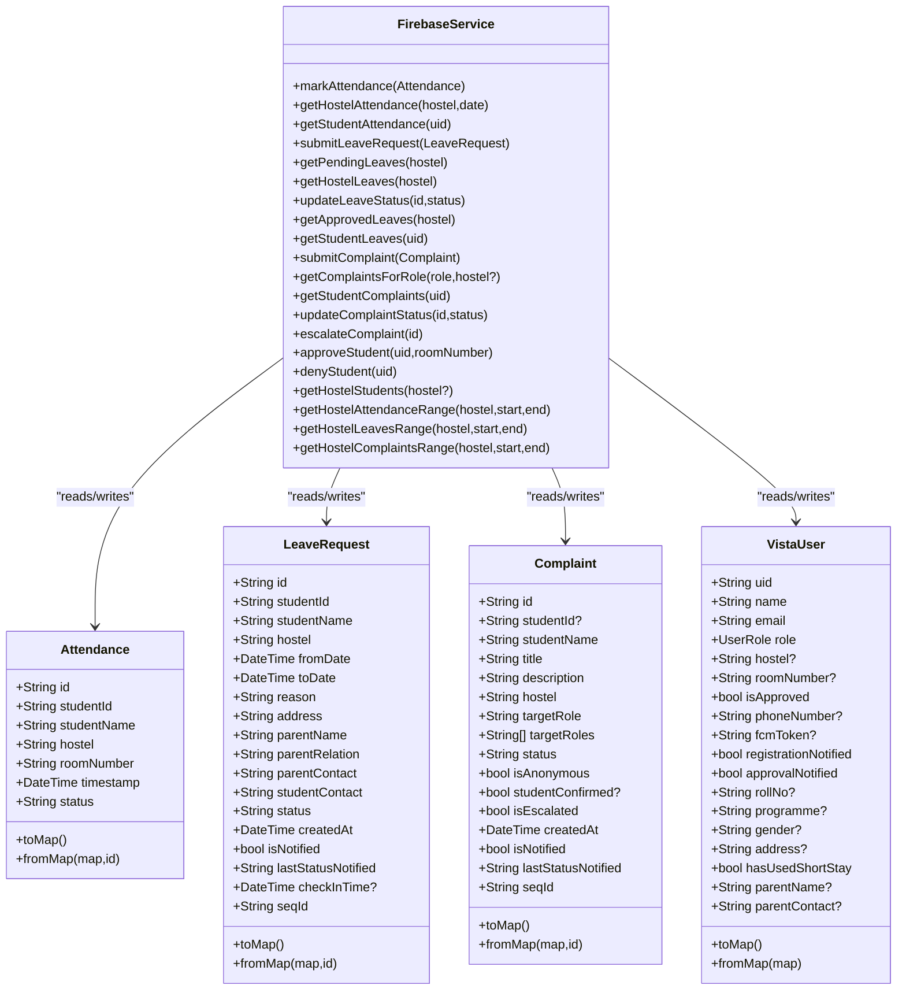
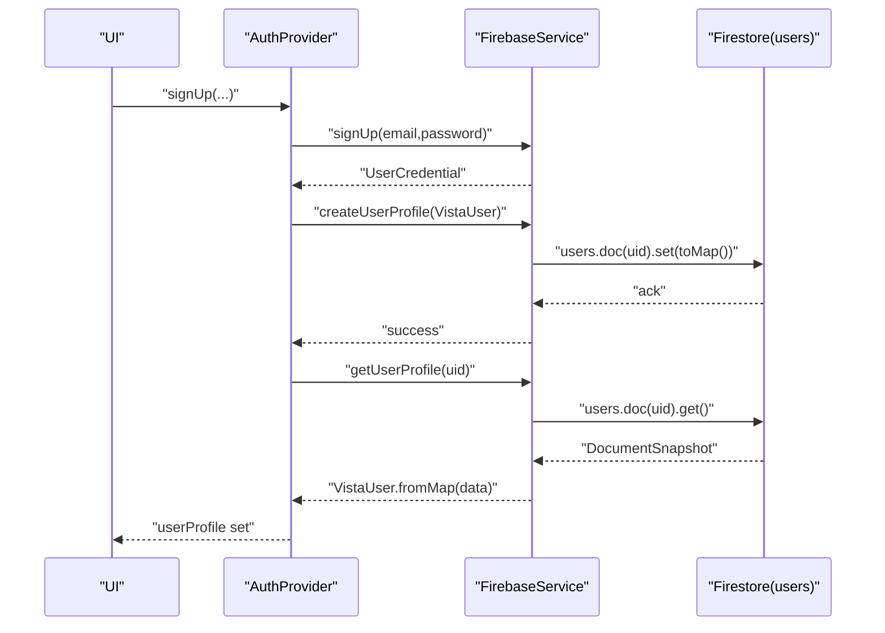
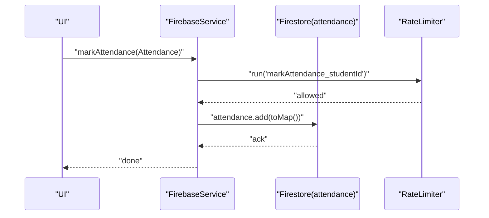
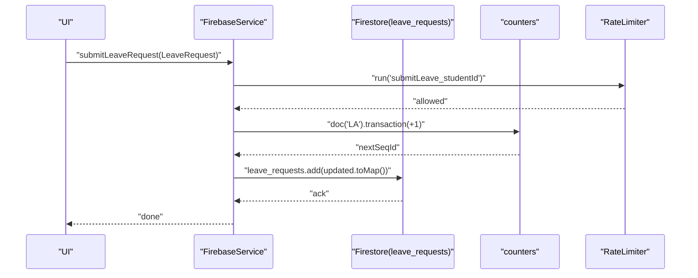
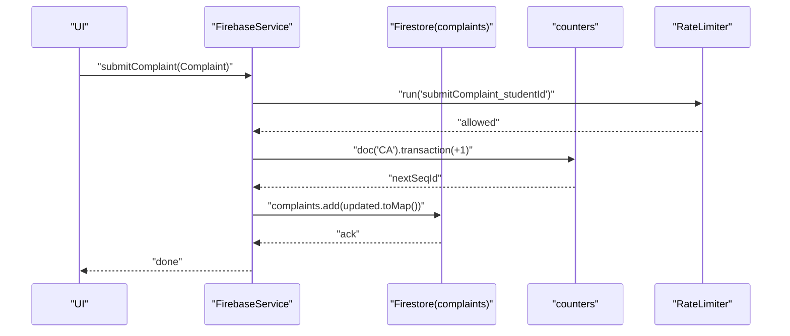
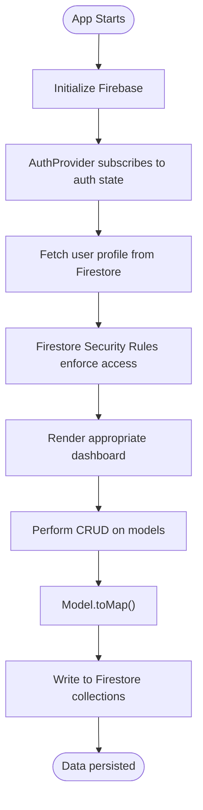
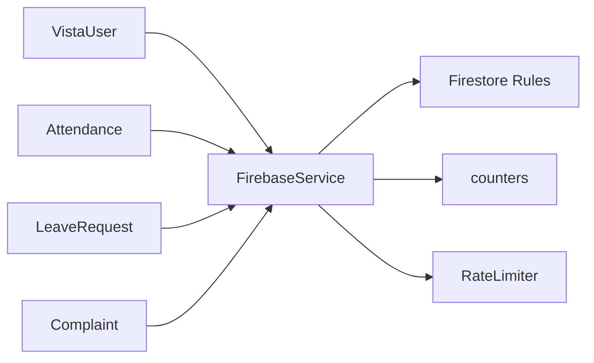

# Data Models and Schema

<cite>
**Referenced Files in This Document**
- [vista_user.dart](file://lib/models/vista_user.dart)
- [attendance_model.dart](file://lib/models/attendance_model.dart)
- [leave_request_model.dart](file://lib/models/leave_request_model.dart)
- [complaint_model.dart](file://lib/models/complaint_model.dart)
- [short_stay_model.dart](file://lib/models/short_stay_model.dart)
- [firebase_service.dart](file://lib/services/firebase_service.dart)
- [firebase_rules](file://firestore.rules)
- [firebase_indexes](file://firestore.indexes.json)
- [main.dart](file://lib/main.dart)
- [auth_provider.dart](file://lib/providers/auth_provider.dart)
- [face_recognition_service.dart](file://lib/services/face_recognition_service.dart)
- [rate_limiter.dart](file://lib/utils/rate_limiter.dart)
- [pubspec.yaml](file://pubspec.yaml)
</cite>

## Table of Contents
1. [Introduction](#introduction)
2. [Project Structure](#project-structure)
3. [Core Components](#core-components)
4. [Architecture Overview](#architecture-overview)
5. [Detailed Component Analysis](#detailed-component-analysis)
6. [Dependency Analysis](#dependency-analysis)
7. [Performance Considerations](#performance-considerations)
8. [Troubleshooting Guide](#troubleshooting-guide)
9. [Conclusion](#conclusion)
10. [Appendices](#appendices)

## Introduction
This document provides comprehensive data model documentation for the VISTA APP database schema. It focuses on the entity relationships among VistaUser, AttendanceRecord (Attendance), LeaveRequest, and Complaint models. It documents field definitions, data types, validation rules, and business constraints for each model, explains Firestore collection structure, indexing strategies, and query optimization patterns, and covers data lifecycle management, privacy considerations for biometric data, and access control via role-based permissions. It also addresses data serialization/deserialization, null safety, model validation, migration strategies, versioning considerations, and backup/recovery procedures.

## Project Structure
The VISTA APP organizes data models under the models directory and integrates with Firestore via a centralized service layer. Authentication and role-based access control are enforced by Firestore security rules. The application uses a provider-based state management pattern to manage user profiles and navigation.

**Diagram sources**
- [main.dart:100-117](file://lib/main.dart#L100-L117)
- [auth_provider.dart:8-34](file://lib/providers/auth_provider.dart#L8-L34)
- [firebase_service.dart:12-22](file://lib/services/firebase_service.dart#L12-L22)

**Section sources**
- [main.dart:100-117](file://lib/main.dart#L100-L117)
- [auth_provider.dart:8-34](file://lib/providers/auth_provider.dart#L8-L34)
- [firebase_service.dart:12-22](file://lib/services/firebase_service.dart#L12-L22)

## Core Components
This section documents the four primary data models and their relationships to Firestore collections.

- VistaUser
  - Purpose: Represents user profiles with roles and hostel assignments.
  - Collections: users
  - Key fields: uid, name, email, role, hostel, roomNumber, isApproved, phoneNumber, fcmToken, registrationNotified, approvalNotified, rollNo, programme, gender, address, hasUsedShortStay, parentName, parentContact.
  - Validation rules: Role is an enum; optional fields include hostel, roomNumber, phoneNumber, fcmToken, rollNo, programme, gender, address, parentName, parentContact; defaults for booleans and counters are defined in the model.
  - Business constraints: Role determines access control; approval flag gates dashboard access; phone mappings enable secure lookup.

- Attendance
  - Purpose: Records student attendance events with timestamps and status.
  - Collections: attendance
  - Key fields: id, studentId, studentName, hostel, roomNumber, timestamp, status.
  - Validation rules: Status is constrained to Present/Absent; timestamp is stored as Firestore Timestamp; a derived date string is included for efficient filtering.
  - Business constraints: Each record is associated with a single student; queries filter by date and hostel.

- LeaveRequest
  - Purpose: Manages leave applications with dates, reasons, and approvals.
  - Collections: leave_requests
  - Key fields: id, studentId, studentName, hostel, fromDate, toDate, reason, address, parentName, parentRelation, parentContact, studentContact, status, createdAt, isNotified, lastStatusNotified, checkInTime, seqId.
  - Validation rules: Status constrained to Pending/Approved/Rejected; seqId generated via counters; checkInTime optional.
  - Business constraints: Sequential IDs generated via counters; status updates controlled by roles; check-in timestamp recorded upon return.

- Complaint
  - Purpose: Tracks complaints submitted by students with escalation capabilities.
  - Collections: complaints
  - Key fields: id, studentId, studentName, title, description, hostel, targetRole, targetRoles, status, isAnonymous, studentConfirmed, isEscalated, createdAt, isNotified, lastStatusNotified, seqId.
  - Validation rules: Status constrained to Pending/Resolved; targetRoles supports multiple recipients; sequential IDs generated via counters.
  - Business constraints: Escalation routes to Head Warden; anonymous mode hides student identity from wardens.

**Section sources**
- [vista_user.dart:5-95](file://lib/models/vista_user.dart#L5-L95)
- [attendance_model.dart:3-45](file://lib/models/attendance_model.dart#L3-L45)
- [leave_request_model.dart:3-89](file://lib/models/leave_request_model.dart#L3-L89)
- [complaint_model.dart:3-83](file://lib/models/complaint_model.dart#L3-L83)

## Architecture Overview
The data architecture centers on Firestore collections mapped to Dart models. Access control is enforced by Firestore security rules. Sequential IDs are generated using a counters collection with transactions. Rate limiting protects critical write operations.

**Diagram sources**
- [vista_user.dart:5-95](file://lib/models/vista_user.dart#L5-L95)
- [attendance_model.dart:3-45](file://lib/models/attendance_model.dart#L3-L45)
- [leave_request_model.dart:3-89](file://lib/models/leave_request_model.dart#L3-L89)
- [complaint_model.dart:3-83](file://lib/models/complaint_model.dart#L3-L83)
- [firebase_service.dart:148-667](file://lib/services/firebase_service.dart#L148-L667)

## Detailed Component Analysis

### VistaUser Model
- Serialization/deserialization
  - toMap serializes all fields and sets createdAt to server timestamp.
  - fromMap reconstructs the model with defaults for missing fields.
- Null safety
  - Optional fields are nullable; defaults are provided in fromMap.
- Validation rules
  - Role enum values are parsed from string representation.
- Business constraints
  - isApproved controls dashboard access; role determines access control.

**Diagram sources**
- [auth_provider.dart:51-108](file://lib/providers/auth_provider.dart#L51-L108)
- [firebase_service.dart:73-146](file://lib/services/firebase_service.dart#L73-L146)
- [vista_user.dart:46-95](file://lib/models/vista_user.dart#L46-L95)

**Section sources**
- [vista_user.dart:5-95](file://lib/models/vista_user.dart#L5-L95)
- [auth_provider.dart:51-108](file://lib/providers/auth_provider.dart#L51-L108)
- [firebase_service.dart:73-146](file://lib/services/firebase_service.dart#L73-L146)

### Attendance Model
- Serialization/deserialization
  - toMap converts timestamp to Firestore Timestamp and derives a date string.
  - fromMap reconstructs timestamp and applies defaults.
- Null safety
  - Defaults for status and other fields are handled in fromMap.
- Validation rules
  - Status constrained to Present/Absent.
- Business constraints
  - Queries filter by date and hostel; sorted by timestamp descending for recent records.

**Diagram sources**
- [attendance_model.dart:22-32](file://lib/models/attendance_model.dart#L22-L32)
- [firebase_service.dart:149-153](file://lib/services/firebase_service.dart#L149-L153)
- [rate_limiter.dart:32-38](file://lib/utils/rate_limiter.dart#L32-L38)

**Section sources**
- [attendance_model.dart:3-45](file://lib/models/attendance_model.dart#L3-L45)
- [firebase_service.dart:149-181](file://lib/services/firebase_service.dart#L149-L181)
- [rate_limiter.dart:32-38](file://lib/utils/rate_limiter.dart#L32-L38)

### LeaveRequest Model
- Serialization/deserialization
  - toMap converts date fields to Firestore Timestamp; seqId is populated via counters.
  - fromMap reconstructs timestamps and applies defaults for booleans and optional fields.
- Null safety
  - Optional fields like checkInTime are nullable; defaults are provided.
- Validation rules
  - Status constrained to Pending/Approved/Rejected; isNotified defaults to true for existing docs.
- Business constraints
  - Sequential IDs generated via counters; status updates restricted by roles; checkInTime recorded on return.

**Diagram sources**
- [leave_request_model.dart:44-64](file://lib/models/leave_request_model.dart#L44-L64)
- [firebase_service.dart:205-228](file://lib/services/firebase_service.dart#L205-L228)
- [firebase_service.dart:184-202](file://lib/services/firebase_service.dart#L184-L202)

**Section sources**
- [leave_request_model.dart:3-89](file://lib/models/leave_request_model.dart#L3-L89)
- [firebase_service.dart:205-296](file://lib/services/firebase_service.dart#L205-L296)
- [firebase_service.dart:184-202](file://lib/services/firebase_service.dart#L184-L202)

### Complaint Model
- Serialization/deserialization
  - toMap writes targetRole and targetRoles; seqId populated via counters.
  - fromMap reconstructs lists and timestamps with defaults.
- Null safety
  - studentConfirmed is nullable; defaults applied in fromMap.
- Validation rules
  - Status constrained to Pending/Resolved; isAnonymous defaults to true.
- Business constraints
  - Escalation updates targetRoles to Head Warden; anonymous mode hides identity.

**Diagram sources**
- [complaint_model.dart:40-57](file://lib/models/complaint_model.dart#L40-L57)
- [firebase_service.dart:431-452](file://lib/services/firebase_service.dart#L431-L452)
- [firebase_service.dart:184-202](file://lib/services/firebase_service.dart#L184-L202)

**Section sources**
- [complaint_model.dart:3-83](file://lib/models/complaint_model.dart#L3-L83)
- [firebase_service.dart:431-501](file://lib/services/firebase_service.dart#L431-L501)
- [firebase_service.dart:184-202](file://lib/services/firebase_service.dart#L184-L202)

### Conceptual Overview
The following conceptual flow illustrates how models relate to Firestore collections and how access control is enforced.

[No sources needed since this diagram shows conceptual workflow, not actual code structure]

## Dependency Analysis
- Model-to-Service dependencies
  - Each model’s toMap/fromMap is consumed by FirebaseService methods that write/read from Firestore.
- Service-to-Rule dependencies
  - FirebaseService methods align with Firestore security rules to ensure authorized access.
- Counter and rate limiting
  - Sequential IDs rely on counters collection and transactions; rate limiting protects critical operations.

**Diagram sources**
- [firebase_service.dart:148-667](file://lib/services/firebase_service.dart#L148-L667)
- [firebase_rules:1-109](file://firestore.rules#L1-L109)
- [rate_limiter.dart:5-47](file://lib/utils/rate_limiter.dart#L5-L47)

**Section sources**
- [firebase_service.dart:148-667](file://lib/services/firebase_service.dart#L148-L667)
- [firebase_rules:1-109](file://firestore.rules#L1-L109)
- [rate_limiter.dart:5-47](file://lib/utils/rate_limiter.dart#L5-L47)

## Performance Considerations
- Indexing strategies
  - Current indexes configuration is empty; consider adding composite indexes for frequent queries:
    - attendance: date + hostel, studentId + timestamp
    - leave_requests: status + hostel + createdAt, studentId + createdAt
    - complaints: targetRoles + hostel + createdAt, studentId + createdAt
- Query optimization patterns
  - Use equality filters first, then range filters; sort client-side only when necessary.
  - Leverage derived date fields (e.g., Attendance.date) for efficient daily queries.
- Rate limiting
  - Critical write operations are protected by a rate limiter to prevent spamming.

**Section sources**
- [firebase_indexes:1-4](file://firestore.indexes.json#L1-L4)
- [firebase_service.dart:155-181](file://lib/services/firebase_service.dart#L155-L181)
- [firebase_service.dart:230-296](file://lib/services/firebase_service.dart#L230-L296)
- [firebase_service.dart:454-491](file://lib/services/firebase_service.dart#L454-L491)
- [rate_limiter.dart:32-38](file://lib/utils/rate_limiter.dart#L32-L38)

## Troubleshooting Guide
- Authentication and user profile
  - Ensure Firebase is initialized before use; handle exceptions during initialization.
  - AuthProvider listens to auth state and fetches user profiles; verify Firestore reads succeed.
- Access control issues
  - Verify Firestore rules permit read/write operations for the current user’s role.
  - Check that document IDs match expectations (UID vs email fallback).
- Biometric data privacy
  - Face embeddings are not stored in Firestore; only computed embeddings are used for recognition.
  - Ensure the MobileFaceNet model is loaded and used for inference only locally.
- Rate limiting
  - If rate-limited, retry after the cooldown period; adjust cooldown if needed.

**Section sources**
- [main.dart:23-84](file://lib/main.dart#L23-L84)
- [auth_provider.dart:24-49](file://lib/providers/auth_provider.dart#L24-L49)
- [firebase_rules:15-36](file://firestore.rules#L15-L36)
- [firebase_service.dart:110-146](file://lib/services/firebase_service.dart#L110-L146)
- [face_recognition_service.dart:16-26](file://lib/services/face_recognition_service.dart#L16-L26)
- [rate_limiter.dart:13-28](file://lib/utils/rate_limiter.dart#L13-L28)

## Conclusion
The VISTA APP data models are designed around Firestore collections with clear serialization/deserialization patterns and role-based access control. Sequential IDs and rate limiting enhance reliability and integrity. Current indexing is minimal; adding targeted composite indexes will improve query performance. Privacy is maintained by avoiding storage of raw biometric data, relying instead on local inference.

## Appendices

### Firestore Collection Structure and Relationships
- users
  - Fields: uid, name, email, role, hostel, roomNumber, isApproved, phoneNumber, fcmToken, registrationNotified, approvalNotified, rollNo, programme, gender, address, hasUsedShortStay, parentName, parentContact, createdAt.
  - Access control: Self-read/update; warden/headWarden read/update; face embeddings access restricted.
- attendance
  - Fields: studentId, studentName, hostel, roomNumber, timestamp, status, date.
  - Access control: Owner read; warden/headWarden read.
- leave_requests
  - Fields: studentId, studentName, hostel, fromDate, toDate, reason, address, parentName, parentRelation, parentContact, studentContact, status, createdAt, isNotified, lastStatusNotified, checkInTime, seqId.
  - Access control: Owner create/read; warden/headWarden create/read/update; status updates controlled by roles.
- complaints
  - Fields: studentId, studentName, title, description, hostel, targetRole, targetRoles, status, isAnonymous, studentConfirmed, isEscalated, createdAt, isNotified, lastStatusNotified, seqId.
  - Access control: Owner create/read; warden/headWarden create/read/update; escalation updates targetRoles.
- counters
  - Fields: current.
  - Access control: Authenticated read/write.
- phone_mappings
  - Fields: email, updatedAt.
  - Access control: Get allowed; list denied; write allowed for authenticated users.

**Section sources**
- [firebase_rules:15-106](file://firestore.rules#L15-L106)
- [firebase_service.dart:72-108](file://lib/services/firebase_service.dart#L72-L108)
- [firebase_service.dart:148-181](file://lib/services/firebase_service.dart#L148-L181)
- [firebase_service.dart:204-296](file://lib/services/firebase_service.dart#L204-L296)
- [firebase_service.dart:430-501](file://lib/services/firebase_service.dart#L430-L501)

### Data Lifecycle Management
- Creation
  - Models are serialized via toMap and written to Firestore; sequential IDs generated via counters.
- Updates
  - Controlled via FirebaseService methods; status transitions and escalations enforced by service logic.
- Deletion
  - Not observed in the reviewed code; deletion policies should be defined in Firestore rules and service methods.

**Section sources**
- [firebase_service.dart:184-202](file://lib/services/firebase_service.dart#L184-L202)
- [firebase_service.dart:205-228](file://lib/services/firebase_service.dart#L205-L228)
- [firebase_service.dart:431-452](file://lib/services/firebase_service.dart#L431-L452)

### Privacy Considerations for Biometric Data
- Embeddings are not stored in Firestore; inference is performed locally using a TensorFlow Lite model.
- Ensure the model asset is bundled and loaded securely; avoid persisting raw embeddings.

**Section sources**
- [face_recognition_service.dart:16-26](file://lib/services/face_recognition_service.dart#L16-L26)
- [pubspec.yaml:90-93](file://pubspec.yaml#L90-L93)

### Access Control Through Role-Based Permissions
- Roles: student, warden, headWarden.
- Rules enforce:
  - Self-access for users.
  - Warden/headWarden access for relevant collections.
  - Restricted updates for sensitive fields.

**Section sources**
- [firebase_rules:7-36](file://firestore.rules#L7-L36)
- [firebase_rules:48-79](file://firestore.rules#L48-L79)
- [firebase_rules:66-79](file://firestore.rules#L66-L79)

### Data Serialization/Deserialization and Null Safety
- toMap and fromMap methods ensure consistent serialization; defaults are applied in fromMap for missing fields.
- Timestamps are converted appropriately; optional fields are handled with null checks.

**Section sources**
- [vista_user.dart:46-95](file://lib/models/vista_user.dart#L46-L95)
- [attendance_model.dart:22-45](file://lib/models/attendance_model.dart#L22-L45)
- [leave_request_model.dart:44-89](file://lib/models/leave_request_model.dart#L44-L89)
- [complaint_model.dart:40-83](file://lib/models/complaint_model.dart#L40-L83)

### Model Validation
- Enum parsing for roles.
- Constrained statuses for Attendance, LeaveRequest, and Complaint.
- Defaults for booleans and optional fields in fromMap.

**Section sources**
- [vista_user.dart:75-78](file://lib/models/vista_user.dart#L75-L78)
- [attendance_model.dart](file://lib/models/attendance_model.dart#L10)
- [leave_request_model.dart](file://lib/models/leave_request_model.dart#L16)
- [complaint_model.dart](file://lib/models/complaint_model.dart#L12)

### Data Migration Strategies and Versioning
- Sequential IDs via counters provide stable identifiers across schema changes.
- Consider adding version fields to documents if schema evolution becomes necessary; apply migrations in service methods.

**Section sources**
- [firebase_service.dart:184-202](file://lib/services/firebase_service.dart#L184-L202)

### Backup and Recovery Procedures
- Firestore Backups: Enable automated backups in the Firebase console; retain snapshots for disaster recovery.
- Restore Strategy: Use point-in-time recovery to restore collections to a known good state; validate data integrity post-restore.

[No sources needed since this section provides general guidance]