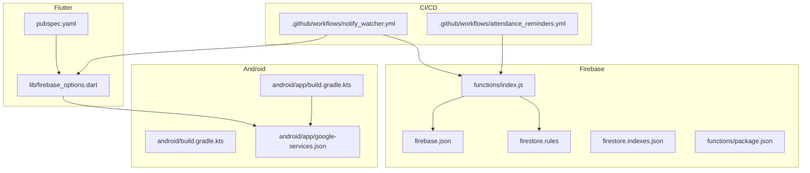
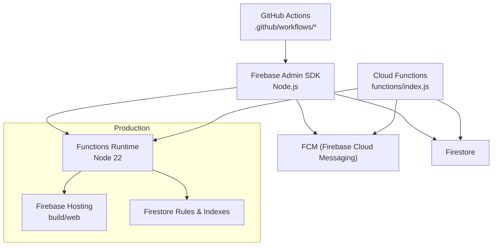
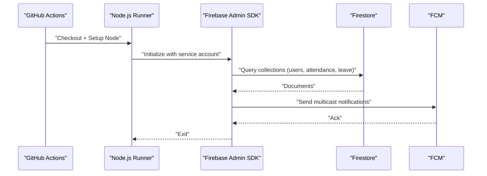
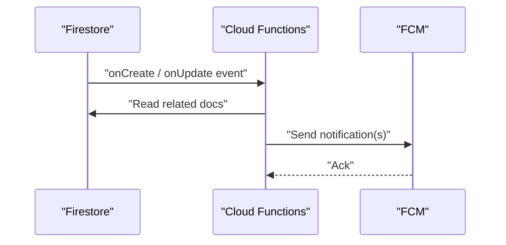
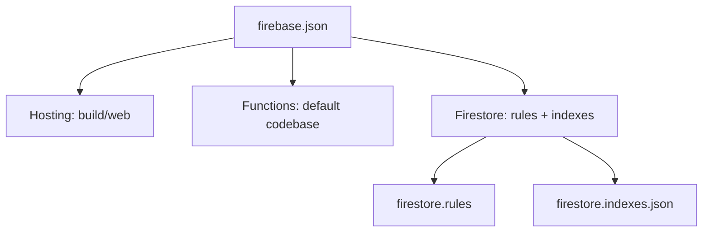
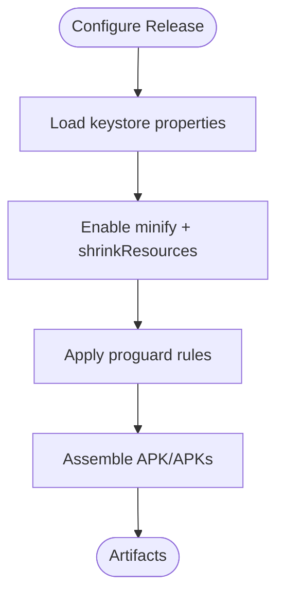
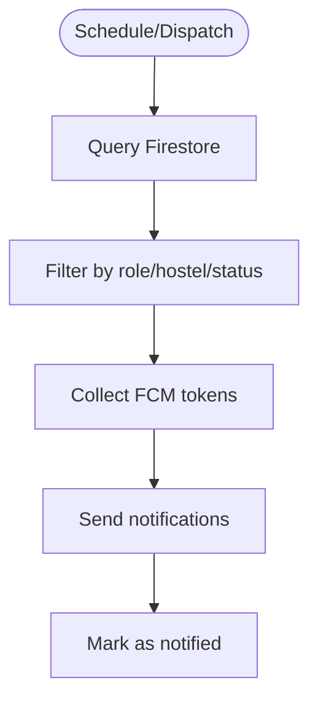
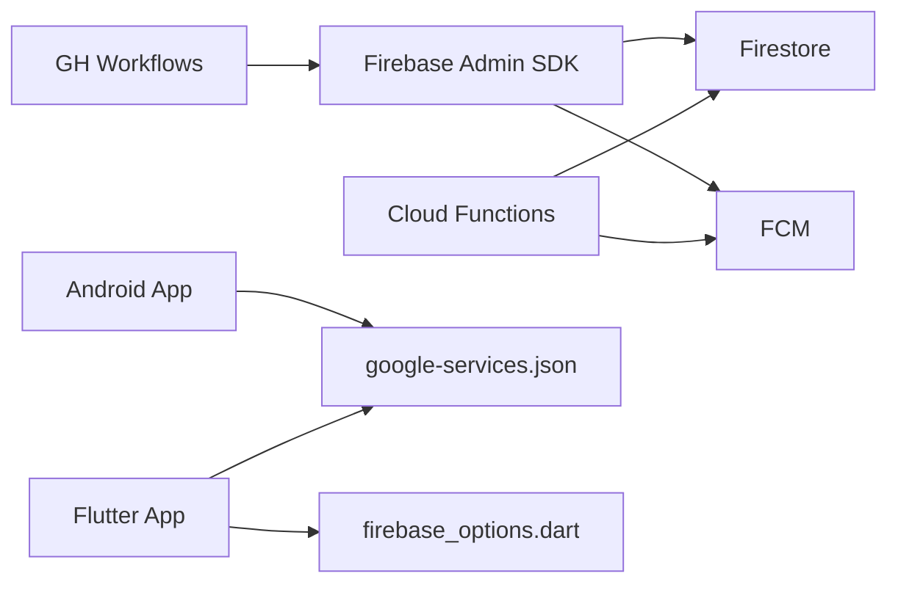

# Deployment and CI/CD

<cite>
**Referenced Files in This Document**
- [.github/workflows/attendance_reminders.yml](file://.github%2Fworkflows%2Fattendance_reminders.yml)
- [.github/workflows/notify_watcher.yml](file://.github%2Fworkflows%2Fnotify_watcher.yml)
- [firebase.json](file://firebase.json)
- [firestore.rules](file://firestore.rules)
- [firestore.indexes.json](file://firestore.indexes.json)
- [functions/index.js](file://functions%2Findex.js)
- [functions/package.json](file://functions%2Fpackage.json)
- [scripts/send_reminders.js](file://scripts%2Fsend_reminders.js)
- [scripts/notify_watcher.js](file://scripts%2Fnotify_watcher.js)
- [scripts/package.json](file://scripts%2Fpackage.json)
- [android/app/build.gradle.kts](file://android%2Fapp%2Fbuild.gradle.kts)
- [android/build.gradle.kts](file://android%2Fbuild.gradle.kts)
- [android/app/google-services.json](file://android%2Fapp%2Fgoogle-services.json)
- [lib/firebase_options.dart](file://lib%2Ffirebase_options.dart)
- [pubspec.yaml](file://pubspec.yaml)
</cite>

## Table of Contents
1. [Introduction](#introduction)
2. [Project Structure](#project-structure)
3. [Core Components](#core-components)
4. [Architecture Overview](#architecture-overview)
5. [Detailed Component Analysis](#detailed-component-analysis)
6. [Dependency Analysis](#dependency-analysis)
7. [Performance Considerations](#performance-considerations)
8. [Troubleshooting Guide](#troubleshooting-guide)
9. [Conclusion](#conclusion)
10. [Appendices](#appendices)

## Introduction
This document explains the deployment and CI/CD procedures for the VISTA APP, focusing on automated workflows, production deployment strategy across Firebase Hosting, Cloud Functions, and Firestore security rules, zero-cost operational guidance, automated notification systems, security hardening, Android release builds with obfuscation and signing, rollback procedures, monitoring, and post-deployment validation.

## Project Structure
The repository integrates a Flutter frontend, Firebase backend, and GitHub Actions-driven CI/CD. Key deployment-related areas:
- GitHub Actions workflows define scheduled and on-demand automation for notifications.
- Firebase configuration files define Hosting, Functions, Firestore rules and indexes.
- Cloud Functions implement real-time and scheduled triggers.
- Scripts under scripts/ support manual and scheduled tasks outside the Functions runtime.
- Android app module configures release signing, minification, and resource shrinking.

**Diagram sources**
- [.github/workflows/attendance_reminders.yml](file://.github%2Fworkflows%2Fattendance_reminders.yml)
- [.github/workflows/notify_watcher.yml](file://.github%2Fworkflows%2Fnotify_watcher.yml)
- [firebase.json](file://firebase.json)
- [firestore.rules](file://firestore.rules)
- [firestore.indexes.json](file://firestore.indexes.json)
- [functions/index.js](file://functions%2Findex.js)
- [functions/package.json](file://functions%2Fpackage.json)
- [android/app/build.gradle.kts](file://android%2Fapp%2Fbuild.gradle.kts)
- [android/build.gradle.kts](file://android%2Fbuild.gradle.kts)
- [android/app/google-services.json](file://android%2Fapp%2Fgoogle-services.json)
- [lib/firebase_options.dart](file://lib%2Ffirebase_options.dart)
- [pubspec.yaml](file://pubspec.yaml)

**Section sources**
- [.github/workflows/attendance_reminders.yml](file://.github%2Fworkflows%2Fattendance_reminders.yml)
- [.github/workflows/notify_watcher.yml](file://.github%2Fworkflows%2Fnotify_watcher.yml)
- [firebase.json](file://firebase.json)
- [functions/index.js](file://functions%2Findex.js)
- [android/app/build.gradle.kts](file://android%2Fapp%2Fbuild.gradle.kts)
- [lib/firebase_options.dart](file://lib%2Ffirebase_options.dart)

## Core Components
- GitHub Actions Workflows:
  - Attendance Reminders: scheduled jobs to send two daily reminders via Firebase Admin.
  - Real-time Notifications Watcher: periodic job to watch Firestore and send targeted notifications.
- Firebase Configuration:
  - Hosting: static web build served from build/web with SPA routing fallback.
  - Functions: Node.js codebase deployed as Cloud Functions.
  - Firestore: security rules and indexes.
- Cloud Functions:
  - Scheduled triggers for attendance reminders.
  - Firestore triggers for registrations, leave, complaints, and updates.
- Scripts:
  - Manual runners for reminders and watcher logic outside Functions.
- Android Build:
  - Release signing, R8 minification, resource shrinking, and shared build directory layout.

**Section sources**
- [.github/workflows/attendance_reminders.yml](file://.github%2Fworkflows%2Fattendance_reminders.yml)
- [.github/workflows/notify_watcher.yml](file://.github%2Fworkflows%2Fnotify_watcher.yml)
- [firebase.json](file://firebase.json)
- [firestore.rules](file://firestore.rules)
- [firestore.indexes.json](file://firestore.indexes.json)
- [functions/index.js](file://functions%2Findex.js)
- [scripts/send_reminders.js](file://scripts%2Fsend_reminders.js)
- [scripts/notify_watcher.js](file://scripts%2Fnotify_watcher.js)
- [android/app/build.gradle.kts](file://android%2Fapp%2Fbuild.gradle.kts)

## Architecture Overview
The deployment pipeline combines GitHub Actions with Firebase infrastructure. Workflows orchestrate Firebase Admin tasks to send push notifications and maintain Firestore state. Cloud Functions complement these by reacting to Firestore events and scheduling.

**Diagram sources**
- [.github/workflows/attendance_reminders.yml](file://.github%2Fworkflows%2Fattendance_reminders.yml)
- [.github/workflows/notify_watcher.yml](file://.github%2Fworkflows%2Fnotify_watcher.yml)
- [functions/index.js](file://functions%2Findex.js)
- [firebase.json](file://firebase.json)
- [firestore.rules](file://firestore.rules)
- [firestore.indexes.json](file://firestore.indexes.json)

## Detailed Component Analysis

### GitHub Actions Workflows
- Attendance Reminders Workflow:
  - Schedules two daily reminders around 10:00 PM and 10:20 PM IST.
  - Installs Node.js and dependencies, then executes scripts to send notifications.
  - Uses a service account secret for Firebase Admin initialization.
- Real-time Notifications Watcher Workflow:
  - Runs every 10 minutes to scan Firestore for pending notifications.
  - Sends targeted alerts to wardens and students based on roles and statuses.

**Diagram sources**
- [.github/workflows/attendance_reminders.yml](file://.github%2Fworkflows%2Fattendance_reminders.yml)
- [scripts/send_reminders.js](file://scripts%2Fsend_reminders.js)
- [scripts/notify_watcher.js](file://scripts%2Fnotify_watcher.js)

**Section sources**
- [.github/workflows/attendance_reminders.yml](file://.github%2Fworkflows%2Fattendance_reminders.yml)
- [.github/workflows/notify_watcher.yml](file://.github%2Fworkflows%2Fnotify_watcher.yml)
- [scripts/send_reminders.js](file://scripts%2Fsend_reminders.js)
- [scripts/notify_watcher.js](file://scripts%2Fnotify_watcher.js)

### Cloud Functions Implementation
- Scheduled Functions:
  - Triggered at 16:30 and 16:50 UTC (10:00 PM and 10:20 PM IST) to send attendance reminders.
- Firestore Triggers:
  - On new student registration, new leave/complaint creation, and document updates, targeted notifications are sent to appropriate recipients (wardens/head wardens, students).
- Region and Environment:
  - Functions configured for asia-south1 region and Node 22 runtime.

**Diagram sources**
- [functions/index.js](file://functions%2Findex.js)

**Section sources**
- [functions/index.js](file://functions%2Findex.js)
- [functions/package.json](file://functions%2Fpackage.json)

### Firebase Hosting, Functions, and Firestore Configuration
- Hosting:
  - Public directory set to build/web with SPA rewrite to index.html.
  - Ignores node_modules and dotfiles.
- Functions:
  - Single codebase named "default", with ignore patterns for development artifacts.
- Firestore:
  - Security rules enforce role-based access and field-level restrictions.
  - Indexes declared but empty in current configuration.

**Diagram sources**
- [firebase.json](file://firebase.json)
- [firestore.rules](file://firestore.rules)
- [firestore.indexes.json](file://firestore.indexes.json)

**Section sources**
- [firebase.json](file://firebase.json)
- [firestore.rules](file://firestore.rules)
- [firestore.indexes.json](file://firestore.indexes.json)

### Android Release Build and Signing
- Release Build:
  - Minification enabled with R8 and resource shrinking.
  - Proguard rules included via standard Android Gradle plugin.
- Signing:
  - Release signing configured using keystore properties loaded from root key.properties.
  - Desugaring enabled for Java 8+ APIs.
- Shared Build Directory:
  - Root build directory redirected to a shared location for monorepo-friendly builds.

**Diagram sources**
- [android/app/build.gradle.kts](file://android%2Fapp%2Fbuild.gradle.kts)
- [android/build.gradle.kts](file://android%2Fbuild.gradle.kts)

**Section sources**
- [android/app/build.gradle.kts](file://android%2Fapp%2Fbuild.gradle.kts)
- [android/build.gradle.kts](file://android%2Fbuild.gradle.kts)

### Automated Notification System
- Real-time Watcher:
  - Periodic checks for unnotified events and sends targeted notifications to wardens and students.
- Attendance Reminders:
  - Two scheduled tasks: general reminder and missed reminder, excluding students on leave and those who already marked attendance.
- Head Warden Escalation:
  - Complaints targeting head wardens broadcast to head wardens’ tokens.

**Diagram sources**
- [scripts/notify_watcher.js](file://scripts%2Fnotify_watcher.js)
- [scripts/send_reminders.js](file://scripts%2Fsend_reminders.js)
- [functions/index.js](file://functions%2Findex.js)

**Section sources**
- [scripts/notify_watcher.js](file://scripts%2Fnotify_watcher.js)
- [scripts/send_reminders.js](file://scripts%2Fsend_reminders.js)
- [functions/index.js](file://functions%2Findex.js)

## Dependency Analysis
- CI/CD depends on Firebase Admin credentials and Node.js runtime.
- Functions depend on Firestore and FCM; Firestore rules govern access.
- Android app depends on Firebase configuration files and keystore properties.
- Flutter app depends on Firebase options and environment configuration.

**Diagram sources**
- [.github/workflows/attendance_reminders.yml](file://.github%2Fworkflows%2Fattendance_reminders.yml)
- [.github/workflows/notify_watcher.yml](file://.github%2Fworkflows%2Fnotify_watcher.yml)
- [functions/index.js](file://functions%2Findex.js)
- [android/app/google-services.json](file://android%2Fapp%2Fgoogle-services.json)
- [lib/firebase_options.dart](file://lib%2Ffirebase_options.dart)

**Section sources**
- [android/app/google-services.json](file://android%2Fapp%2Fgoogle-services.json)
- [lib/firebase_options.dart](file://lib%2Ffirebase_options.dart)
- [pubspec.yaml](file://pubspec.yaml)

## Performance Considerations
- Minification and Resource Shrinking:
  - Enabled in the Android release build to reduce APK size and improve load times.
- Firestore Queries:
  - Prefer indexed fields and limit queries to reduce costs and latency.
- Function Regions:
  - asia-south1 region chosen for lower latency for the target audience.
- Notification Batching:
  - Multicast sends consolidate tokens to minimize FCM calls.

[No sources needed since this section provides general guidance]

## Troubleshooting Guide
- Firebase Admin Initialization Failures:
  - Verify FIREBASE_SERVICE_ACCOUNT secret is set in GitHub Actions and matches the service account JSON.
- Missing FCM Tokens:
  - Ensure clients register for FCM and persist tokens to Firestore.
- Attendance Reminders Not Sent:
  - Confirm scheduled times align with IST and that Firestore documents include required fields (e.g., date, leave ranges).
- Android Signing Issues:
  - Validate keystore properties and file paths; ensure storeFile path is absolute or correctly resolved.
- Hosting Rewrites:
  - Confirm build/web exists and firebase.json rewrite targets index.html for SPA routing.

**Section sources**
- [.github/workflows/attendance_reminders.yml](file://.github%2Fworkflows%2Fattendance_reminders.yml)
- [.github/workflows/notify_watcher.yml](file://.github%2Fworkflows%2Fnotify_watcher.yml)
- [android/app/build.gradle.kts](file://android%2Fapp%2Fbuild.gradle.kts)
- [firebase.json](file://firebase.json)

## Conclusion
The VISTA APP leverages GitHub Actions for automated notifications, Firebase for hosting and backend services, and Cloud Functions for scalable event-driven logic. The Android release pipeline applies industry-standard obfuscation and signing. Security is enforced via Firestore rules and role-based access. The documented procedures enable repeatable deployments, monitoring, and rollback readiness.

[No sources needed since this section summarizes without analyzing specific files]

## Appendices

### Production Deployment Strategy
- Firebase Hosting:
  - Build the Flutter web app and deploy the public directory defined in firebase.json.
- Cloud Functions:
  - Deploy the functions codebase; ensure region and runtime match configuration.
- Firestore Rules and Indexes:
  - Apply rules and indexes; monitor query performance and add composite indexes as needed.
- Android APK:
  - Build release APK with minification and signing; distribute via internal testing or Play Console.

**Section sources**
- [firebase.json](file://firebase.json)
- [functions/package.json](file://functions%2Fpackage.json)
- [firestore.rules](file://firestore.rules)
- [firestore.indexes.json](file://firestore.indexes.json)
- [android/app/build.gradle.kts](file://android%2Fapp%2Fbuild.gradle.kts)

### Zero-Cost Operation Approach
- Utilize free tier quotas for Firestore, FCM, and Hosting.
- Schedule Functions and watchers to minimize concurrent executions.
- Keep Firestore indexes minimal until query patterns stabilize.
- Monitor usage via Firebase console and adjust as needed.

[No sources needed since this section provides general guidance]

### Security Hardening Procedures
- Firestore Rules:
  - Role-based access controls and field-level diffs prevent unauthorized modifications.
- Secret Management:
  - Store FIREBASE_SERVICE_ACCOUNT as a GitHub secret; restrict permissions to least privilege.
- Android Keystore:
  - Protect keystore files; rotate passwords periodically and store securely.

**Section sources**
- [firestore.rules](file://firestore.rules)
- [.github/workflows/attendance_reminders.yml](file://.github%2Fworkflows%2Fattendance_reminders.yml)
- [android/app/build.gradle.kts](file://android%2Fapp%2Fbuild.gradle.kts)

### Rollback Procedures
- Hosting:
  - Re-deploy previous commit or tag to revert UI changes.
- Functions:
  - Redeploy a known-good revision or use Firebase console rollback.
- Firestore:
  - Restore from backup if available; otherwise, rely on audit logs and manual corrections.

[No sources needed since this section provides general guidance]

### Monitoring Setup and Post-Deployment Validation
- Monitoring:
  - Track Function invocations, errors, and durations in Cloud Functions logs.
  - Observe Firestore reads/writes and rule denials.
- Validation:
  - Smoke-test Hosting SPA routing.
  - Verify attendance reminders and real-time notifications reach intended users.
  - Confirm Android release APK installs and authenticates with Firebase.

[No sources needed since this section provides general guidance]