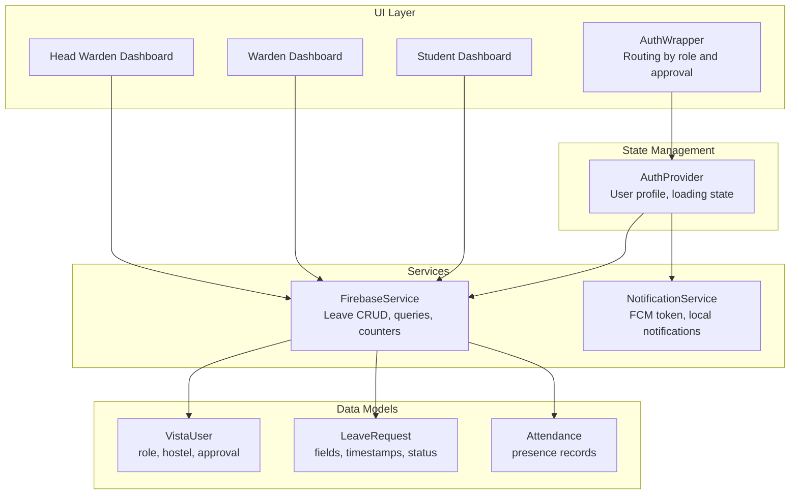
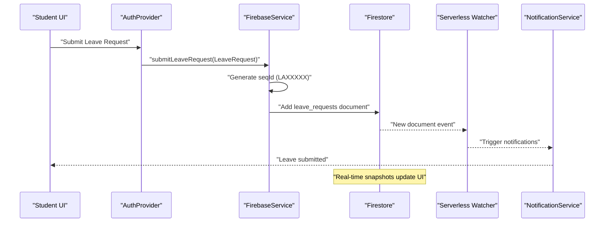
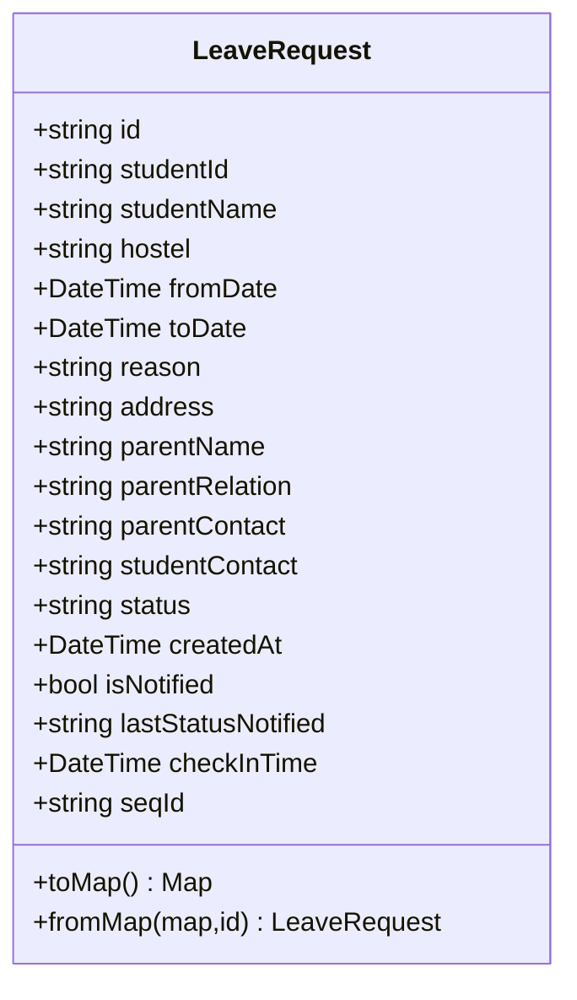
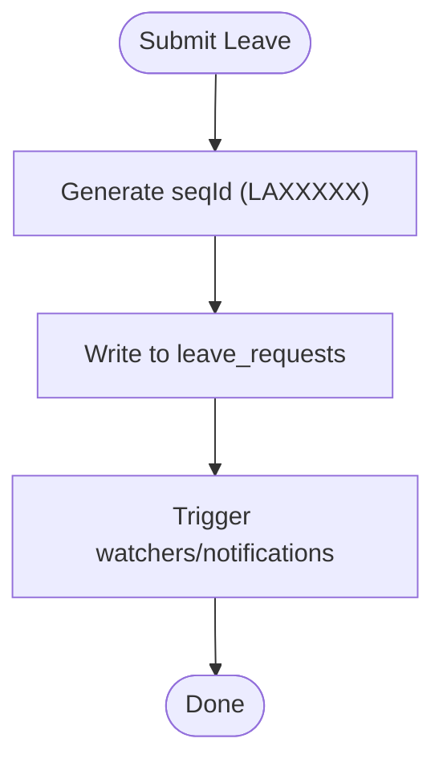
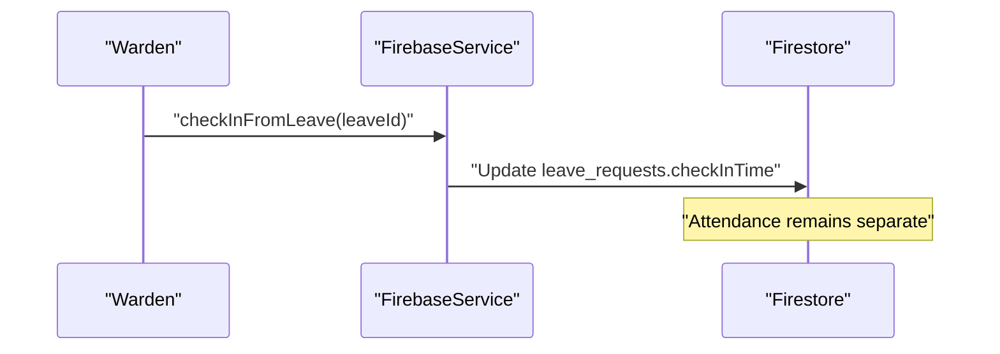
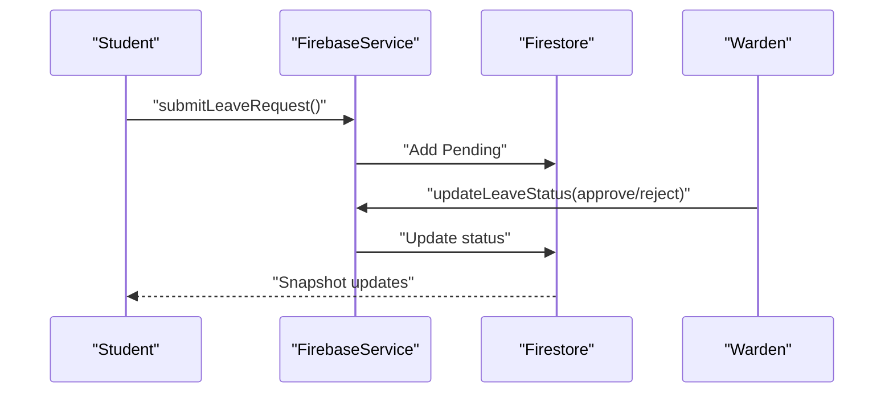
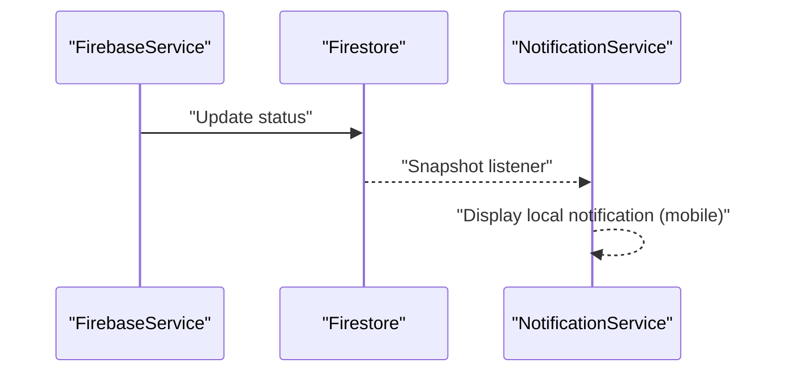
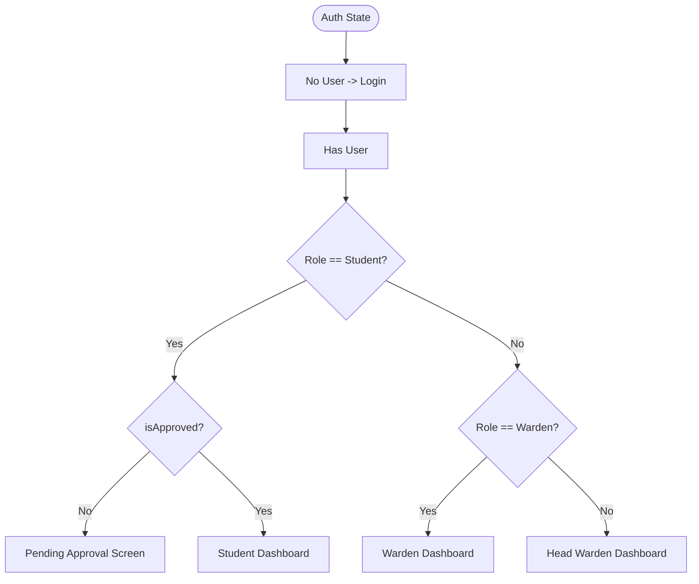
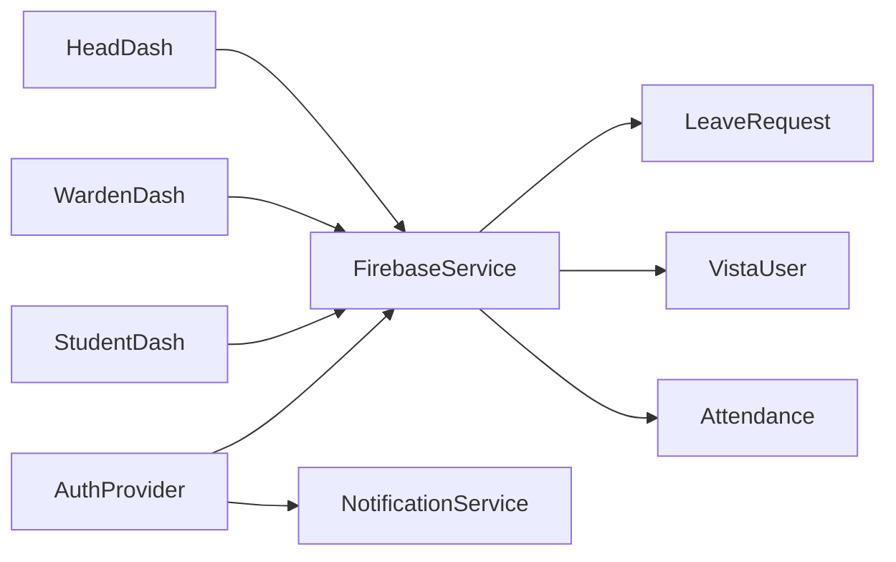

# Leave Management System

<cite>
**Referenced Files in This Document**
- [README.md](file://README.md)
- [main.dart](file://lib/main.dart)
- [firebase_service.dart](file://lib/services/firebase_service.dart)
- [notification_service.dart](file://lib/services/notification_service.dart)
- [auth_provider.dart](file://lib/providers/auth_provider.dart)
- [vista_user.dart](file://lib/models/vista_user.dart)
- [leave_request_model.dart](file://lib/models/leave_request_model.dart)
- [attendance_model.dart](file://lib/models/attendance_model.dart)
</cite>

## Table of Contents
1. [Introduction](#introduction)
2. [Project Structure](#project-structure)
3. [Core Components](#core-components)
4. [Architecture Overview](#architecture-overview)
5. [Detailed Component Analysis](#detailed-component-analysis)
6. [Dependency Analysis](#dependency-analysis)
7. [Performance Considerations](#performance-considerations)
8. [Troubleshooting Guide](#troubleshooting-guide)
9. [Conclusion](#conclusion)

## Introduction
This document describes the leave management system within the VISTA hostel management application. It focuses on the digital leave application workflow, validation, attachments, approval processes across roles (Student, Warden, Head Warden), escalation paths, status tracking, integration with the attendance system, leave duration calculations, conflict detection, UI components, notifications, automation, and historical tracking.

The system leverages Firebase for authentication, real-time Firestore collections, and Firebase Cloud Messaging (FCM) for notifications. The Flutter frontend uses MVVM with Provider for state management.

## Project Structure
The leave management feature spans several modules:
- Models define data structures for users, leave requests, and attendance.
- Services encapsulate Firebase interactions, including leave CRUD, queries, and status updates.
- Providers manage authentication state and user profiles.
- Screens route users to dashboards based on role and approval status.
- Notification service integrates FCM and local notifications.

**Diagram sources**
- [main.dart:120-146](file://lib/main.dart#L120-L146)
- [auth_provider.dart:8-49](file://lib/providers/auth_provider.dart#L8-L49)
- [firebase_service.dart:12-667](file://lib/services/firebase_service.dart#L12-L667)
- [notification_service.dart:10-113](file://lib/services/notification_service.dart#L10-L113)
- [vista_user.dart:5-95](file://lib/models/vista_user.dart#L5-L95)
- [leave_request_model.dart:3-89](file://lib/models/leave_request_model.dart#L3-L89)
- [attendance_model.dart:3-45](file://lib/models/attendance_model.dart#L3-L45)

**Section sources**
- [README.md:1-95](file://README.md#L1-L95)
- [main.dart:120-146](file://lib/main.dart#L120-L146)

## Core Components
- LeaveRequest model: Captures student identity, hostel, leave dates, reason, parent/guardian info, status, timestamps, and check-in time.
- FirebaseService: Provides submit, query, and update operations for leave requests; manages sequential IDs; exposes streams for pending/approved/hostel-wide lists; supports range queries for reporting.
- VistaUser: Defines roles (student, warden, headWarden) and approval state used to route dashboards and permissions.
- NotificationService: Initializes FCM, stores tokens, and displays local notifications on mobile.

Key responsibilities:
- Form submission: Submit a LeaveRequest with required fields; assign a sequential ID.
- Validation: Enforced by Firestore schema and UI constraints; backend defaults protect missing fields.
- Approval routing: Streams filtered by status and hostel; Warden/HeadWarden dashboards consume these streams.
- Status tracking: Real-time updates via Firestore snapshots; last status notification tracking included.
- Attendance integration: Leave check-in time recorded; attendance presence stored separately.
- Conflict detection: Range queries detect overlapping leaves per hostel.

**Section sources**
- [leave_request_model.dart:3-89](file://lib/models/leave_request_model.dart#L3-L89)
- [firebase_service.dart:204-296](file://lib/services/firebase_service.dart#L204-L296)
- [vista_user.dart:5-95](file://lib/models/vista_user.dart#L5-L95)
- [notification_service.dart:10-113](file://lib/services/notification_service.dart#L10-L113)

## Architecture Overview
The leave workflow is event-driven and data-centric:
- UI captures inputs and submits LeaveRequest documents.
- Firestore triggers watchers (serverless) and client listeners update dashboards.
- Approval actions update status; notifications inform stakeholders.
- Attendance remains decoupled but integrates via check-in timestamps.

**Diagram sources**
- [firebase_service.dart:204-228](file://lib/services/firebase_service.dart#L204-L228)
- [auth_provider.dart:36-49](file://lib/providers/auth_provider.dart#L36-L49)
- [notification_service.dart:18-81](file://lib/services/notification_service.dart#L18-L81)

## Detailed Component Analysis

### LeaveRequest Model
Purpose:
- Encapsulates all fields required for a leave application.
- Provides serialization/deserialization to/from Firestore.
- Includes status tracking and optional check-in timestamp.

Important fields:
- Identity: studentId, studentName, hostel.
- Dates: fromDate, toDate, createdAt.
- Contact: studentContact, parentName, parentRelation, parentContact.
- Status: status, isNotified, lastStatusNotified.
- Attendance tie-in: checkInTime.
- Sequential ID: seqId for audit trails.

Validation and defaults:
- Missing dates/timestamps default to current time.
- Defaults for booleans and strings ensure UI stability.

**Diagram sources**
- [leave_request_model.dart:3-89](file://lib/models/leave_request_model.dart#L3-L89)

**Section sources**
- [leave_request_model.dart:3-89](file://lib/models/leave_request_model.dart#L3-L89)

### FirebaseService: Leave Operations
Responsibilities:
- Submit leave requests with sequential ID generation.
- Query pending/approved/hostel-wide leave lists.
- Update leave status.
- Retrieve student-specific leave history.
- Range queries for reporting and conflict detection.
- Record leave check-in time.

Sequential ID:
- Uses a counters collection with transactions to guarantee uniqueness and formatting.

Streams:
- Pending leaves per hostel.
- Hostel-wide and approved leaves.
- Student-specific leave history.

Conflict detection:
- Range overlap checks across leave requests for a given hostel.

**Diagram sources**
- [firebase_service.dart:183-202](file://lib/services/firebase_service.dart#L183-L202)
- [firebase_service.dart:204-228](file://lib/services/firebase_service.dart#L204-L228)

**Section sources**
- [firebase_service.dart:183-202](file://lib/services/firebase_service.dart#L183-L202)
- [firebase_service.dart:204-296](file://lib/services/firebase_service.dart#L204-L296)
- [firebase_service.dart:571-590](file://lib/services/firebase_service.dart#L571-L590)

### Attendance Integration and Leave Check-In
- Attendance records store presence with date and timestamp.
- Leave check-in time can be recorded upon return, enabling reconciliation between absence and presence.

**Diagram sources**
- [firebase_service.dart:662-666](file://lib/services/firebase_service.dart#L662-L666)
- [attendance_model.dart:3-45](file://lib/models/attendance_model.dart#L3-L45)

**Section sources**
- [firebase_service.dart:662-666](file://lib/services/firebase_service.dart#L662-L666)
- [attendance_model.dart:3-45](file://lib/models/attendance_model.dart#L3-L45)

### Approval Workflows and Escalation
Role-based dashboards:
- Student: applies for leave, tracks status.
- Warden: reviews pending leaves for assigned hostel.
- Head Warden: escalates and oversees higher-level decisions.

Streams and filtering:
- Pending leaves are queried by status and hostel.
- Hostel-specific queries restrict visibility to authorized areas.

Escalation:
- While the leave collection does not explicitly define an escalation field, the complaint module demonstrates escalation patterns (changing target role and status). Similar patterns can be adapted for leaves if needed.

**Diagram sources**
- [firebase_service.dart:230-244](file://lib/services/firebase_service.dart#L230-L244)
- [firebase_service.dart:260-262](file://lib/services/firebase_service.dart#L260-L262)

**Section sources**
- [firebase_service.dart:230-244](file://lib/services/firebase_service.dart#L230-L244)
- [firebase_service.dart:260-262](file://lib/services/firebase_service.dart#L260-L262)

### Notifications and Status Changes
- FCM token retrieval and persistence on user profile.
- Local notifications on mobile for foreground messages.
- Status change triggers can be observed via Firestore snapshots; the LeaveRequest model includes notification flags to avoid duplicate alerts.

**Diagram sources**
- [notification_service.dart:18-81](file://lib/services/notification_service.dart#L18-L81)
- [firebase_service.dart:260-262](file://lib/services/firebase_service.dart#L260-L262)

**Section sources**
- [notification_service.dart:18-113](file://lib/services/notification_service.dart#L18-L113)
- [leave_request_model.dart:16-21](file://lib/models/leave_request_model.dart#L16-L21)

### UI Routing and Dashboards
- AuthWrapper selects dashboard based on role and approval status.
- Student dashboard provides leave application and history.
- Warden and Head Warden dashboards display pending/approved leaves for their jurisdiction.

**Diagram sources**
- [main.dart:120-146](file://lib/main.dart#L120-L146)

**Section sources**
- [main.dart:120-146](file://lib/main.dart#L120-L146)

## Dependency Analysis
- AuthProvider depends on FirebaseService and NotificationService to bootstrap user profiles and enable push notifications.
- FirebaseService centralizes Firestore interactions for leave, attendance, and related entities.
- Models are lightweight and serializable, minimizing coupling.
- UI components depend on Provider for reactive updates.

**Diagram sources**
- [auth_provider.dart:8-49](file://lib/providers/auth_provider.dart#L8-L49)
- [firebase_service.dart:12-667](file://lib/services/firebase_service.dart#L12-L667)
- [vista_user.dart:5-95](file://lib/models/vista_user.dart#L5-L95)
- [leave_request_model.dart:3-89](file://lib/models/leave_request_model.dart#L3-L89)
- [attendance_model.dart:3-45](file://lib/models/attendance_model.dart#L3-L45)

**Section sources**
- [auth_provider.dart:8-49](file://lib/providers/auth_provider.dart#L8-L49)
- [firebase_service.dart:12-667](file://lib/services/firebase_service.dart#L12-L667)

## Performance Considerations
- Sequential ID generation uses Firestore transactions to ensure uniqueness; this is efficient for low-frequency submissions.
- Queries filter by status and hostel to reduce payload sizes.
- Range queries for reporting and conflict detection use composite conditions; ensure appropriate indexes are deployed.
- Rate limiting wrappers around sensitive operations (e.g., leave submission) help mitigate abuse.

[No sources needed since this section provides general guidance]

## Troubleshooting Guide
Common issues and resolutions:
- Authentication bootstrapping failures: Verify Firebase initialization and credentials; ensure .env is properly loaded on supported environments.
- Missing FCM token: Confirm user granted notification permission; re-initialize token storage after logout.
- No leave updates in UI: Confirm Firestore rules allow reads for the user’s role and hostel; verify snapshot listeners are active.
- Overlapping leaves: Use range queries to detect conflicts; adjust dates accordingly.
- Leave check-in not reflected: Ensure Warden updates the check-in timestamp; confirm snapshot listeners update the UI.

**Section sources**
- [main.dart:23-84](file://lib/main.dart#L23-L84)
- [notification_service.dart:18-81](file://lib/services/notification_service.dart#L18-L81)
- [firebase_service.dart:571-590](file://lib/services/firebase_service.dart#L571-L590)
- [firebase_service.dart:662-666](file://lib/services/firebase_service.dart#L662-L666)

## Conclusion
The leave management system integrates cleanly with VISTA’s multi-role architecture. It provides a robust, real-time workflow for leave applications, approvals, and status tracking, with clear pathways for escalation and historical auditing. Attendance tie-ins and conflict detection further strengthen operational oversight. The modular design enables straightforward enhancements for attachments, advanced validation, and expanded automation.