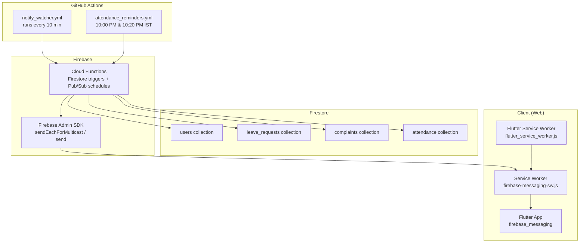
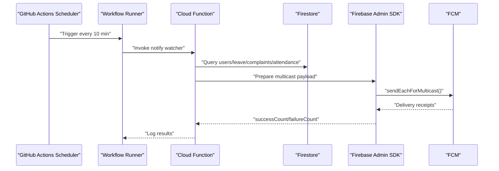
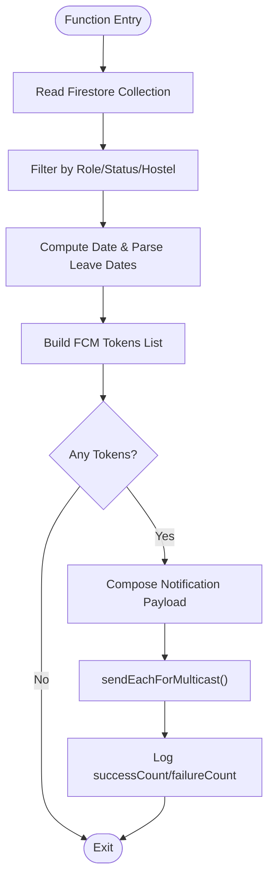
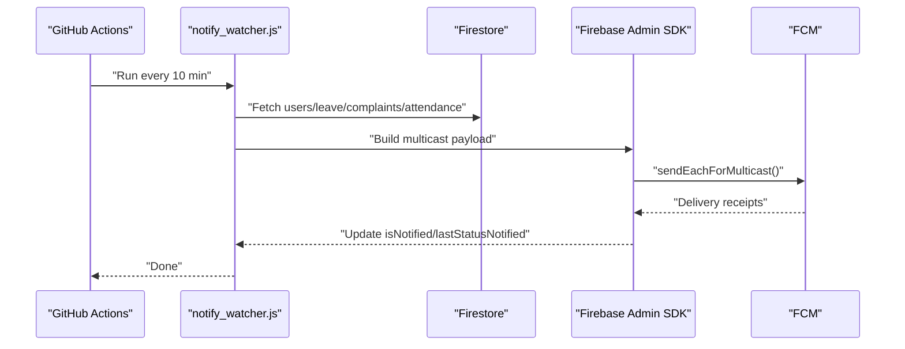
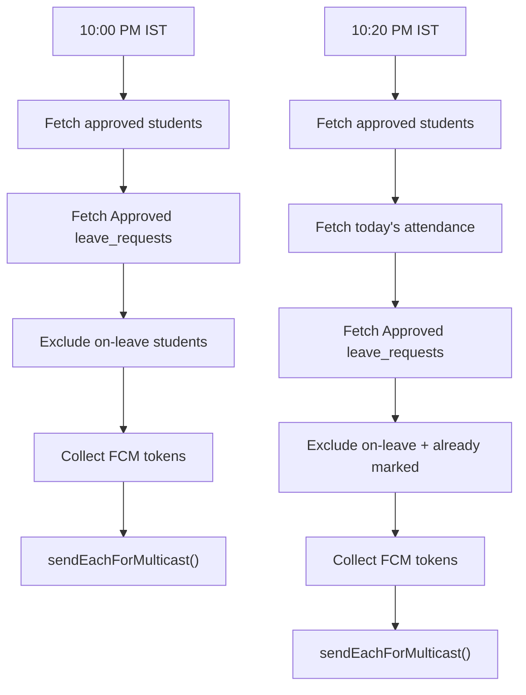
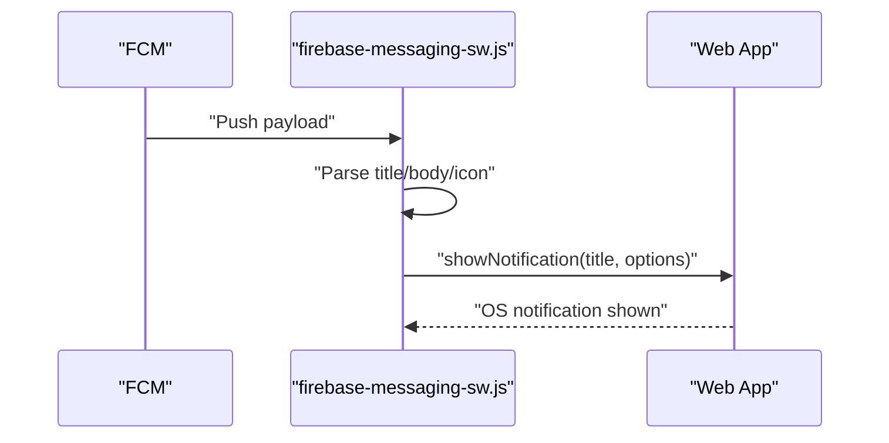
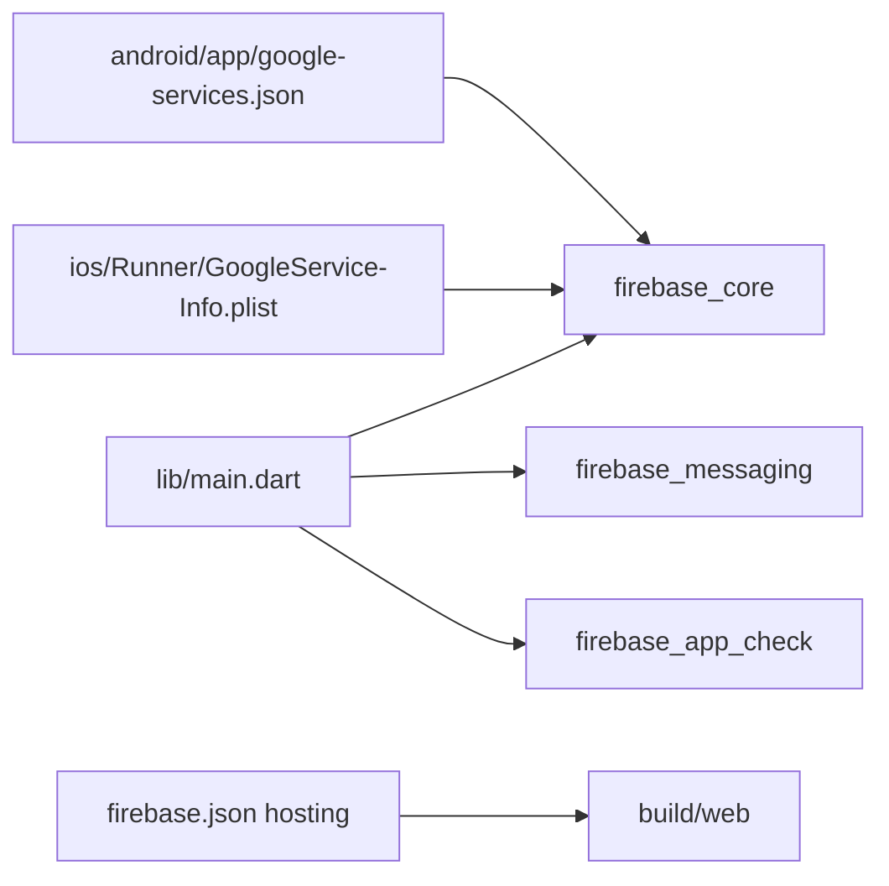
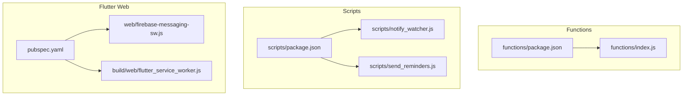

# Notification System

<cite>
**Referenced Files in This Document**
- [notify_watcher.yml](file://.github/workflows/notify_watcher.yml)
- [attendance_reminders.yml](file://.github/workflows/attendance_reminders.yml)
- [index.js](file://functions/index.js)
- [notify_watcher.js](file://scripts/notify_watcher.js)
- [send_reminders.js](file://scripts/send_reminders.js)
- [firebase-messaging-sw.js](file://web/firebase-messaging-sw.js)
- [flutter_service_worker.js](file://build/web/flutter_service_worker.js)
- [main.dart](file://lib/main.dart)
- [google-services.json](file://android/app/google-services.json)
- [GoogleService-Info.plist](file://ios/Runner/GoogleService-Info.plist)
- [firebase.json](file://firebase.json)
- [package.json (scripts)](file://scripts/package.json)
- [package.json (functions)](file://functions/package.json)
- [pubspec.yaml](file://pubspec.yaml)
</cite>

## Table of Contents
1. [Introduction](#introduction)
2. [Project Structure](#project-structure)
3. [Core Components](#core-components)
4. [Architecture Overview](#architecture-overview)
5. [Detailed Component Analysis](#detailed-component-analysis)
6. [Dependency Analysis](#dependency-analysis)
7. [Performance Considerations](#performance-considerations)
8. [Troubleshooting Guide](#troubleshooting-guide)
9. [Conclusion](#conclusion)
10. [Appendices](#appendices)

## Introduction
This document explains the automated notification system powering VISTA’s real-time alerts and scheduled reminders. It covers:
- Firebase Cloud Messaging (FCM) integration for push notifications
- A serverless watcher implemented with GitHub Actions that monitors Firestore every 10 minutes
- Nightly attendance reminders at 10:00 PM and 10:20 PM IST
- Registration approval notifications and status update alerts
- Web push notification service worker implementation
- Notification scheduling and delivery optimization
- Zero-cost operation without Firebase paid plans
- Reliability strategies and troubleshooting common delivery issues

## Project Structure
The notification system spans backend Cloud Functions, serverless watchers, and client-side Flutter web assets:
- Backend: Firebase Cloud Functions handle Firestore triggers and scheduled tasks
- Serverless watchers: GitHub Actions workflows run Node.js scripts to poll Firestore and send notifications
- Client: Flutter web uses a service worker and Firebase Messaging to receive background notifications

**Diagram sources**
- [notify_watcher.yml:1-29](file://.github/workflows/notify_watcher.yml#L1-L29)
- [attendance_reminders.yml:1-46](file://.github/workflows/attendance_reminders.yml#L1-L46)
- [index.js:1-253](file://functions/index.js#L1-L253)
- [notify_watcher.js:1-165](file://scripts/notify_watcher.js#L1-L165)
- [send_reminders.js:1-210](file://scripts/send_reminders.js#L1-L210)
- [firebase-messaging-sw.js:1-26](file://web/firebase-messaging-sw.js#L1-L26)
- [flutter_service_worker.js:1-214](file://build/web/flutter_service_worker.js#L1-L214)

**Section sources**
- [notify_watcher.yml:1-29](file://.github/workflows/notify_watcher.yml#L1-L29)
- [attendance_reminders.yml:1-46](file://.github/workflows/attendance_reminders.yml#L1-L46)
- [index.js:1-253](file://functions/index.js#L1-L253)
- [notify_watcher.js:1-165](file://scripts/notify_watcher.js#L1-L165)
- [send_reminders.js:1-210](file://scripts/send_reminders.js#L1-L210)
- [firebase-messaging-sw.js:1-26](file://web/firebase-messaging-sw.js#L1-L26)
- [flutter_service_worker.js:1-214](file://build/web/flutter_service_worker.js#L1-L214)

## Core Components
- Cloud Functions (Firestore triggers and Pub/Sub schedules): Send targeted notifications for registrations, leave requests, complaints, and status updates; schedule daily reminders at 10:00 PM and 10:20 PM IST.
- Serverless watchers (GitHub Actions): Poll Firestore every 10 minutes to detect new events and send notifications; also run nightly reminders locally via scripts.
- Client-side service workers: Receive background notifications on web and display native OS notifications.

Key responsibilities:
- Eligibility checks: Approved students, on-leave exclusions, and attendance markers
- Multicast delivery: Efficiently target multiple tokens per batch
- Timezone handling: IST-based scheduling and date formatting
- Head Warden escalations: Special routing for escalated complaints

**Section sources**
- [index.js:25-104](file://functions/index.js#L25-L104)
- [index.js:109-118](file://functions/index.js#L109-L118)
- [index.js:124-151](file://functions/index.js#L124-L151)
- [index.js:153-178](file://functions/index.js#L153-L178)
- [index.js:180-212](file://functions/index.js#L180-L212)
- [index.js:214-252](file://functions/index.js#L214-L252)
- [notify_watcher.js:25-162](file://scripts/notify_watcher.js#L25-L162)
- [send_reminders.js:48-120](file://scripts/send_reminders.js#L48-L120)
- [send_reminders.js:125-199](file://scripts/send_reminders.js#L125-L199)

## Architecture Overview
The system combines serverless triggers and periodic polling to ensure reliable, low-cost notifications.

**Diagram sources**
- [notify_watcher.yml:1-29](file://.github/workflows/notify_watcher.yml#L1-L29)
- [index.js:1-253](file://functions/index.js#L1-L253)
- [notify_watcher.js:1-165](file://scripts/notify_watcher.js#L1-L165)

## Detailed Component Analysis

### Cloud Functions: Real-time and Scheduled Notifications
Cloud Functions react to Firestore changes and run on Pub/Sub schedules:
- Nightly reminders: Two functions schedule at 10:00 PM and 10:20 PM IST
- Real-time triggers: New student registration, new leave/complaint, and status updates
- Eligibility logic: Filters approved students, excludes on-leave users, and marks missed attendance

**Diagram sources**
- [index.js:25-104](file://functions/index.js#L25-L104)
- [index.js:109-118](file://functions/index.js#L109-L118)
- [index.js:124-151](file://functions/index.js#L124-L151)
- [index.js:153-178](file://functions/index.js#L153-L178)
- [index.js:180-212](file://functions/index.js#L180-L212)
- [index.js:214-252](file://functions/index.js#L214-L252)

**Section sources**
- [index.js:109-118](file://functions/index.js#L109-L118)
- [index.js:124-151](file://functions/index.js#L124-L151)
- [index.js:153-178](file://functions/index.js#L153-L178)
- [index.js:180-212](file://functions/index.js#L180-L212)
- [index.js:214-252](file://functions/index.js#L214-L252)

### Serverless Watcher: GitHub Actions-based Polling
A GitHub Actions workflow runs a Node.js script every 10 minutes to:
- Send nightly reminders (general and missed)
- Notify wardens of new registrations and pending items
- Broadcast status updates to students
- Mark approvals delivered to avoid duplicates

**Diagram sources**
- [notify_watcher.yml:1-29](file://.github/workflows/notify_watcher.yml#L1-L29)
- [notify_watcher.js:25-162](file://scripts/notify_watcher.js#L25-L162)

**Section sources**
- [notify_watcher.yml:1-29](file://.github/workflows/notify_watcher.yml#L1-L29)
- [notify_watcher.js:25-162](file://scripts/notify_watcher.js#L25-L162)

### Nightly Attendance Reminders: IST Scheduling
Two GitHub Actions jobs run at 10:00 PM and 10:20 PM IST:
- 10:00 PM: General reminder to all approved students not on leave
- 10:20 PM: Missed reminder to students who did not mark attendance and are not on leave

**Diagram sources**
- [attendance_reminders.yml:1-46](file://.github/workflows/attendance_reminders.yml#L1-L46)
- [send_reminders.js:48-120](file://scripts/send_reminders.js#L48-L120)
- [send_reminders.js:125-199](file://scripts/send_reminders.js#L125-L199)

**Section sources**
- [attendance_reminders.yml:1-46](file://.github/workflows/attendance_reminders.yml#L1-L46)
- [send_reminders.js:48-120](file://scripts/send_reminders.js#L48-L120)
- [send_reminders.js:125-199](file://scripts/send_reminders.js#L125-L199)

### Web Push Notification Service Worker
The web app uses a background service worker to receive and display notifications:
- Initializes Firebase app and messaging
- Handles onBackgroundMessage to show native OS notifications
- Flutter service worker manages caching and offline behavior

**Diagram sources**
- [firebase-messaging-sw.js:1-26](file://web/firebase-messaging-sw.js#L1-L26)
- [flutter_service_worker.js:1-214](file://build/web/flutter_service_worker.js#L1-L214)

**Section sources**
- [firebase-messaging-sw.js:1-26](file://web/firebase-messaging-sw.js#L1-L26)
- [flutter_service_worker.js:1-214](file://build/web/flutter_service_worker.js#L1-L214)

### Client Initialization and Dependencies
- Flutter app initializes Firebase with platform-specific options
- Uses firebase_messaging for foreground/background handling
- Android and iOS Firebase configurations are embedded via google-services.json and GoogleService-Info.plist
- Hosting configuration points to build/web and rewrites to index.html

**Diagram sources**
- [main.dart:1-195](file://lib/main.dart#L1-L195)
- [google-services.json:1-29](file://android/app/google-services.json#L1-L29)
- [GoogleService-Info.plist:1-30](file://ios/Runner/GoogleService-Info.plist#L1-L30)
- [firebase.json:27-40](file://firebase.json#L27-L40)

**Section sources**
- [main.dart:1-195](file://lib/main.dart#L1-L195)
- [google-services.json:1-29](file://android/app/google-services.json#L1-L29)
- [GoogleService-Info.plist:1-30](file://ios/Runner/GoogleService-Info.plist#L1-L30)
- [firebase.json:27-40](file://firebase.json#L27-L40)

## Dependency Analysis
- Cloud Functions depend on firebase-admin and firebase-functions
- Scripts depend on firebase-admin
- Flutter app depends on firebase_messaging and firebase_core
- Hosting configuration integrates web assets and service workers

**Diagram sources**
- [package.json (functions):1-14](file://functions/package.json#L1-L14)
- [index.js:1-253](file://functions/index.js#L1-L253)
- [package.json (scripts):1-6](file://scripts/package.json#L1-L6)
- [notify_watcher.js:1-165](file://scripts/notify_watcher.js#L1-L165)
- [send_reminders.js:1-210](file://scripts/send_reminders.js#L1-L210)
- [pubspec.yaml:37-41](file://pubspec.yaml#L37-L41)
- [firebase-messaging-sw.js:1-26](file://web/firebase-messaging-sw.js#L1-L26)
- [flutter_service_worker.js:1-214](file://build/web/flutter_service_worker.js#L1-L214)

**Section sources**
- [package.json (functions):1-14](file://functions/package.json#L1-L14)
- [package.json (scripts):1-6](file://scripts/package.json#L1-L6)
- [pubspec.yaml:37-41](file://pubspec.yaml#L37-L41)

## Performance Considerations
- Multicast batching: Using sendEachForMulticast reduces per-token overhead and improves throughput
- Eligibility pre-filtering: Queries filter by role/status/hostel to minimize token list size
- Timezone alignment: IST-based scheduling avoids off-by-one errors and redundant sends
- Duplicate prevention: Flags like registrationNotified, isNotified, approvalNotified prevent repeated notifications
- Web caching: Flutter service worker caches assets to reduce load and improve responsiveness

[No sources needed since this section provides general guidance]

## Troubleshooting Guide
Common delivery issues and remedies:
- Missing FCM tokens: Ensure clients register and persist tokens; verify presence in users collection
- Exclusions not working: Confirm leave date parsing and hostel matching logic
- Duplicate notifications: Check notification flags and lastStatusNotified updates
- Web notifications not showing: Verify service worker registration and onBackgroundMessage handler
- Timezone mismatches: Validate cron expressions and date formatting logic
- Workflow failures: Inspect GitHub Actions logs and FIREBASE_SERVICE_ACCOUNT secret configuration

**Section sources**
- [index.js:40-59](file://functions/index.js#L40-L59)
- [index.js:214-252](file://functions/index.js#L214-L252)
- [notify_watcher.js:68-121](file://scripts/notify_watcher.js#L68-L121)
- [notify_watcher.js:123-140](file://scripts/notify_watcher.js#L123-L140)
- [firebase-messaging-sw.js:16-25](file://web/firebase-messaging-sw.js#L16-L25)

## Conclusion
The notification system leverages Firebase Cloud Functions, Firestore triggers, and GitHub Actions to deliver timely, reliable alerts at zero cost. By combining scheduled Pub/Sub functions with periodic polling, it ensures coverage for both real-time and time-bound events. The web service worker enables seamless background notifications, while careful eligibility checks and duplicate prevention maintain reliability and user experience.

[No sources needed since this section summarizes without analyzing specific files]

## Appendices

### Zero-Cost Operation Checklist
- Use Firebase free tier quotas for messaging and Cloud Functions
- Keep token lists small via precise filters
- Batch notifications with sendEachForMulticast
- Avoid unnecessary polling by relying on Firestore triggers where possible
- Monitor delivery receipts and adjust retry logic if needed

[No sources needed since this section provides general guidance]