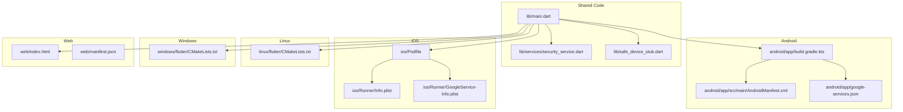
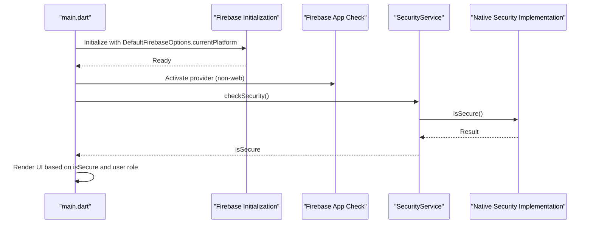
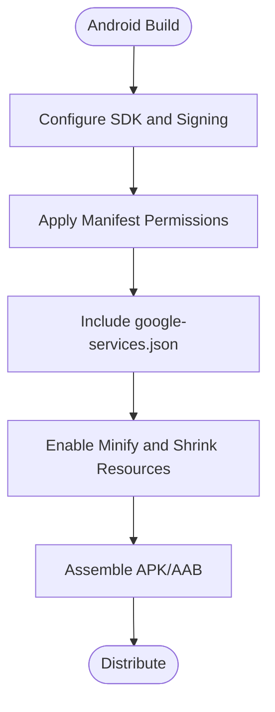
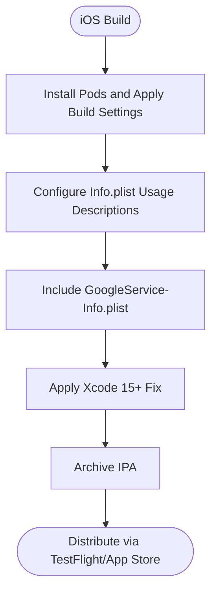
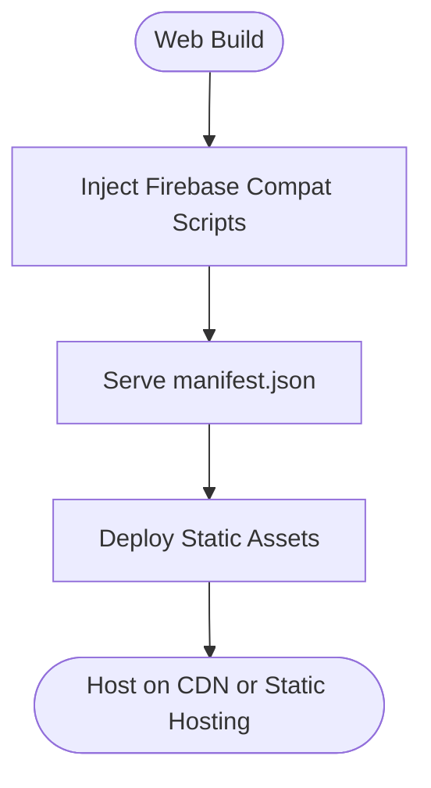
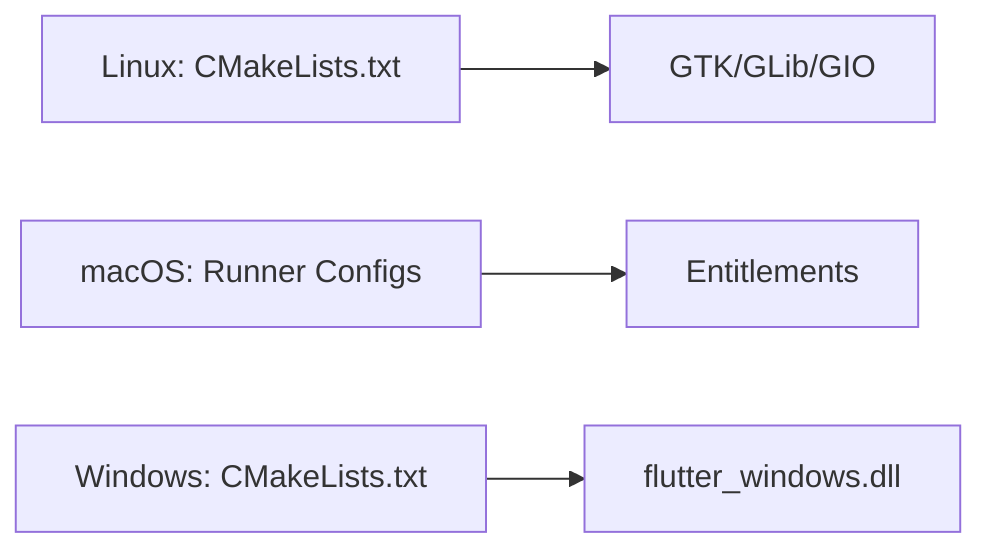
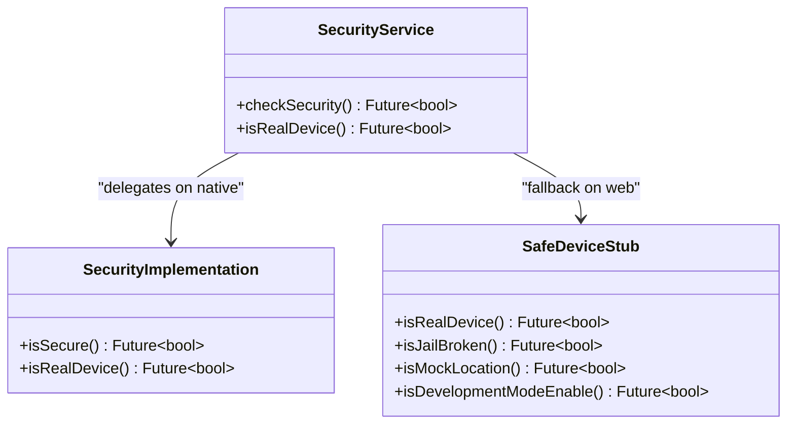
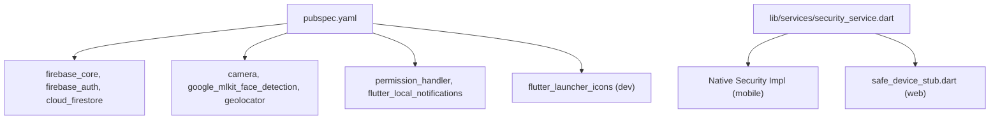

# Platform-Specific Integration

<cite>
**Referenced Files in This Document**
- [pubspec.yaml](file://pubspec.yaml)
- [main.dart](file://lib/main.dart)
- [security_service.dart](file://lib/services/security_service.dart)
- [safe_device_stub.dart](file://lib/safe_device_stub.dart)
- [android app build.gradle.kts](file://android/app/build.gradle.kts)
- [AndroidManifest.xml](file://android/app/src/main/AndroidManifest.xml)
- [google-services.json](file://android/app/google-services.json)
- [ios Podfile](file://ios/Podfile)
- [iOS Info.plist](file://ios/Runner/Info.plist)
- [iOS GoogleService-Info.plist](file://ios/Runner/GoogleService-Info.plist)
- [linux CMakeLists.txt](file://linux/flutter/CMakeLists.txt)
- [windows CMakeLists.txt](file://windows/flutter/CMakeLists.txt)
- [web index.html](file://web/index.html)
- [web manifest.json](file://web/manifest.json)
</cite>

## Table of Contents
1. [Introduction](#introduction)
2. [Project Structure](#project-structure)
3. [Core Components](#core-components)
4. [Architecture Overview](#architecture-overview)
5. [Detailed Component Analysis](#detailed-component-analysis)
6. [Dependency Analysis](#dependency-analysis)
7. [Performance Considerations](#performance-considerations)
8. [Troubleshooting Guide](#troubleshooting-guide)
9. [Conclusion](#conclusion)
10. [Appendices](#appendices)

## Introduction
This document explains the cross-platform implementation of VISTA APP across Android, iOS, Web, Linux, macOS, and Windows. It covers platform-specific configurations, native code integration, platform abstraction strategies, security implementations, and deployment considerations. The shared code architecture leverages Flutter’s platform abstraction layers, including method channels and conditional imports, to deliver a unified user experience while enabling platform-specific capabilities such as device security checks, native plugins, and platform-specific build and signing processes.

## Project Structure
The repository follows a standard Flutter monorepo layout with platform-specific folders for Android, iOS, Linux, macOS, Windows, and Web. Shared Dart code resides under lib/, while platform configurations live under each platform folder. The pubspec.yaml defines shared dependencies and platform-specific assets and icons.

**Diagram sources**
- [main.dart](file://lib/main.dart)
- [security_service.dart](file://lib/services/security_service.dart)
- [safe_device_stub.dart](file://lib/safe_device_stub.dart)
- [android app build.gradle.kts](file://android/app/build.gradle.kts)
- [AndroidManifest.xml](file://android/app/src/main/AndroidManifest.xml)
- [google-services.json](file://android/app/google-services.json)
- [ios Podfile](file://ios/Podfile)
- [iOS Info.plist](file://ios/Runner/Info.plist)
- [iOS GoogleService-Info.plist](file://ios/Runner/GoogleService-Info.plist)
- [linux CMakeLists.txt](file://linux/flutter/CMakeLists.txt)
- [windows CMakeLists.txt](file://windows/flutter/CMakeLists.txt)
- [web index.html](file://web/index.html)
- [web manifest.json](file://web/manifest.json)

**Section sources**
- [pubspec.yaml](file://pubspec.yaml)
- [main.dart](file://lib/main.dart)

## Core Components
- Cross-platform initialization and security gating:
  - Firebase initialization with platform-specific options and App Check activation on non-web platforms.
  - Conditional security checks via a platform abstraction layer that delegates to native implementations on mobile and a stub on web.
- Platform abstraction for security:
  - Conditional import pattern selects a mobile implementation on native platforms and a stub on web.
- Build-time configuration:
  - Versioning and SDK targets are configured per platform via Gradle, CocoaPods/Xcode, and CMake.
- Asset and icon configuration:
  - Launcher icons and web icons are generated via flutter_launcher_icons and included in the Flutter assets pipeline.

**Section sources**
- [main.dart](file://lib/main.dart)
- [security_service.dart](file://lib/services/security_service.dart)
- [safe_device_stub.dart](file://lib/safe_device_stub.dart)
- [pubspec.yaml](file://pubspec.yaml)

## Architecture Overview
The app initializes platform-specific services, enforces security policies on native platforms, and renders a role-based UI. The security service is abstracted to allow native checks on mobile while gracefully degrading on web.

**Diagram sources**
- [main.dart](file://lib/main.dart)
- [security_service.dart](file://lib/services/security_service.dart)

## Detailed Component Analysis

### Android Implementation
- Build configuration:
  - Application ID, min/target SDK, signing configuration, and release minification/shrinking are defined in the Gradle configuration.
  - Java 17 compatibility and desugaring are enabled for broader API support.
- Permissions and manifest:
  - Location, camera, and notification permissions are declared in the Android manifest.
- Firebase integration:
  - google-services.json is included for Android to configure Firebase services.
- Deployment:
  - Release builds rely on keystore properties loaded from a local properties file.

**Diagram sources**
- [android app build.gradle.kts](file://android/app/build.gradle.kts)
- [AndroidManifest.xml](file://android/app/src/main/AndroidManifest.xml)
- [google-services.json](file://android/app/google-services.json)

**Section sources**
- [android app build.gradle.kts](file://android/app/build.gradle.kts)
- [AndroidManifest.xml](file://android/app/src/main/AndroidManifest.xml)
- [google-services.json](file://android/app/google-services.json)

### iOS Implementation
- CocoaPods and Xcode configuration:
  - Podfile sets platform version, modular headers, and preprocessor definitions for permission-related constants.
  - Build settings include simulator exclusion for arm64 and Xcode 15+ compatibility fix.
- Info.plist:
  - Usage descriptions for camera, microphone, location, and photo library are defined.
  - Bundle identifiers and app metadata are configured for iOS.
- Firebase integration:
  - GoogleService-Info.plist configures Firebase services for iOS.

**Diagram sources**
- [ios Podfile](file://ios/Podfile)
- [iOS Info.plist](file://ios/Runner/Info.plist)
- [iOS GoogleService-Info.plist](file://ios/Runner/GoogleService-Info.plist)

**Section sources**
- [ios Podfile](file://ios/Podfile)
- [iOS Info.plist](file://ios/Runner/Info.plist)
- [iOS GoogleService-Info.plist](file://ios/Runner/GoogleService-Info.plist)

### Web Implementation
- HTML and manifest:
  - index.html includes Firebase compat libraries and a manifest link for Progressive Web App behavior.
  - manifest.json defines app metadata, icons, and orientation.
- Firebase on web:
  - Firebase compat libraries are loaded via CDN in index.html to initialize services on the web.

**Diagram sources**
- [web index.html](file://web/index.html)
- [web manifest.json](file://web/manifest.json)

**Section sources**
- [web index.html](file://web/index.html)
- [web manifest.json](file://web/manifest.json)

### Desktop Platforms (Linux, macOS, Windows)
- Linux:
  - Flutter CMakeLists.txt integrates GTK/GLib/GIO and links the Flutter Linux GTK engine.
- macOS:
  - Runner configuration and entitlements are present for macOS builds.
- Windows:
  - Flutter CMakeLists.txt integrates the Flutter Windows DLL and wrapper sources for plugin and app integration.

**Diagram sources**
- [linux CMakeLists.txt](file://linux/flutter/CMakeLists.txt)
- [windows CMakeLists.txt](file://windows/flutter/CMakeLists.txt)

**Section sources**
- [linux CMakeLists.txt](file://linux/flutter/CMakeLists.txt)
- [windows CMakeLists.txt](file://windows/flutter/CMakeLists.txt)

### Security Abstraction and Native Integrations
- Conditional imports:
  - The security service uses conditional imports to select a mobile implementation on native platforms and a stub on web.
- Method channel for debug token retrieval:
  - A platform channel is used to fetch a debug token on non-web platforms, aiding development and diagnostics.
- Safe device checks:
  - The safe_device package is used on native platforms; a stub is provided for web to satisfy imports without native channels.

**Diagram sources**
- [security_service.dart](file://lib/services/security_service.dart)
- [safe_device_stub.dart](file://lib/safe_device_stub.dart)

**Section sources**
- [security_service.dart](file://lib/services/security_service.dart)
- [safe_device_stub.dart](file://lib/safe_device_stub.dart)
- [main.dart](file://lib/main.dart)

## Dependency Analysis
- Shared dependencies:
  - Firebase core and platform-specific SDKs, authentication, Firestore, messaging, storage, notifications, camera, MLKit, geolocation, permissions, and others are declared in pubspec.yaml.
- Platform-specific assets and icons:
  - Launcher icons and web icons are generated and included via flutter_launcher_icons.
- Conditional imports:
  - The security service switches implementation based on the platform to avoid runtime failures on unsupported platforms.

**Diagram sources**
- [pubspec.yaml](file://pubspec.yaml)
- [security_service.dart](file://lib/services/security_service.dart)
- [safe_device_stub.dart](file://lib/safe_device_stub.dart)

**Section sources**
- [pubspec.yaml](file://pubspec.yaml)
- [security_service.dart](file://lib/services/security_service.dart)
- [safe_device_stub.dart](file://lib/safe_device_stub.dart)

## Performance Considerations
- Android:
  - Enable minification and resource shrinking in release builds to reduce APK size.
  - Use desugaring to support modern APIs on older Android versions.
- iOS:
  - Exclude simulator architectures appropriately and apply Xcode compatibility fixes to streamline builds.
- Web:
  - Serve Firebase compat libraries efficiently and leverage browser caching for static assets.
- Desktop:
  - Ensure Flutter engine and platform libraries are properly linked via CMake to avoid runtime overhead.

[No sources needed since this section provides general guidance]

## Troubleshooting Guide
- Firebase initialization failures on web:
  - The app attempts to load environment variables and initialize Firebase with platform-specific options. Failures are handled gracefully to avoid blocking the app on web.
- Debug token retrieval:
  - A platform channel is used to fetch a debug token on non-web platforms. Exceptions are caught and logged to aid debugging.
- Security gating:
  - On non-web platforms, the app checks device security and displays a blocked screen if security violations are detected.

**Section sources**
- [main.dart](file://lib/main.dart)

## Conclusion
VISTA APP employs a robust cross-platform architecture leveraging Flutter’s platform abstraction layers. Platform-specific configurations are centralized in Gradle, CocoaPods/Xcode, and CMake files, while shared logic resides in Dart. Security is enforced on native platforms through a conditional abstraction, and web gracefully degrades using stubs. With proper build and signing configurations, the app supports Android, iOS, Web, Linux, macOS, and Windows deployments.

[No sources needed since this section summarizes without analyzing specific files]

## Appendices
- Build and signing checklist:
  - Android: Keystore properties, minify/shrink, and release signing configuration.
  - iOS: Pod installation, entitlements, and Xcode build settings.
  - Web: Firebase CDN scripts and manifest configuration.
  - Desktop: Verify Flutter engine linkage and platform libraries via CMake.
- Security checklist:
  - Confirm App Check activation on non-web platforms.
  - Validate permission usage descriptions on iOS.
  - Ensure safe device checks are only invoked on supported platforms.

[No sources needed since this section provides general guidance]