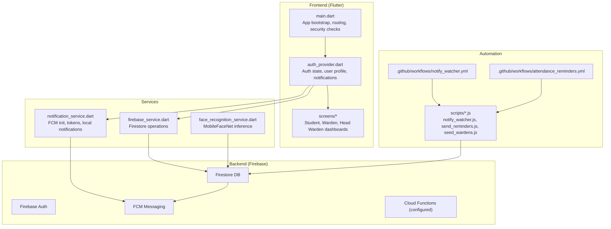
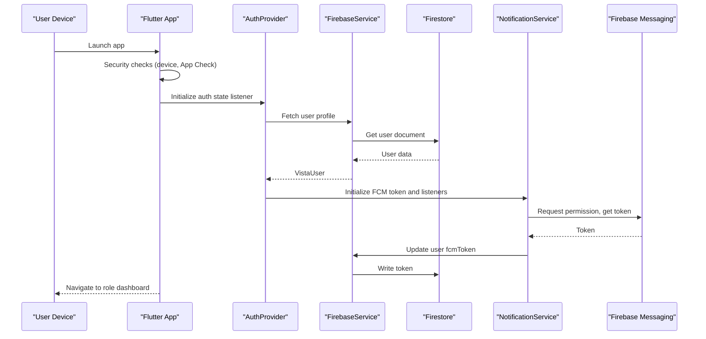
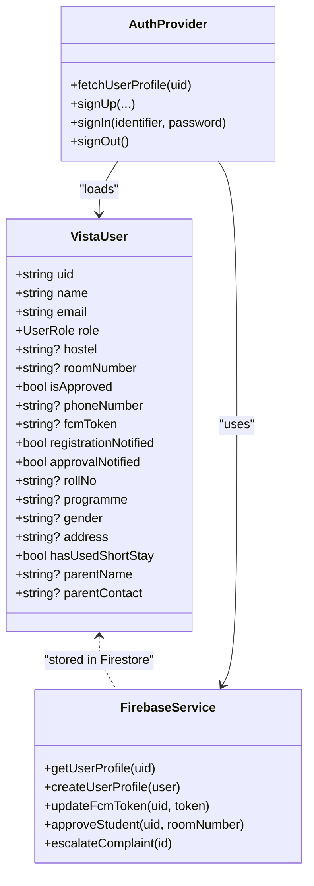
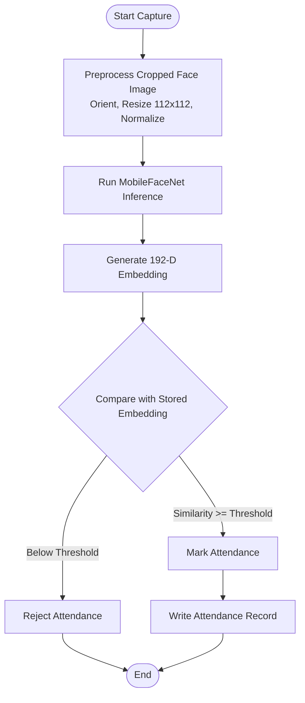
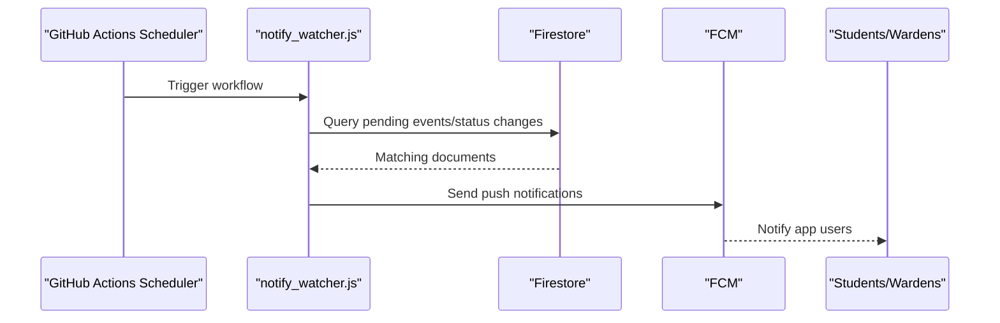
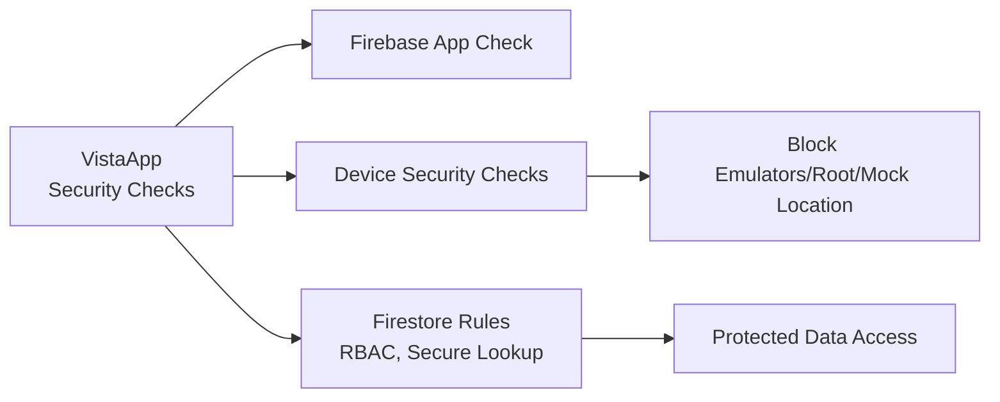
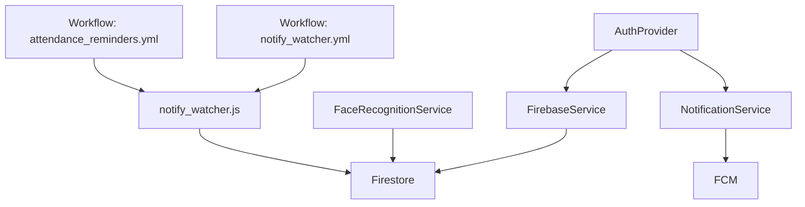

# Key Features Overview

<cite>
**Referenced Files in This Document**
- [README.md](file://README.md)
- [main.dart](file://lib/main.dart)
- [auth_provider.dart](file://lib/providers/auth_provider.dart)
- [firebase_service.dart](file://lib/services/firebase_service.dart)
- [notification_service.dart](file://lib/services/notification_service.dart)
- [face_recognition_service.dart](file://lib/services/face_recognition_service.dart)
- [vista_user.dart](file://lib/models/vista_user.dart)
- [firestore.rules](file://firestore.rules)
- [firebase.json](file://firebase.json)
- [proguard-rules.pro](file://android/app/proguard-rules.pro)
- [attendance_reminders.yml](file://.github/workflows/attendance_reminders.yml)
- [notify_watcher.yml](file://.github/workflows/notify_watcher.yml)
- [notify_watcher.js](file://scripts/notify_watcher.js)
- [send_reminders.js](file://scripts/send_reminders.js)
- [seed_wardens.js](file://scripts/seed_wardens.js)
- [firebase-messaging-sw.js](file://web/firebase-messaging-sw.js)
</cite>

## Table of Contents
1. [Introduction](#introduction)
2. [Project Structure](#project-structure)
3. [Core Components](#core-components)
4. [Architecture Overview](#architecture-overview)
5. [Detailed Component Analysis](#detailed-component-analysis)
6. [Dependency Analysis](#dependency-analysis)
7. [Performance Considerations](#performance-considerations)
8. [Troubleshooting Guide](#troubleshooting-guide)
9. [Conclusion](#conclusion)

## Introduction
This document presents the key features overview of the VISTA APP, a Flutter-based hostel management system. It focuses on the multi-role ecosystem (Students, Wardens, Head Wardens), the AI face recognition attendance system with MobileFaceNet and liveness detection, the automated notification engine driven by GitHub Actions and Firebase Cloud Messaging (FCM), and hardened security measures including production-grade Firestore rules, code obfuscation, and secure signing. Practical examples illustrate how these features integrate to deliver a seamless, secure, and automated hostel management solution.

## Project Structure
The application follows a layered architecture:
- Frontend: Flutter (Dart) with MVVM-style Providers for state management
- Backend: Firebase (Authentication, Firestore, FCM, Cloud Functions)
- AI/ML: TensorFlow Lite (MobileFaceNet) integrated via tflite_flutter
- Automation: GitHub Actions workflows and Node.js watchers
- Security: App Check, device security checks, obfuscation, and secure signing

**Diagram sources**
- [main.dart:23-117](file://lib/main.dart#L23-L117)
- [auth_provider.dart:8-49](file://lib/providers/auth_provider.dart#L8-L49)
- [firebase_service.dart:12-22](file://lib/services/firebase_service.dart#L12-L22)
- [notification_service.dart:10-81](file://lib/services/notification_service.dart#L10-L81)
- [face_recognition_service.dart:8-26](file://lib/services/face_recognition_service.dart#L8-L26)
- [.github/workflows/notify_watcher.yml](file://.github/workflows/notify_watcher.yml)
- [.github/workflows/attendance_reminders.yml](file://.github/workflows/attendance_reminders.yml)
- [scripts/notify_watcher.js](file://scripts/notify_watcher.js)
- [scripts/send_reminders.js](file://scripts/send_reminders.js)
- [scripts/seed_wardens.js](file://scripts/seed_wardens.js)

**Section sources**
- [README.md:82-88](file://README.md#L82-L88)
- [firebase.json:22-53](file://firebase.json#L22-L53)

## Core Components
- Multi-role ecosystem: Students, Wardens, and Head Wardens with role-specific dashboards and capabilities
- AI face recognition attendance: MobileFaceNet integration with preprocessing and cosine similarity scoring
- Automated notification engine: GitHub Actions workflows and Node.js watchers for nightly reminders and status updates
- Hardened security: Firestore rules, App Check, device security checks, code obfuscation, and secure signing

**Section sources**
- [README.md:7-31](file://README.md#L7-L31)
- [main.dart:137-144](file://lib/main.dart#L137-L144)
- [vista_user.dart:3-44](file://lib/models/vista_user.dart#L3-L44)

## Architecture Overview
The system orchestrates authentication, role-aware routing, real-time data access, AI-powered attendance, push notifications, and automation. The backend leverages Firebase for identity, storage, and messaging, while GitHub Actions powers scheduled tasks.

**Diagram sources**
- [main.dart:23-84](file://lib/main.dart#L23-L84)
- [auth_provider.dart:24-49](file://lib/providers/auth_provider.dart#L24-L49)
- [firebase_service.dart:110-146](file://lib/services/firebase_service.dart#L110-L146)
- [notification_service.dart:18-81](file://lib/services/notification_service.dart#L18-L81)

## Detailed Component Analysis

### Multi-Role Ecosystem
- Roles and responsibilities:
  - Students: Apply for hostel membership, request leaves, track complaints, and use attendance features
  - Wardens: Manage specific hostels (BH1, BH2, GH1, GH2), approve registrations, handle leave and short-stay requests, and oversee complaints
  - Head Wardens: High-level oversight with escalated complaint management
- Role-aware navigation and UI routing are handled in the application bootstrap and auth wrapper.

**Diagram sources**
- [vista_user.dart:5-95](file://lib/models/vista_user.dart#L5-L95)
- [auth_provider.dart:36-49](file://lib/providers/auth_provider.dart#L36-L49)
- [firebase_service.dart:73-146](file://lib/services/firebase_service.dart#L73-L146)

Practical examples:
- A Student logs in and views their dashboard, submits a leave request, and receives a push notification when the status updates.
- A Warden filters pending registrations for their hostel, approves a student, and receives a notification about the approval.
- A Head Warden escalates a complaint to the next level and reviews aggregated reports.

**Section sources**
- [README.md:9-12](file://README.md#L9-L12)
- [main.dart:137-144](file://lib/main.dart#L137-L144)
- [auth_provider.dart:36-49](file://lib/providers/auth_provider.dart#L36-L49)
- [firebase_service.dart:504-531](file://lib/services/firebase_service.dart#L504-L531)

### AI Face Recognition Attendance with MobileFaceNet and Liveness Detection
- MobileFaceNet integration:
  - Loads a TFLite model asset and preprocesses cropped face images (orientation bake, resize to 112x112, normalization to [-1, 1])
  - Runs inference to produce embeddings and computes cosine similarity for matching
  - Threshold-based matching supports reliable identification
- Liveness detection:
  - Anti-spoofing requirement enforced by requesting a blink during capture
- Biometric protection:
  - Strict Firestore rules limit access to face embeddings and sensitive data

**Diagram sources**
- [face_recognition_service.dart:16-60](file://lib/services/face_recognition_service.dart#L16-L60)

Practical examples:
- A Student captures their face on the Face Capture Screen; the system validates liveness by prompting a blink, generates an embedding, compares it with stored biometrics, and marks attendance if matched.

**Section sources**
- [README.md:14-17](file://README.md#L14-L17)
- [face_recognition_service.dart:28-82](file://lib/services/face_recognition_service.dart#L28-L82)

### Automated Notification Engine (GitHub Actions + FCM)
- Serverless watcher:
  - Node.js watcher monitors Firestore and triggers actions at scheduled intervals using GitHub Actions
- Push notifications:
  - Real-time alerts for new registration applications, leave/complaint status updates, and nightly attendance reminders (10:00 PM and 10:20 PM IST)
- Zero-cost operation:
  - Designed to run without paid Firebase plans by leveraging GitHub Actions and FCM

**Diagram sources**
- [.github/workflows/notify_watcher.yml](file://.github/workflows/notify_watcher.yml)
- [scripts/notify_watcher.js](file://scripts/notify_watcher.js)
- [scripts/send_reminders.js](file://scripts/send_reminders.js)

Practical examples:
- At 10:00 PM IST, the scheduler triggers the reminder workflow, which queries unmarked attendance records and sends push notifications to students to complete their daily attendance.

**Section sources**
- [README.md:19-25](file://README.md#L19-L25)
- [.github/workflows/attendance_reminders.yml](file://.github/workflows/attendance_reminders.yml)
- [scripts/notify_watcher.js](file://scripts/notify_watcher.js)
- [scripts/send_reminders.js](file://scripts/send_reminders.js)

### Hardened Security Measures
- Production-grade Firestore rules:
  - Role-based access control (RBAC) restricts reads/writes to authorized roles
  - Sensitive collections (e.g., users, attendance) enforce fine-grained permissions
  - Secure lookup via phone_mappings limits enumeration
- Device and app integrity:
  - Firebase App Check activated on non-web platforms
  - Device security checks block emulators, rooted devices, and mock locations
- Code obfuscation and secure signing:
  - Release builds are obfuscated and signed for Android
  - ProGuard rules preserve ML dependencies

**Diagram sources**
- [main.dart:45-82](file://lib/main.dart#L45-L82)
- [firestore.rules:7-106](file://firestore.rules#L7-L106)
- [firebase.json:22-26](file://firebase.json#L22-L26)
- [proguard-rules.pro:1-9](file://android/app/proguard-rules.pro#L1-L9)

Practical examples:
- If a user attempts to run the app on a rooted device or with mock locations enabled, the app displays a blocked screen and prevents access.
- Only authorized roles can read/write sensitive data; for example, only the student or their Warden can access face embeddings.

**Section sources**
- [README.md:27-31](file://README.md#L27-L31)
- [main.dart:148-194](file://lib/main.dart#L148-L194)
- [firestore.rules:16-106](file://firestore.rules#L16-L106)
- [proguard-rules.pro:1-9](file://android/app/proguard-rules.pro#L1-L9)

## Dependency Analysis
The application’s dependencies span Flutter services, Firebase APIs, GitHub Actions, and Node.js scripts. Cohesion is strong within each module, while coupling is primarily through Firebase and shared models.

**Diagram sources**
- [auth_provider.dart:8-49](file://lib/providers/auth_provider.dart#L8-L49)
- [firebase_service.dart:12-22](file://lib/services/firebase_service.dart#L12-L22)
- [notification_service.dart:10-21](file://lib/services/notification_service.dart#L10-L21)
- [face_recognition_service.dart:8-14](file://lib/services/face_recognition_service.dart#L8-L14)
- [.github/workflows/notify_watcher.yml](file://.github/workflows/notify_watcher.yml)
- [.github/workflows/attendance_reminders.yml](file://.github/workflows/attendance_reminders.yml)
- [scripts/notify_watcher.js](file://scripts/notify_watcher.js)

**Section sources**
- [auth_provider.dart:8-49](file://lib/providers/auth_provider.dart#L8-L49)
- [firebase_service.dart:12-22](file://lib/services/firebase_service.dart#L12-L22)
- [notification_service.dart:10-21](file://lib/services/notification_service.dart#L10-L21)
- [face_recognition_service.dart:8-14](file://lib/services/face_recognition_service.dart#L8-L14)

## Performance Considerations
- Model loading and inference:
  - Load MobileFaceNet once and reuse the interpreter to minimize startup overhead
  - Preprocessing steps (orientation bake, resize, normalize) should be performed efficiently to maintain real-time responsiveness
- Firestore queries:
  - Use targeted queries with role-based filters and date ranges to reduce payload sizes
  - Consider indexing strategies for frequent filters (e.g., hostel, status, timestamps)
- Notifications:
  - Defer heavy operations until after permission is granted
  - Batch notification updates to avoid redundant writes
- Automation:
  - Schedule GitHub Actions to align with IST timeframes to reduce unnecessary polling
  - Use rate limiting for operations like leave and complaint submissions

[No sources needed since this section provides general guidance]

## Troubleshooting Guide
Common issues and resolutions:
- Firebase initialization failures on web:
  - The app attempts to initialize Firebase and catches initialization errors gracefully; subsequent calls may fail on web if initialization is skipped
- Missing configuration files:
  - Ensure google-services.json (Android) and GoogleService-Info.plist (iOS) are present before running
- FCM token not received:
  - Verify notification permission is granted and the token is written to Firestore; clear token on logout to prevent stale entries
- Attendance not marking:
  - Confirm the captured face meets liveness requirements and the embedding similarity threshold is met
- Security block:
  - If the device is detected as rooted/emulator/mock location enabled, the app displays a blocked screen; use a physical device without developer options

**Section sources**
- [main.dart:34-58](file://lib/main.dart#L34-L58)
- [README.md:52-66](file://README.md#L52-L66)
- [notification_service.dart:18-81](file://lib/services/notification_service.dart#L18-L81)
- [face_recognition_service.dart:28-82](file://lib/services/face_recognition_service.dart#L28-L82)
- [main.dart:148-194](file://lib/main.dart#L148-L194)

## Conclusion
VISTA APP delivers a robust, secure, and automated hostel management solution by combining role-aware dashboards, AI-powered attendance with MobileFaceNet and liveness detection, a zero-cost automated notification engine, and hardened security controls. These features work together to streamline operations, enhance security, and improve user experience across Students, Wardens, and Head Wardens.

[No sources needed since this section summarizes without analyzing specific files]