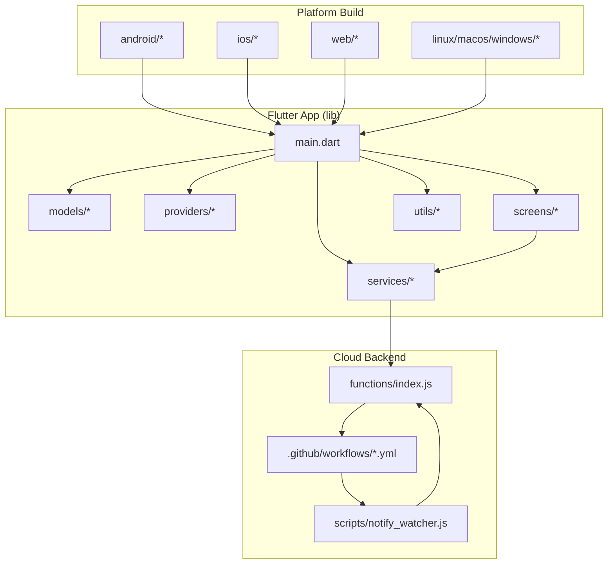
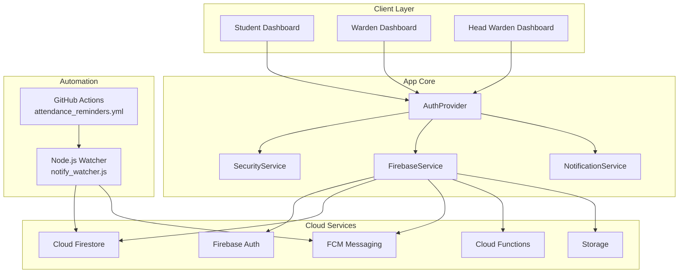
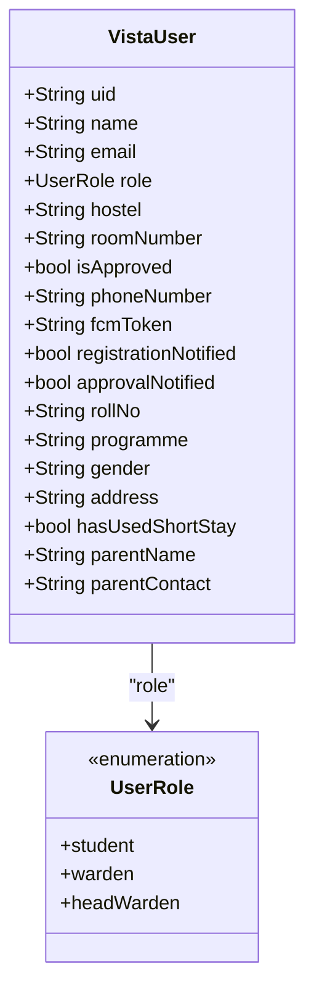
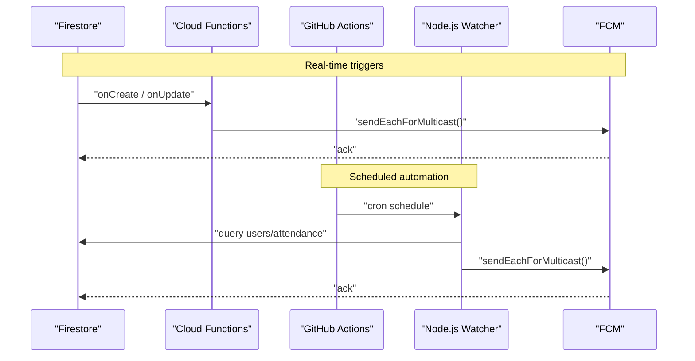
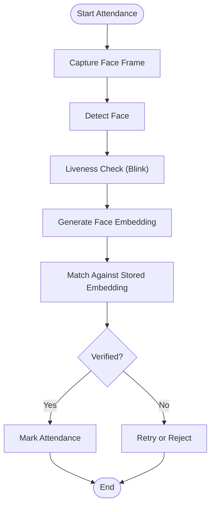
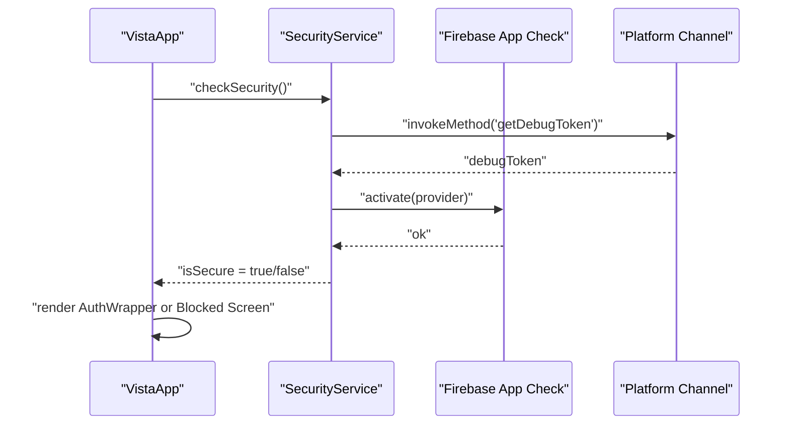
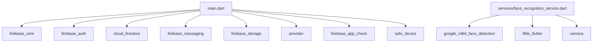

# Project Overview

<cite>
**Referenced Files in This Document**
- [README.md](file://README.md)
- [main.dart](file://lib/main.dart)
- [pubspec.yaml](file://pubspec.yaml)
- [vista_user.dart](file://lib/models/vista_user.dart)
- [index.js](file://functions/index.js)
- [notify_watcher.js](file://scripts/notify_watcher.js)
- [attendance_reminders.yml](file://.github/workflows/attendance_reminders.yml)
- [theme.dart](file://lib/utils/theme.dart)
</cite>

## Table of Contents
1. [Introduction](#introduction)
2. [Project Structure](#project-structure)
3. [Core Components](#core-components)
4. [Architecture Overview](#architecture-overview)
5. [Detailed Component Analysis](#detailed-component-analysis)
6. [Dependency Analysis](#dependency-analysis)
7. [Performance Considerations](#performance-considerations)
8. [Troubleshooting Guide](#troubleshooting-guide)
9. [Conclusion](#conclusion)

## Introduction
VISTA is a professional, secure, and fully automated Flutter application for university hostel management. It streamlines student registrations, leave requests, complaint management, and attendance using cutting-edge AI and real-time cloud technology. The system targets university administrators, hostel staff, and students, delivering a robust multi-role ecosystem with hardened security and an automated notification engine.

Key value propositions:
- Operational efficiency: Reduce manual administrative overhead with automation and AI-driven attendance.
- Enhanced security: Protect sensitive biometric and personal data with production-grade Firestore rules and device integrity checks.
- Scalable communication: Real-time push notifications for approvals, leave updates, and nightly attendance reminders.
- Zero-cost operation: Achieve continuous automation without paid Firebase subscriptions by leveraging serverless triggers and GitHub Actions.

## Project Structure
The repository follows a modular Flutter project layout with clear separation of concerns:
- lib: Application code (models, providers, services, screens, utils, widgets)
- functions: Firebase Cloud Functions for real-time triggers and scheduled tasks
- scripts: Node.js watcher for background automation
- .github/workflows: GitHub Actions for scheduled attendance reminders
- android/ios/web/windows/linux/macos: Platform-specific build configurations and assets

**Diagram sources**
- [main.dart:1-195](file://lib/main.dart#L1-L195)
- [index.js:1-253](file://functions/index.js#L1-L253)
- [notify_watcher.js:1-165](file://scripts/notify_watcher.js#L1-L165)
- [attendance_reminders.yml:1-46](file://.github/workflows/attendance_reminders.yml#L1-L46)

**Section sources**
- [README.md:82-89](file://README.md#L82-L89)
- [pubspec.yaml:88-122](file://pubspec.yaml#L88-L122)

## Core Components
- Multi-role ecosystem: Students, Wardens, and Head Wardens with role-based dashboards and permissions.
- AI face recognition attendance: MobileFaceNet integration with liveness detection for biometric verification.
- Automated notification engine: Real-time FCM notifications for approvals, leave/complaint updates, and nightly attendance reminders.
- Hardened security: Firestore production rules, App Check, device integrity checks, and secure signing.

Target audience and use cases:
- University hostel administrators seeking operational automation and audit trails.
- Students needing streamlined registration, leave, and complaint processes.
- Wardens managing block-level operations and oversight.
- Head Wardens monitoring escalated issues and cross-block coordination.

Practical examples:
- A student registers for hostel membership and receives an approval notification.
- A Warden receives a real-time alert when a student applies for leave.
- Nightly attendance reminders prompt students to mark attendance, with missed reminders after 10:20 PM IST.

**Section sources**
- [README.md:7-31](file://README.md#L7-L31)
- [main.dart:100-146](file://lib/main.dart#L100-L146)
- [vista_user.dart:1-96](file://lib/models/vista_user.dart#L1-L96)

## Architecture Overview
The system integrates a Flutter frontend with Firebase backend services and serverless automation. The architecture emphasizes real-time updates, scheduled tasks, and device-level security checks.

**Diagram sources**
- [main.dart:1-195](file://lib/main.dart#L1-L195)
- [index.js:1-253](file://functions/index.js#L1-L253)
- [notify_watcher.js:1-165](file://scripts/notify_watcher.js#L1-L165)
- [attendance_reminders.yml:1-46](file://.github/workflows/attendance_reminders.yml#L1-L46)

## Detailed Component Analysis

### Multi-Role Ecosystem
The application supports three distinct roles with tailored dashboards and permissions:
- Student: Registration, leave requests, complaint filing, and attendance marking.
- Warden: Block-level oversight, approval workflows, and request management.
- Head Warden: Cross-block escalation and high-level reporting.

**Diagram sources**
- [vista_user.dart:1-96](file://lib/models/vista_user.dart#L1-L96)

**Section sources**
- [vista_user.dart:1-96](file://lib/models/vista_user.dart#L1-L96)
- [main.dart:100-146](file://lib/main.dart#L100-L146)

### Automated Notification Engine
The notification engine combines real-time triggers and scheduled automation:
- Real-time triggers: Firestore onCreate/onUpdate events for registrations, leave requests, complaints, and status changes.
- Scheduled automation: GitHub Actions and a Node.js watcher sending nightly attendance reminders and broadcasting updates.

**Diagram sources**
- [index.js:109-118](file://functions/index.js#L109-L118)
- [index.js:124-151](file://functions/index.js#L124-L151)
- [index.js:214-252](file://functions/index.js#L214-L252)
- [attendance_reminders.yml:1-46](file://.github/workflows/attendance_reminders.yml#L1-L46)
- [notify_watcher.js:25-67](file://scripts/notify_watcher.js#L25-L67)

**Section sources**
- [index.js:109-118](file://functions/index.js#L109-L118)
- [index.js:124-151](file://functions/index.js#L124-L151)
- [index.js:214-252](file://functions/index.js#L214-L252)
- [attendance_reminders.yml:1-46](file://.github/workflows/attendance_reminders.yml#L1-L46)
- [notify_watcher.js:25-67](file://scripts/notify_watcher.js#L25-L67)

### AI Face Recognition Attendance
The attendance system integrates Google ML Kit and TFLite with MobileFaceNet for precise face matching and liveness detection requiring a blink to prevent spoofing. Biometric data is protected by production-grade Firestore rules.

**Diagram sources**
- [README.md:14-17](file://README.md#L14-L17)

**Section sources**
- [README.md:14-17](file://README.md#L14-L17)

### Security and Device Integrity
The app enforces device integrity checks and App Check to block emulators, rooted devices, and mock locations. On web, Firebase initialization is handled gracefully, while mobile platforms receive additional protections.

**Diagram sources**
- [main.dart:23-84](file://lib/main.dart#L23-L84)

**Section sources**
- [main.dart:23-84](file://lib/main.dart#L23-L84)
- [README.md:27-31](file://README.md#L27-L31)

## Dependency Analysis
The Flutter application leverages a modern stack for productivity, scalability, and security. Dependencies include Firebase services, ML/AI libraries, state management, and platform-specific integrations.

**Diagram sources**
- [pubspec.yaml:30-70](file://pubspec.yaml#L30-L70)
- [main.dart:1-20](file://lib/main.dart#L1-L20)

**Section sources**
- [pubspec.yaml:30-70](file://pubspec.yaml#L30-L70)
- [main.dart:1-20](file://lib/main.dart#L1-L20)

## Performance Considerations
- Minimize network calls: Batch Firestore queries and leverage real-time listeners where appropriate.
- Optimize ML inference: Use efficient TFLite models and limit frame rates during live capture.
- Reduce notification spam: Implement deduplication and status change tracking to avoid redundant FCM messages.
- Caching: Persist essential user data locally to improve offline resilience and reduce cold-start latency.

## Troubleshooting Guide
Common issues and resolutions:
- Firebase initialization failures on web: Verify configuration files and handle graceful fallbacks.
- Attendance reminders not received: Confirm timezone settings and scheduled job status in GitHub Actions.
- Device blocked: Disable mock locations and use a physical device for production builds.
- Notification delivery failures: Validate FCM tokens and ensure Firestore rules permit messaging.

**Section sources**
- [main.dart:34-58](file://lib/main.dart#L34-L58)
- [attendance_reminders.yml:1-46](file://.github/workflows/attendance_reminders.yml#L1-L46)
- [main.dart:148-194](file://lib/main.dart#L148-L194)

## Conclusion
VISTA delivers a comprehensive, secure, and automated solution for university hostel management. Its multi-role ecosystem, AI-powered attendance, and robust notification engine streamline operations while maintaining strong security and zero-cost scalability. The modular architecture and clear separation of concerns enable maintainability and future enhancements aligned with university hostel needs.