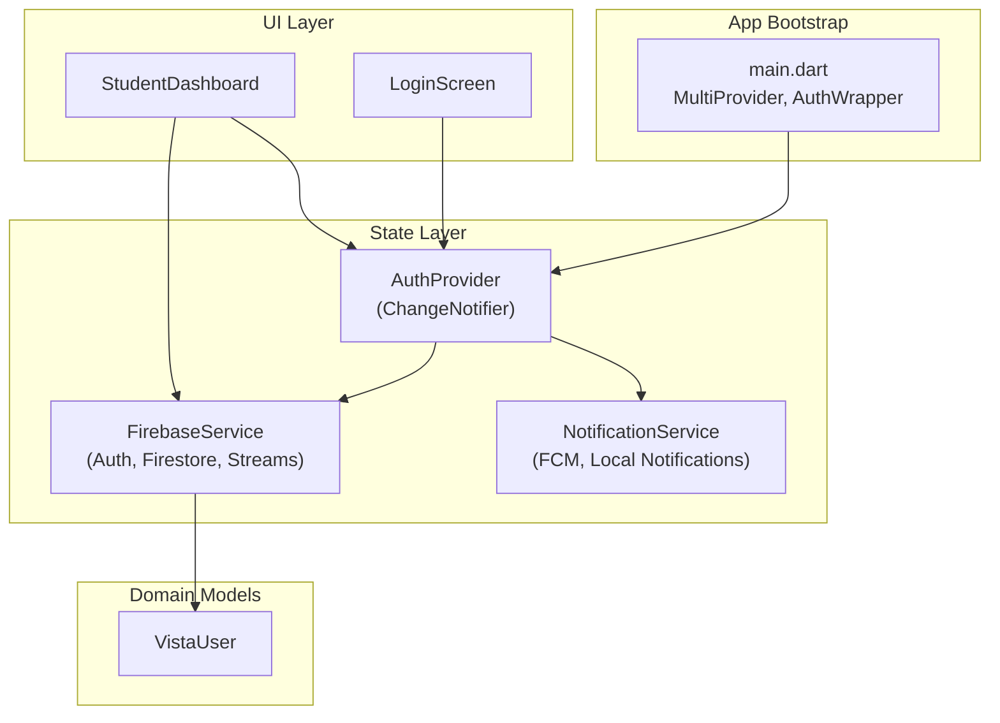
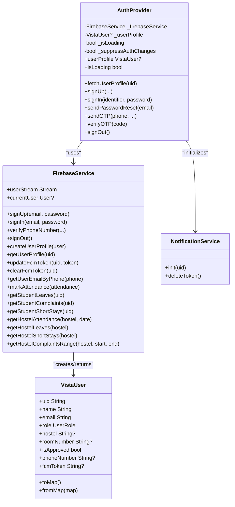
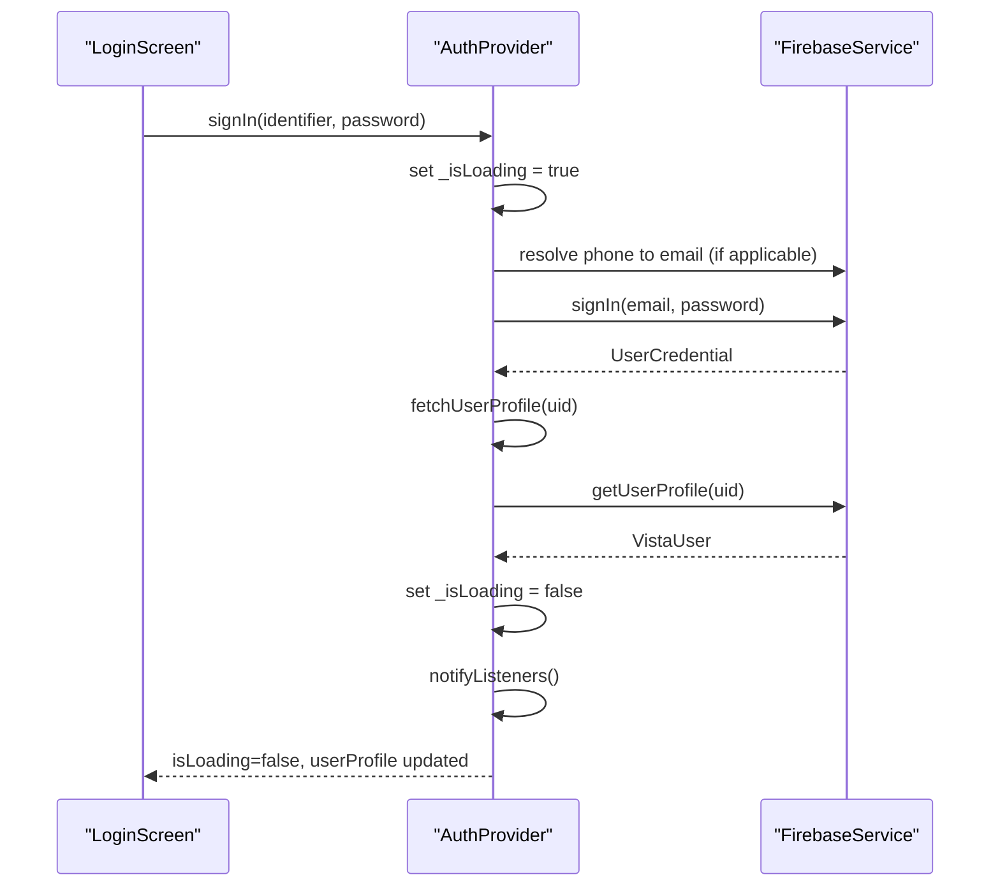
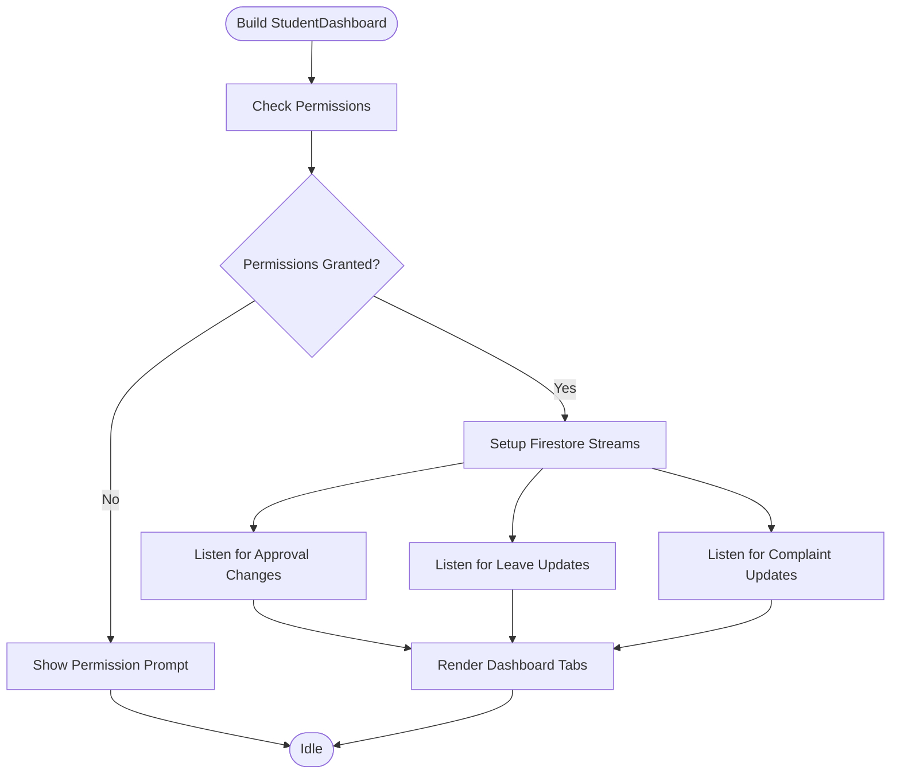
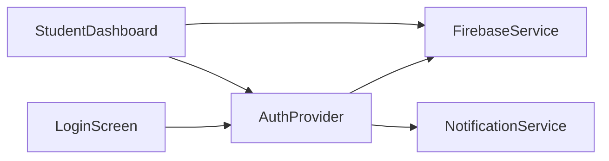

# State Management

<cite>
**Referenced Files in This Document**
- [main.dart](file://lib/main.dart)
- [auth_provider.dart](file://lib/providers/auth_provider.dart)
- [firebase_service.dart](file://lib/services/firebase_service.dart)
- [notification_service.dart](file://lib/services/notification_service.dart)
- [login_screen.dart](file://lib/screens/auth/login_screen.dart)
- [student_dashboard.dart](file://lib/screens/student/student_dashboard.dart)
- [vista_user.dart](file://lib/models/vista_user.dart)
- [sanitizer.dart](file://lib/utils/sanitizer.dart)
- [security_service.dart](file://lib/services/security_service.dart)
</cite>

## Table of Contents
1. [Introduction](#introduction)
2. [Project Structure](#project-structure)
3. [Core Components](#core-components)
4. [Architecture Overview](#architecture-overview)
5. [Detailed Component Analysis](#detailed-component-analysis)
6. [Dependency Analysis](#dependency-analysis)
7. [Performance Considerations](#performance-considerations)
8. [Troubleshooting Guide](#troubleshooting-guide)
9. [Conclusion](#conclusion)
10. [Appendices](#appendices)

## Introduction
This document explains the Provider-based state management implementation used in the application. It focuses on the MVVM-style architecture where ViewModels (implemented as Provider classes) manage reactive state, coordinate with Firebase services for data synchronization, and enable cross-component communication via streams and change notifications. The AuthProvider demonstrates authentication state lifecycle, asynchronous state handling, and integration with Firebase Authentication and Cloud Firestore. The document also covers observer patterns, state restoration across app restarts, memory management, provider scoping, performance optimization, and debugging strategies.

## Project Structure
The state management spans several layers:
- Application bootstrap initializes Firebase and wraps the app with MultiProvider to expose shared providers.
- The AuthProvider acts as the primary ViewModel for authentication and user profile state.
- FirebaseService encapsulates all Firebase interactions (Auth, Firestore, Messaging).
- UI screens consume provider state reactively and trigger asynchronous operations through provider methods.
- Supporting utilities handle input sanitization and security checks.

**Diagram sources**
- [main.dart:100-117](file://lib/main.dart#L100-L117)
- [auth_provider.dart:8-34](file://lib/providers/auth_provider.dart#L8-L34)
- [firebase_service.dart:12-28](file://lib/services/firebase_service.dart#L12-L28)
- [notification_service.dart:10-81](file://lib/services/notification_service.dart#L10-L81)
- [login_screen.dart:15-54](file://lib/screens/auth/login_screen.dart#L15-L54)
- [student_dashboard.dart:39-97](file://lib/screens/student/student_dashboard.dart#L39-L97)
- [vista_user.dart:5-44](file://lib/models/vista_user.dart#L5-L44)

**Section sources**
- [main.dart:23-117](file://lib/main.dart#L23-L117)
- [auth_provider.dart:8-34](file://lib/providers/auth_provider.dart#L8-L34)
- [firebase_service.dart:12-28](file://lib/services/firebase_service.dart#L12-L28)

## Core Components
- AuthProvider: Manages authentication state, user profile loading, async transitions, and suppression of auth-state listener during sign-up to prevent premature navigation. It exposes isLoading and userProfile getters and notifies listeners on state changes.
- FirebaseService: Centralizes Firebase operations including auth state stream, user profile CRUD, phone/email mapping, and Firestore collections for attendance, leaves, short stays, and complaints. It also provides rate-limited submission helpers and range queries.
- NotificationService: Initializes FCM, stores tokens in Firestore, listens for token refresh, and shows local notifications on mobile.
- VistaUser: Domain model representing a user with role, hostel, and metadata, including serialization/deserialization helpers.
- LoginScreen and StudentDashboard: UI components that consume provider state reactively and invoke provider methods to perform async operations.

Key reactive patterns:
- ChangeNotifier-driven state updates: AuthProvider extends ChangeNotifier and calls notifyListeners on state changes.
- Streams for real-time updates: userStream drives user profile updates; Firestore snapshots feed domain lists (leaves, complaints, short stays).
- Async state handling: isLoading flags coordinate UI feedback during long-running operations.

**Section sources**
- [auth_provider.dart:8-206](file://lib/providers/auth_provider.dart#L8-L206)
- [firebase_service.dart:12-668](file://lib/services/firebase_service.dart#L12-L668)
- [notification_service.dart:10-114](file://lib/services/notification_service.dart#L10-L114)
- [vista_user.dart:5-96](file://lib/models/vista_user.dart#L5-L96)
- [login_screen.dart:15-54](file://lib/screens/auth/login_screen.dart#L15-L54)
- [student_dashboard.dart:39-97](file://lib/screens/student/student_dashboard.dart#L39-L97)

## Architecture Overview
The system follows an MVVM-style pattern:
- Model: VistaUser and Firestore-backed entities.
- ViewModel: AuthProvider orchestrates state and async flows.
- View: Screens subscribe to provider state and render reactive UI.

**Diagram sources**
- [auth_provider.dart:8-206](file://lib/providers/auth_provider.dart#L8-L206)
- [firebase_service.dart:12-668](file://lib/services/firebase_service.dart#L12-L668)
- [notification_service.dart:10-114](file://lib/services/notification_service.dart#L10-L114)
- [vista_user.dart:5-96](file://lib/models/vista_user.dart#L5-L96)

## Detailed Component Analysis

### AuthProvider: MVVM ViewModel for Authentication
Responsibilities:
- Subscribe to Firebase auth state stream and load user profile on sign-in/sign-out.
- Expose isLoading and userProfile to UI.
- Coordinate sign-up, sign-in, password reset, and phone OTP verification.
- Suppress auth-state listener during sign-up to avoid premature navigation.
- Initialize notifications after profile load.

Reactive state:
- _isLoading toggled around async operations; notifyListeners invoked to refresh UI.
- _suppressAuthChanges prevents AuthWrapper from switching screens mid-signup.

Async flows:
- signUp writes profile with a timeout to tolerate slow Firestore on web.
- signIn resolves phone identifiers to emails and signs in.
- signOut clears FCM token in Firestore and deletes device token.

**Diagram sources**
- [login_screen.dart:21-54](file://lib/screens/auth/login_screen.dart#L21-L54)
- [auth_provider.dart:165-187](file://lib/providers/auth_provider.dart#L165-L187)
- [firebase_service.dart:39-41](file://lib/services/firebase_service.dart#L39-L41)
- [firebase_service.dart:110-146](file://lib/services/firebase_service.dart#L110-L146)

**Section sources**
- [auth_provider.dart:8-206](file://lib/providers/auth_provider.dart#L8-L206)
- [login_screen.dart:15-54](file://lib/screens/auth/login_screen.dart#L15-L54)

### FirebaseService: Data Synchronization with Firebase
Capabilities:
- Auth state stream and current user access.
- User profile creation/update and retrieval with fallback logic.
- Phone/email mapping for secure login resolution.
- Real-time streams for attendance, leaves, short stays, and complaints.
- Range queries for hostels and sequences for unique IDs.
- Rate-limited submissions to prevent abuse.

Observer pattern:
- userStream drives AuthProvider to update userProfile.
- Snapshot streams feed domain lists to UI components.

Persistence and synchronization:
- Firestore documents for users, attendance, leaves, short stays, and complaints.
- FCM token stored per user for targeted messaging.

**Section sources**
- [firebase_service.dart:12-668](file://lib/services/firebase_service.dart#L12-L668)

### NotificationService: Reactive Messaging
Responsibilities:
- Request notification permission and obtain FCM token.
- Update Firestore with token and listen for refresh.
- Show local notifications on mobile.

Integration:
- Called from AuthProvider after successful profile load.
- Ensures token cleanup on sign-out.

**Section sources**
- [notification_service.dart:10-114](file://lib/services/notification_service.dart#L10-L114)
- [auth_provider.dart:40-48](file://lib/providers/auth_provider.dart#L40-L48)

### UI Integration: LoginScreen and StudentDashboard
LoginScreen:
- Consumes AuthProvider for isLoading and error messaging.
- Calls AuthProvider.signIn with sanitized inputs.
- Uses Provider.of(context, listen: false) to avoid unnecessary rebuilds during async calls.

StudentDashboard:
- Subscribes to Firestore streams for leaves, complaints, and approvals.
- Manages lifecycle subscriptions and disposes them in dispose().
- Uses SecurityService checks and conditional rendering for device capabilities.

**Diagram sources**
- [student_dashboard.dart:39-97](file://lib/screens/student/student_dashboard.dart#L39-L97)
- [student_dashboard.dart:56-61](file://lib/screens/student/student_dashboard.dart#L56-L61)

**Section sources**
- [login_screen.dart:15-54](file://lib/screens/auth/login_screen.dart#L15-L54)
- [student_dashboard.dart:39-97](file://lib/screens/student/student_dashboard.dart#L39-L97)

## Dependency Analysis
Provider scope and coupling:
- AuthProvider is provided at the root via MultiProvider, enabling global access across screens.
- FirebaseService is injected into AuthProvider and reused by UI components for specialized queries.
- NotificationService depends on FirebaseService for token updates.

Potential circular dependencies:
- None observed; AuthProvider depends on FirebaseService and NotificationService, but UI components depend on AuthProvider rather than on each other.

External dependencies:
- Firebase Authentication, Cloud Firestore, Firebase Messaging.
- Flutter provider, geolocator, permission_handler, shared_preferences.

**Diagram sources**
- [main.dart:100-117](file://lib/main.dart#L100-L117)
- [auth_provider.dart:8-206](file://lib/providers/auth_provider.dart#L8-L206)
- [firebase_service.dart:12-668](file://lib/services/firebase_service.dart#L12-L668)
- [notification_service.dart:10-114](file://lib/services/notification_service.dart#L10-L114)
- [login_screen.dart:15-54](file://lib/screens/auth/login_screen.dart#L15-L54)
- [student_dashboard.dart:39-97](file://lib/screens/student/student_dashboard.dart#L39-L97)

**Section sources**
- [main.dart:100-117](file://lib/main.dart#L100-L117)
- [auth_provider.dart:8-206](file://lib/providers/auth_provider.dart#L8-L206)

## Performance Considerations
- Minimize rebuilds: Use Provider.of(..., listen: false) for non-reactive reads during async operations.
- Debounce UI updates: Avoid frequent notifyListeners within tight loops; batch state changes.
- Stream lifecycle: Dispose subscriptions in dispose() to prevent leaks (as seen in StudentDashboard).
- Network timeouts: AuthProvider uses timeouts for profile writes to avoid blocking UI.
- Rate limiting: FirebaseService wraps heavy operations with rate limiter to reduce backend pressure.
- Conditional rendering: Guard mobile-only features behind kIsWeb checks to avoid unnecessary work on web.

[No sources needed since this section provides general guidance]

## Troubleshooting Guide
Common issues and resolutions:
- AuthWrapper navigates prematurely during sign-up:
  - AuthProvider sets _suppressAuthChanges during signUp to suppress auth-state listener until sign-up completes.
- Loading state not reflected:
  - Ensure _isLoading is toggled around async calls and notifyListeners is invoked.
- Notifications not received:
  - Verify NotificationService.init is called post-login and FCM token is persisted in Firestore.
- Permission errors on mobile:
  - StudentDashboard checks location/camera permissions and prompts users accordingly.
- Input sanitization failures:
  - Use InputSanitizer.sanitize and normalizePhone to prevent injection and ensure consistent phone formats.

**Section sources**
- [auth_provider.dart:66-108](file://lib/providers/auth_provider.dart#L66-L108)
- [auth_provider.dart:40-48](file://lib/providers/auth_provider.dart#L40-L48)
- [notification_service.dart:18-81](file://lib/services/notification_service.dart#L18-L81)
- [student_dashboard.dart:119-140](file://lib/screens/student/student_dashboard.dart#L119-L140)
- [sanitizer.dart:24-97](file://lib/utils/sanitizer.dart#L24-L97)

## Conclusion
The application employs a clean Provider-based MVVM architecture with reactive state updates and robust Firebase integration. AuthProvider centralizes authentication and user state, while FirebaseService and NotificationService encapsulate data synchronization and messaging. UI components consume state reactively and invoke provider methods to perform asynchronous operations. Proper scoping, lifecycle management, and sanitization ensure reliability and security across platforms.

[No sources needed since this section summarizes without analyzing specific files]

## Appendices

### Best Practices for Provider Scoping and Memory Management
- Scope providers at the root for global access; keep local providers scoped to feature boundaries.
- Always dispose of StreamSubscription and timers in dispose().
- Use listen: false for non-reactive reads to avoid unnecessary rebuilds.
- Keep state immutable where possible; rebuild only when notifyListeners is called.

[No sources needed since this section provides general guidance]

### Async State Handling and Error Propagation Patterns
- Set isLoading flags around async operations; reset on completion or error.
- Catch and rethrow exceptions to let UI decide how to surface errors.
- Use timeouts for network-bound operations to maintain responsiveness.
- Normalize user inputs before invoking provider/Firebase methods.

**Section sources**
- [auth_provider.dart:66-108](file://lib/providers/auth_provider.dart#L66-L108)
- [login_screen.dart:21-54](file://lib/screens/auth/login_screen.dart#L21-L54)
- [sanitizer.dart:24-97](file://lib/utils/sanitizer.dart#L24-L97)