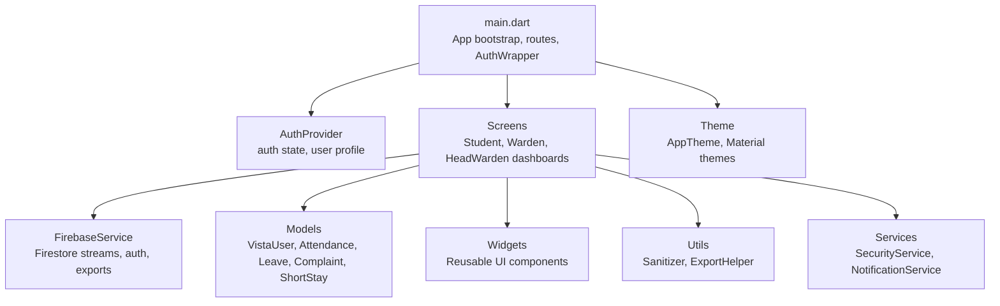
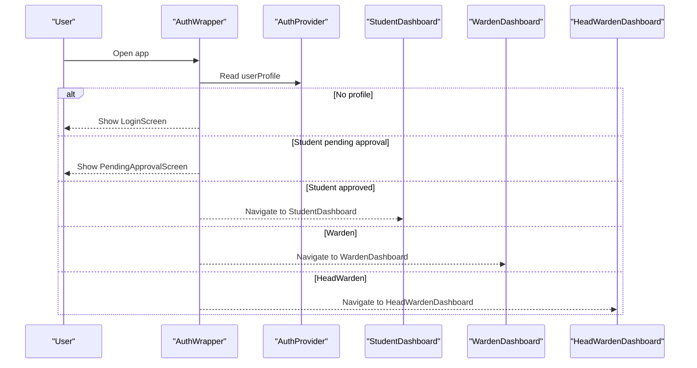
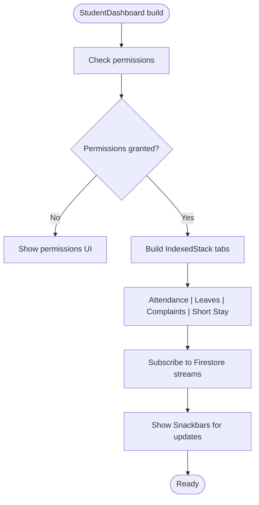
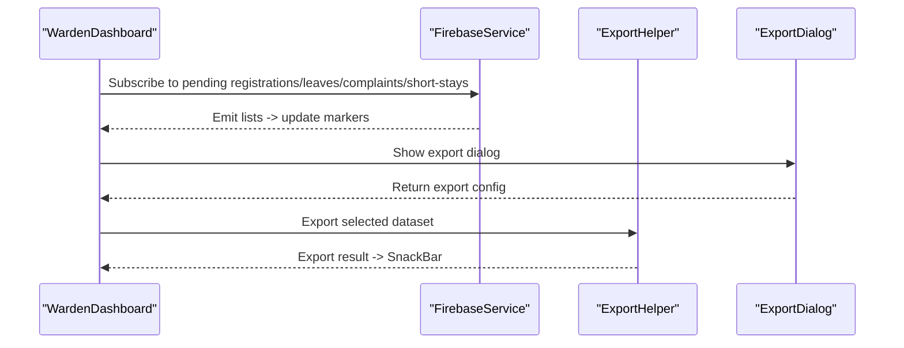
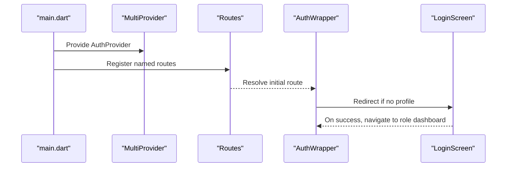
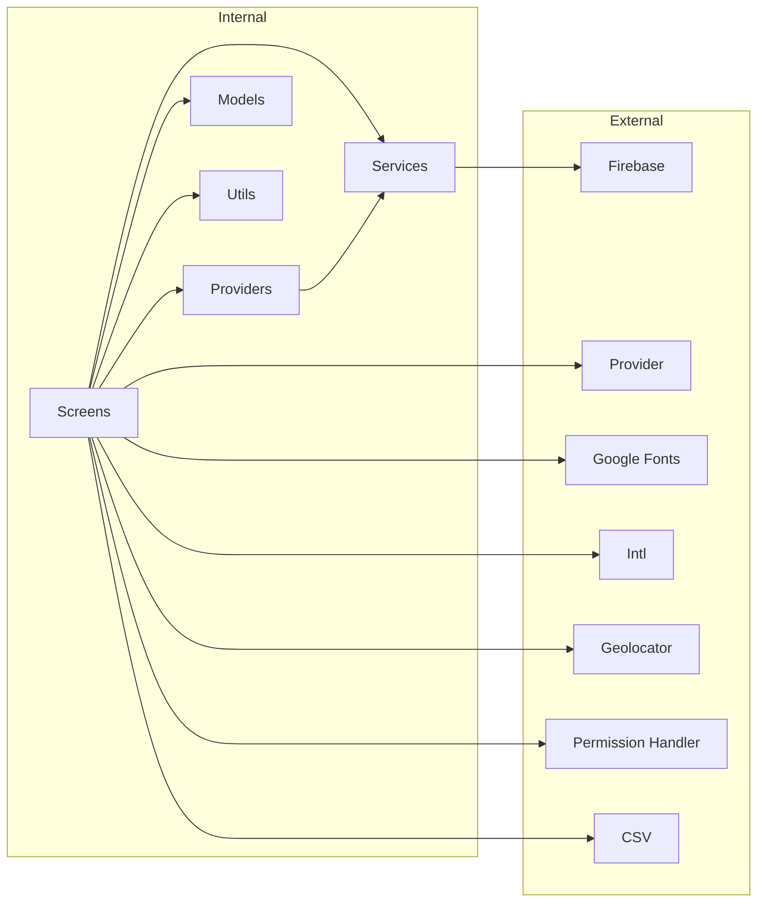

# UI Components and Screens

<cite>
**Referenced Files in This Document**
- [main.dart](file://lib/main.dart)
- [theme.dart](file://lib/utils/theme.dart)
- [vista_user.dart](file://lib/models/vista_user.dart)
- [auth_provider.dart](file://lib/providers/auth_provider.dart)
- [login_screen.dart](file://lib/screens/auth/login_screen.dart)
- [student_dashboard.dart](file://lib/screens/student/student_dashboard.dart)
- [warden_dashboard.dart](file://lib/screens/warden/warden_dashboard.dart)
- [head_warden_dashboard.dart](file://lib/screens/head_warden/head_warden_dashboard.dart)
- [firebase_service.dart](file://lib/services/firebase_service.dart)
- [export_helper.dart](file://lib/utils/export_helper.dart)
- [export_dialog.dart](file://lib/widgets/export_dialog.dart)
- [sanitizer.dart](file://lib/utils/sanitizer.dart)
- [security_service.dart](file://lib/services/security_service.dart)
- [face_capture_screen.dart](file://lib/screens/student/face_capture_screen.dart)
- [face_capture_screen_stub.dart](file://lib/screens/student/face_capture_screen_stub.dart)
- [attendance_model.dart](file://lib/models/attendance_model.dart)
- [leave_request_model.dart](file://lib/models/leave_request_model.dart)
- [complaint_model.dart](file://lib/models/complaint_model.dart)
- [short_stay_model.dart](file://lib/models/short_stay_model.dart)
- [pubspec.yaml](file://pubspec.yaml)
</cite>

## Table of Contents
1. [Introduction](#introduction)
2. [Project Structure](#project-structure)
3. [Core Components](#core-components)
4. [Architecture Overview](#architecture-overview)
5. [Detailed Component Analysis](#detailed-component-analysis)
6. [Dependency Analysis](#dependency-analysis)
7. [Performance Considerations](#performance-considerations)
8. [Troubleshooting Guide](#troubleshooting-guide)
9. [Conclusion](#conclusion)
10. [Appendices](#appendices)

## Introduction
This document describes the UI components and screen architecture of the VISTA app, focusing on role-based dashboards for Students, Wardens, and Head Wardens. It explains navigation patterns, layout structures, reusable widgets, responsive design, screen transitions, state management via Provider, real-time data binding, accessibility, theming, cross-platform consistency, performance optimization, and practical troubleshooting strategies.

## Project Structure
The UI layer is organized around:
- Entry point initializes Firebase, security checks, and routing.
- Role-based dashboards under dedicated screen modules.
- Shared models, providers, services, and utilities.
- Theming and reusable UI components.

**Diagram sources**
- [main.dart:23-118](file://lib/main.dart#L23-L118)
- [auth_provider.dart:8-49](file://lib/providers/auth_provider.dart#L8-L49)
- [student_dashboard.dart:32-308](file://lib/screens/student/student_dashboard.dart#L32-L308)
- [warden_dashboard.dart:25-539](file://lib/screens/warden/warden_dashboard.dart#L25-L539)
- [head_warden_dashboard.dart:25-489](file://lib/screens/head_warden/head_warden_dashboard.dart#L25-L489)
- [firebase_service.dart](file://lib/services/firebase_service.dart)
- [theme.dart:4-71](file://lib/utils/theme.dart#L4-L71)

**Section sources**
- [main.dart:23-118](file://lib/main.dart#L23-L118)
- [pubspec.yaml:30-70](file://pubspec.yaml#L30-L70)

## Core Components
- Authentication and routing:
  - App bootstraps Firebase and security, then wraps the app with Provider and routes.
  - AuthWrapper selects the appropriate dashboard based on user role and approval status.
- Role-based dashboards:
  - StudentDashboard: Attendance, Leave, Complaints, Short Stay tabs with permission checks and real-time updates.
  - WardenDashboard: Hostel-level management with activity markers, export dialog, and tabbed content.
  - HeadWardenDashboard: System-wide oversight with global filters and export.
- State management:
  - Provider manages authentication state and user profile, notifying UI on changes.
- Real-time data:
  - Streams from FirebaseService drive live updates for approvals, requests, and statuses.
- Theming and accessibility:
  - Centralized theme with Material Design, consistent typography, and platform transitions.
- Cross-platform:
  - Responsive layouts, platform-specific permission handling, and export capabilities.

**Section sources**
- [main.dart:87-146](file://lib/main.dart#L87-L146)
- [auth_provider.dart:8-49](file://lib/providers/auth_provider.dart#L8-L49)
- [student_dashboard.dart:32-308](file://lib/screens/student/student_dashboard.dart#L32-L308)
- [warden_dashboard.dart:25-539](file://lib/screens/warden/warden_dashboard.dart#L25-L539)
- [head_warden_dashboard.dart:25-489](file://lib/screens/head_warden/head_warden_dashboard.dart#L25-L489)
- [theme.dart:4-71](file://lib/utils/theme.dart#L4-L71)

## Architecture Overview
The dashboards share a consistent pattern:
- Header with branding, greeting, and actions.
- Tabbed content area driven by IndexedStack or AnimatedSwitcher.
- Bottom navigation or row-based navigation with activity indicators.
- Real-time listeners for role-specific updates.
- Export dialog integration for data summaries.

**Diagram sources**
- [main.dart:120-146](file://lib/main.dart#L120-L146)
- [auth_provider.dart:24-49](file://lib/providers/auth_provider.dart#L24-L49)

## Detailed Component Analysis

### Student Dashboard
- Navigation and layout:
  - BottomNavigationBar with tabs for Attendance, Leaves, Complaints, and Short Stay.
  - Conditional tab visibility based on hostel type and approval status.
- Real-time updates:
  - Subscriptions to approval, leave, and complaint streams; alerts via SnackBar.
- Permissions and device checks:
  - Location and camera permission prompts; device security verification for attendance.
- Attendance tab:
  - Night reporting window logic, grace period handling, and leave-based check-in gating.
  - Mobile-only restriction with guidance for download links.
- Face capture integration:
  - Conditional import of face capture screen per platform.

**Diagram sources**
- [student_dashboard.dart:119-140](file://lib/screens/student/student_dashboard.dart#L119-L140)
- [student_dashboard.dart:63-97](file://lib/screens/student/student_dashboard.dart#L63-L97)
- [student_dashboard.dart:230-247](file://lib/screens/student/student_dashboard.dart#L230-L247)

**Section sources**
- [student_dashboard.dart:32-308](file://lib/screens/student/student_dashboard.dart#L32-L308)
- [student_dashboard.dart:376-800](file://lib/screens/student/student_dashboard.dart#L376-L800)
- [face_capture_screen.dart](file://lib/screens/student/face_capture_screen.dart)
- [face_capture_screen_stub.dart](file://lib/screens/student/face_capture_screen_stub.dart)

### Warden Dashboard
- Navigation and layout:
  - Top gradient header with hostels and export button; bottom navigation with activity markers.
- Content switching:
  - AnimatedSwitcher with ValueKey for smooth transitions between tabs.
- Real-time updates:
  - Listeners for pending registrations, leaves, complaints, and short stays; targeted Snackbars.
- Export dialog:
  - Dialog-driven export orchestration for attendance, students, leaves, complaints, and short stays.

**Diagram sources**
- [warden_dashboard.dart:181-256](file://lib/screens/warden/warden_dashboard.dart#L181-L256)
- [warden_dashboard.dart:49-163](file://lib/screens/warden/warden_dashboard.dart#L49-L163)
- [export_helper.dart](file://lib/utils/export_helper.dart)
- [export_dialog.dart](file://lib/widgets/export_dialog.dart)

**Section sources**
- [warden_dashboard.dart:25-539](file://lib/screens/warden/warden_dashboard.dart#L25-L539)
- [export_helper.dart](file://lib/utils/export_helper.dart)
- [export_dialog.dart](file://lib/widgets/export_dialog.dart)

### Head Warden Dashboard
- Navigation and layout:
  - Similar to WardenDashboard but with global scope and “All” hostel filtering.
- Real-time updates:
  - Listeners for system-wide pending items; activity markers and Snackbars.
- Export dialog:
  - Global export orchestration across all hostels and date ranges.

**Section sources**
- [head_warden_dashboard.dart:25-489](file://lib/screens/head_warden/head_warden_dashboard.dart#L25-L489)
- [export_helper.dart](file://lib/utils/export_helper.dart)
- [export_dialog.dart](file://lib/widgets/export_dialog.dart)

### Authentication and Routing
- Entry point initializes Firebase and security, then wraps the app with Provider.
- Routes define named navigations for login, signup, pending approval, and role dashboards.
- AuthWrapper resolves current user and redirects accordingly.

**Diagram sources**
- [main.dart:100-118](file://lib/main.dart#L100-L118)
- [main.dart:120-146](file://lib/main.dart#L120-L146)
- [login_screen.dart:1-230](file://lib/screens/auth/login_screen.dart#L1-L230)

**Section sources**
- [main.dart:23-118](file://lib/main.dart#L23-L118)
- [login_screen.dart:1-230](file://lib/screens/auth/login_screen.dart#L1-L230)
- [auth_provider.dart:24-49](file://lib/providers/auth_provider.dart#L24-L49)

### Theming and Accessibility
- Centralized theme with:
  - Primary/accent colors, surface/background palette, AppBar and Button themes.
  - Typography via Google Fonts and platform-specific page transitions.
- Accessibility considerations:
  - Semantic text sizes and contrast.
  - Focusable controls and clear labels.
  - Snackbars for non-invasive feedback.

**Section sources**
- [theme.dart:4-71](file://lib/utils/theme.dart#L4-L71)

### Reusable Widgets and Components
- Shared components across dashboards include:
  - Section labels, cards, empty states, and styled containers.
  - Export dialog for generating CSV reports.
- These components encapsulate consistent visuals and behavior, reducing duplication.

**Section sources**
- [warden_dashboard.dart:555-691](file://lib/screens/warden/warden_dashboard.dart#L555-L691)
- [head_warden_dashboard.dart:504-640](file://lib/screens/head_warden/head_warden_dashboard.dart#L504-L640)
- [export_dialog.dart](file://lib/widgets/export_dialog.dart)

### Screen Transitions and Navigation Patterns
- Named routes for dashboards and auth screens.
- Bottom navigation and row-based navigation with animated transitions.
- Activity markers and targeted navigation via Snackbars.

**Section sources**
- [main.dart:107-114](file://lib/main.dart#L107-L114)
- [warden_dashboard.dart:333-418](file://lib/screens/warden/warden_dashboard.dart#L333-L418)
- [head_warden_dashboard.dart:299-384](file://lib/screens/head_warden/head_warden_dashboard.dart#L299-L384)

### State Management with Provider
- AuthProvider:
  - Manages user profile, loading states, and auth lifecycle.
  - Listens to Firebase auth state and fetches Firestore profile.
- Dashboards:
  - Access user profile via Provider.of and react to changes.
  - Manage local state for selected tabs, permissions, and UI flags.

**Section sources**
- [auth_provider.dart:8-206](file://lib/providers/auth_provider.dart#L8-L206)
- [student_dashboard.dart:63-97](file://lib/screens/student/student_dashboard.dart#L63-L97)
- [warden_dashboard.dart:181-256](file://lib/screens/warden/warden_dashboard.dart#L181-L256)

### Real-Time Data Binding
- Streams from FirebaseService:
  - Student: approvals, leave and complaint updates.
  - Warden/HeadWarden: pending registrations, leaves, complaints, short stays.
- UI reacts instantly to data changes via StreamBuilders and subscriptions.

**Section sources**
- [student_dashboard.dart:63-97](file://lib/screens/student/student_dashboard.dart#L63-L97)
- [warden_dashboard.dart:181-256](file://lib/screens/warden/warden_dashboard.dart#L181-L256)
- [head_warden_dashboard.dart:171-230](file://lib/screens/head_warden/head_warden_dashboard.dart#L171-L230)

### Responsive Design and Cross-Platform Consistency
- LayoutBuilder and constraints adapt widths for desktop-like views.
- Platform-specific handling:
  - Conditional imports for face capture screen.
  - Permission dialogs and device checks.
- Export dialog supports CSV generation across platforms.

**Section sources**
- [student_dashboard.dart:9-10](file://lib/screens/student/student_dashboard.dart#L9-L10)
- [warden_dashboard.dart:433-512](file://lib/screens/warden/warden_dashboard.dart#L433-L512)
- [head_warden_dashboard.dart:400-461](file://lib/screens/head_warden/head_warden_dashboard.dart#L400-L461)
- [export_helper.dart](file://lib/utils/export_helper.dart)

## Dependency Analysis
- External libraries:
  - Firebase core/auth/firestore/messaging/storage, Provider, Google Fonts, Intl, table_calendar, permission_handler, geolocator, CSV, shared_preferences, and others.
- Internal dependencies:
  - Screens depend on models, services, providers, and utils.
  - Services encapsulate Firestore and device integrations.

**Diagram sources**
- [pubspec.yaml:37-69](file://pubspec.yaml#L37-L69)
- [main.dart:1-20](file://lib/main.dart#L1-L20)
- [student_dashboard.dart:1-22](file://lib/screens/student/student_dashboard.dart#L1-L22)
- [warden_dashboard.dart:1-17](file://lib/screens/warden/warden_dashboard.dart#L1-L17)
- [head_warden_dashboard.dart:1-17](file://lib/screens/head_warden/head_warden_dashboard.dart#L1-L17)

**Section sources**
- [pubspec.yaml:30-70](file://pubspec.yaml#L30-L70)

## Performance Considerations
- Real-time streams:
  - Use StreamBuilder with waiting states to avoid UI flicker.
  - Dispose subscriptions in dispose() to prevent leaks.
- Large datasets:
  - Paginate or filter streams; cache frequently accessed data locally.
  - Debounce search/filter inputs to reduce recomputation.
- UI responsiveness:
  - Avoid heavy computations in build(); move to initState or callbacks.
  - Use IndexedStack or AnimatedSwitcher for smooth tab transitions.
- Device checks:
  - Defer expensive operations until permissions are granted.
- Export operations:
  - Run off the UI thread; show progress and handle failures gracefully.

[No sources needed since this section provides general guidance]

## Troubleshooting Guide
- Authentication issues:
  - Verify Firebase initialization and App Check on native platforms.
  - Check network connectivity and error messages from login screen.
- Real-time updates not appearing:
  - Confirm Firestore rules allow reads for current user roles.
  - Ensure streams are subscribed after user profile is loaded.
- Permissions:
  - On mobile, re-check permissions and guide users to settings if denied.
- Export failures:
  - Validate date range selection and confirm CSV generation succeeded.
- Security block:
  - If blocked screen appears, disable mock locations and use a real device.

**Section sources**
- [main.dart:23-84](file://lib/main.dart#L23-L84)
- [login_screen.dart:21-54](file://lib/screens/auth/login_screen.dart#L21-L54)
- [student_dashboard.dart:119-140](file://lib/screens/student/student_dashboard.dart#L119-L140)
- [warden_dashboard.dart:49-163](file://lib/screens/warden/warden_dashboard.dart#L49-L163)

## Conclusion
The VISTA app employs a clean, role-based UI architecture with consistent theming, robust state management via Provider, and real-time data binding through Firestore. The dashboards are responsive, accessible, and optimized for cross-platform use. By leveraging reusable components, structured navigation, and thoughtful performance strategies, the system delivers a reliable and scalable user experience across Student, Warden, and Head Warden portals.

## Appendices
- Models overview:
  - VistaUser, Attendance, LeaveRequest, Complaint, ShortStay define the domain and support real-time updates.
- Utilities:
  - Sanitizer ensures safe inputs; ExportHelper generates CSV reports.

**Section sources**
- [vista_user.dart:3-96](file://lib/models/vista_user.dart#L3-L96)
- [attendance_model.dart](file://lib/models/attendance_model.dart)
- [leave_request_model.dart](file://lib/models/leave_request_model.dart)
- [complaint_model.dart](file://lib/models/complaint_model.dart)
- [short_stay_model.dart](file://lib/models/short_stay_model.dart)
- [sanitizer.dart](file://lib/utils/sanitizer.dart)
- [export_helper.dart](file://lib/utils/export_helper.dart)